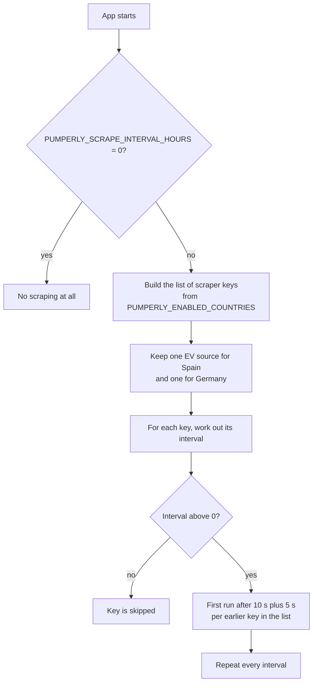

# Countries and scrape schedule

This page covers which scrapers run, how often they run, and what the map shows when it first opens. All of it is set with environment variables. The full list, with every default, is in [Environment variables](../reference/environment-variables.md).

## How scraping is scheduled {#how-scraping-is-scheduled}

A scraper is the code that downloads one source's stations and prices and writes them to the database. Pumperly has no separate scraper container. The scrapers run inside the app process, started by [`src/instrumentation.ts`](https://github.com/GeiserX/Pumperly/blob/main/src/instrumentation.ts) when the server boots.



Some details matter in practice:

- **Start-up is staggered.** The first scraper starts 10 seconds after boot, and each following one 5 seconds later. With every scraper enabled, the last one starts several minutes after boot. This keeps the database from being hit by all of them at once.
- **Runs never overlap.** If a run is still going when its next turn comes, that turn is skipped and the log says `previous run still in progress — skipping this tick`.
- **One process, one scheduler.** Run a single app replica. Two replicas would each run every scraper. The Helm chart defaults to one replica and the `Recreate` update strategy for this reason.
- **A failed run changes nothing.** A scraper that fails, or that gets an empty answer, stops before it replaces any rows. The last good data stays on the map. See [How scrapers work](../data/how-scrapers-work.md).

## Scraper keys {#scraper-keys}

Each scheduled scraper has a key. You use keys in [`PUMPERLY_ENABLED_COUNTRIES`](#choosing-countries) and in [per-scraper intervals](#how-often-scrapers-run).

| Key | What it scrapes | Example |
|---|---|---|
| `<CC>` | Fuel prices for one country, from that country's source | `ES`, `FR`, `AU` |
| `AU_NSW` | Fuel prices for New South Wales. `AU` covers Western Australia only. | `AU_NSW` |
| `EV_<CC>` | EV chargers for one country from Open Charge Map | `EV_FR`, `EV_US` |
| `EV_ES_REVE` | Spain's chargers from Mapa REVE, the official registry | `EV_ES_REVE` |
| `EV_DE_BNETZA` | Germany's chargers from the BNetzA Ladesäulenregister | `EV_DE_BNETZA` |
| `STATIC_<SOURCE>` | A community dataset committed to the repository | none ship today |

`<CC>` is an [ISO 3166-1 alpha-2](https://en.wikipedia.org/wiki/ISO_3166-1_alpha-2) country code. The 39 fuel-price countries are listed in [the country table](#default-country-and-fuel). The United States has chargers only, under `EV_US`, because it has no national fuel price source.

Static datasets are registered from [`src/scrapers/data/index.ts`](https://github.com/GeiserX/Pumperly/blob/main/src/scrapers/data/index.ts). The list is empty in the shipped code. [`src/scrapers/data/README.md`](https://github.com/GeiserX/Pumperly/blob/main/src/scrapers/data/README.md) explains how one is added.

## Choosing countries {#choosing-countries}

[`PUMPERLY_ENABLED_COUNTRIES`](../reference/environment-variables.md#pumperly_enabled_countries) picks which scraper keys run.

When it is **unset or empty**, every scraper key runs. That is every fuel country, `AU_NSW`, every `EV_` key including `EV_US`, and any static dataset.

When it is **set**, the value is a comma-separated list. These rules apply:

1. Case and surrounding spaces do not matter. `es, fr` is the same as `ES,FR`.
2. Each entry that matches a scraper key enables it.
3. A plain code such as `FR` also enables `EV_FR`, if that key exists. This is how `US` works: it has no fuel scraper, but it enables `EV_US`.
4. `EV_` keys can be listed on their own. `EV_FR` without `FR` gives French chargers and no French fuel prices.
5. Entries that match nothing are ignored, and nothing is logged. Check the spelling: `UK` is not a key, `GB` is.
6. `AU` does not include New South Wales. Add `AU_NSW` to the list for it.
7. If no entry matches, no scraper runs at all.

With [`PUMPERLY_EV_ENABLED=0`](../reference/environment-variables.md#pumperly_ev_enabled), rule 3 is off and every `EV_` key is dropped, even one you listed.

| `PUMPERLY_ENABLED_COUNTRIES` | Scrapers that run |
|---|---|
| unset | All of them |
| `ES` | Spain's fuel prices and Spain's chargers |
| `ES,PT,FR` | Fuel prices and chargers for the three countries |
| `AU,AU_NSW` | Fuel prices for Western Australia and New South Wales, and Australia's chargers |
| `US` | Chargers in the United States only |
| `EV_DE` | Germany's chargers only, from the BNetzA register by default |
| `ES,XX` | Same as `ES`. `XX` is ignored. |

The value also sets the `enabledCountries` list that [`/api/config`](../reference/api.md) and `/api/stats` report. That list only holds the 39 fuel-price country codes, so `US`, `AU_NSW` and `EV_` entries never appear in it.

!!! warning "Removing a country does not remove its stations"
    The map reads stations straight from the database and does not filter them by country. Taking a country out of the list stops its scrapers, but its stations and last prices stay visible. To remove them, delete the rows. Prices are deleted with their stations.

    ```sql
    DELETE FROM stations WHERE country = 'XX';
    ```

    Replace `XX` with the country code. Back up first: see [Backing up the database](../operations/backup-and-restore.md).

Some sources are blocked or paused upstream, so a country can be enabled and still get no fresh prices. [Coverage and status](../data/coverage.md) lists them.

## Spain and Germany: one EV source each {#spain-and-germany-ev-sources}

Spain and Germany each have two possible charger sources: Open Charge Map, which is crowdsourced, and an official registry. The two overlap heavily, so running both would put two pins on most chargers. The scheduler always keeps exactly one per country. Listing both keys does not change that.

| Country | Official registry | Picked when | Otherwise |
|---|---|---|---|
| Spain | Mapa REVE (`EV_ES_REVE`) | [`PUMPERLY_REVE_API_KEY`](../reference/environment-variables.md#pumperly_reve_api_key) is set | Open Charge Map (`EV_ES`) |
| Germany | BNetzA Ladesäulenregister (`EV_DE_BNETZA`) | Always, unless the next column applies | Open Charge Map (`EV_DE`) when [`PUMPERLY_DE_EV_SOURCE=ocm`](../reference/environment-variables.md#pumperly_de_ev_source) |

The log shows the choice at start-up:

```text
[scraper] Spain EV: using Mapa REVE (official registry) instead of OpenChargeMap
[scraper] Germany EV: using the BNetzA Ladesäulenregister instead of OpenChargeMap
```

Each registry deletes Open Charge Map's rows for its country once it has taken over:

- **BNetzA** arrives as one daily file. Its first healthy run replaces the whole country and deletes the Open Charge Map rows. "Healthy" means it refreshed at least [`PUMPERLY_BNETZA_MIN_STATIONS`](../reference/environment-variables.md#pumperly_bnetza_min_stations) stations.
- **REVE** fills in over many hourly runs. Open Charge Map's Spanish rows stay on the map until REVE holds [`PUMPERLY_REVE_CUTOVER_RATIO`](../reference/environment-variables.md#pumperly_reve_cutover_ratio) of the registry, 95% by default. Until then, expect two pins on many Spanish chargers. [API keys](api-keys.md#mapa-reve-spain) has the timing.

!!! warning "Switching back leaves the registry's rows behind"
    Nothing deletes a registry's rows if you switch back to Open Charge Map. Open Charge Map then adds its own, and most chargers get two pins. After switching Germany back to `ocm`, or removing the REVE key, delete the registry rows yourself:

    ```sql
    -- Germany, after PUMPERLY_DE_EV_SOURCE=ocm
    DELETE FROM stations
    WHERE country = 'DE' AND station_type = 'ev_charger' AND external_id LIKE 'bnetza-%';

    -- Spain, after removing PUMPERLY_REVE_API_KEY
    DELETE FROM stations
    WHERE country = 'ES' AND station_type = 'ev_charger' AND external_id LIKE 'reve-%';
    ```

## How often scrapers run {#how-often-scrapers-run}

Each scraper key gets an interval in hours. The first rule that applies wins:

1. [`PUMPERLY_SCRAPE_INTERVAL_<KEY>`](../reference/environment-variables.md#pumperly_scrape_interval_key) for that key, for example `PUMPERLY_SCRAPE_INTERVAL_FR`.
2. [`PUMPERLY_SCRAPE_INTERVAL_HOURS`](../reference/environment-variables.md#pumperly_scrape_interval_hours), if it is above 0.
3. The key's default, from `DEFAULT_INTERVALS` in [`src/instrumentation-node.ts`](https://github.com/GeiserX/Pumperly/blob/main/src/instrumentation-node.ts).
4. 12 hours, for a key with no default, such as a static dataset.

The defaults follow how often each source changes:

| Default | Scraper keys |
|---|---|
| 1 hour | `FR`, `DE`, `EV_ES_REVE` |
| 2 hours | `AT` |
| 4 hours | `GB` |
| 6 hours | `SI`, `NL`, `BE`, `DK`, `NO`, `IS`, `CY` |
| 12 hours | every other fuel key, including `AU_NSW` |
| 24 hours | every `EV_<CC>` key and `EV_DE_BNETZA` |

### Turning scraping off {#turning-scraping-off}

| Setting | Effect |
|---|---|
| `PUMPERLY_SCRAPE_INTERVAL_HOURS=0` | No scraper runs, not even ones with their own interval. The log says `automatic scraping disabled`. |
| `PUMPERLY_SCRAPE_INTERVAL_<KEY>=0` | That key does not run. A negative value does the same. |
| `PUMPERLY_EV_ENABLED=0` | No EV charger scraper runs. Fuel scrapers are unaffected. |

Turning scraping off is useful for a read-only copy of the database, or while you restore a backup.

### Changing intervals {#changing-intervals}

Intervals are in hours and may be decimals. `0.5` is every 30 minutes.

=== "Docker Compose"

    ```yaml
    services:
      app:
        environment:
          PUMPERLY_SCRAPE_INTERVAL_HOURS: "6"      # every scraper every 6 h
          PUMPERLY_SCRAPE_INTERVAL_FR: "0.5"       # France every 30 min
          PUMPERLY_SCRAPE_INTERVAL_EV_ES_REVE: "1" # keep REVE hourly
          PUMPERLY_SCRAPE_INTERVAL_NO: "0"         # never scrape Norway
    ```

=== "Helm"

    ```yaml
    config:
      scrapeIntervalHours: "6"
    extraEnv:
      - name: PUMPERLY_SCRAPE_INTERVAL_FR
        value: "0.5"
      - name: PUMPERLY_SCRAPE_INTERVAL_EV_ES_REVE
        value: "1"
      - name: PUMPERLY_SCRAPE_INTERVAL_NO
        value: "0"
    ```

!!! warning "A global interval also moves REVE"
    `PUMPERLY_SCRAPE_INTERVAL_HOURS` applies to every key, including `EV_ES_REVE`. REVE's API allows five requests an hour, so its scraper is built to run hourly. Each run reads the pages that belong to the current hour. Run less often and the backfill takes many times longer. Run more often and later runs in the same hour re-read the same pages or hit the rate limit. If you set a global interval and use REVE, add `PUMPERLY_SCRAPE_INTERVAL_EV_ES_REVE=1`.

!!! danger "Keep every interval a number between 0 and about 596"
    A per-key value that is empty or not a number is not rejected. The same happens to any interval above about 596 hours, the most a Node.js timer can hold. In both cases the timer fires every millisecond. The scraper then runs back to back and fills the log with skip warnings. For a monthly refresh, 596 hours is the practical ceiling.

### Running a scraper by hand {#running-a-scraper-by-hand}

In a source checkout, the scraper CLI runs one or more scrapers once and exits. It reads `.env` from the repository root.

```bash
npm run scraper:run -- --country=ES
npm run scraper:run -- --country=ES,EV_ES
npm run scraper:run -- --country=all
```

The CLI differs from the scheduler in five ways:

- It ignores `PUMPERLY_ENABLED_COUNTRIES` and every interval.
- An unknown key stops it with an error that lists the valid keys.
- `AU` runs both Australian scrapers, Western Australia and New South Wales.
- It has no `AU_NSW` key and does not run `STATIC_` datasets.
- `all` keeps one EV source each for Spain and Germany, as the scheduler does. Naming `EV_ES` or `EV_DE` directly runs it anyway.

The Docker image ships the built app only, not the scraper CLI. See [Local development](../getting-started/development.md).

## Default country and fuel {#default-country-and-fuel}

[`PUMPERLY_DEFAULT_COUNTRY`](../reference/environment-variables.md#pumperly_default_country) sets where the map opens. It uses the centre and zoom from `COUNTRIES` in [`src/lib/config.ts`](https://github.com/GeiserX/Pumperly/blob/main/src/lib/config.ts). The default is `ES`.

- Use an upper-case code from the table below. The value is not upper-cased for you.
- An unknown code opens the map on Spain, with Spain's default fuel.
- The default country does not need to be in `PUMPERLY_ENABLED_COUNTRIES`, and it does not limit what the map shows.

[`PUMPERLY_DEFAULT_FUEL`](../reference/environment-variables.md#pumperly_default_fuel) sets the fuel selected when the map opens. Without it, the default country's fuel is used. Visitors can change the fuel at any time, and a [share link](../using/links.md) that names a fuel wins over the default. The value is not checked, so copy a code from [Fuel types](../reference/fuel-types.md). `EV` opens on the charger layer.

??? info "Countries, default fuel and default fuel scrape interval"

    | Code | Country | Default fuel | Fuel scrape interval |
    |---|---|---|---|
    | `ES` | Spain | `B7` | 12 h |
    | `FR` | France | `E10` | 1 h |
    | `DE` | Germany | `E5` | 1 h |
    | `IT` | Italy | `B7` | 12 h |
    | `GB` | United Kingdom | `E5` | 4 h |
    | `AT` | Austria | `B7` | 2 h |
    | `PT` | Portugal | `B7` | 12 h |
    | `SI` | Slovenia | `B7` | 6 h |
    | `NL` | Netherlands | `E10` | 6 h |
    | `BE` | Belgium | `E10` | 6 h |
    | `LU` | Luxembourg | `E10` | 12 h |
    | `RO` | Romania | `B7` | 12 h |
    | `GR` | Greece | `B7` | 12 h |
    | `IE` | Ireland | `B7` | 12 h |
    | `HR` | Croatia | `B7` | 12 h |
    | `CH` | Switzerland | `E5` | 12 h |
    | `PL` | Poland | `E5` | 12 h |
    | `CZ` | Czech Republic | `E5` | 12 h |
    | `HU` | Hungary | `E5` | 12 h |
    | `BG` | Bulgaria | `B7` | 12 h |
    | `SK` | Slovakia | `E5` | 12 h |
    | `DK` | Denmark | `E10` | 6 h |
    | `SE` | Sweden | `E5` | 12 h |
    | `NO` | Norway | `E5` | 6 h |
    | `RS` | Serbia | `E5` | 12 h |
    | `FI` | Finland | `E10` | 12 h |
    | `EE` | Estonia | `E5` | 12 h |
    | `LV` | Latvia | `E5` | 12 h |
    | `LT` | Lithuania | `E5` | 12 h |
    | `BA` | Bosnia and Herzegovina | `B7` | 12 h |
    | `MK` | North Macedonia | `B7` | 12 h |
    | `TR` | Turkey | `B7` | 12 h |
    | `MD` | Moldova | `B7` | 12 h |
    | `IS` | Iceland | `B7` | 6 h |
    | `CY` | Cyprus | `E5` | 6 h |
    | `TW` | Taiwan | `E5` | 12 h |
    | `AU` | Australia | `E10` | 12 h, and 12 h for `AU_NSW` |
    | `AR` | Argentina | `E5` | 12 h |
    | `MX` | Mexico | `E5` | 12 h |

    Every country also has an `EV_<CC>` charger scraper that runs every 24 hours. So does the United States, as `EV_US`.

## Clustering {#clustering}

Clustering groups nearby stations into one bubble when the map is zoomed out. It keeps a whole country readable and fast to draw. [`PUMPERLY_CLUSTER_STATIONS`](../reference/environment-variables.md#pumperly_cluster_stations) turns it on or off. It is on by default.

When clustering is on:

- Stations are grouped within a 50-pixel radius, up to zoom level 11. Closer in, every station is drawn on its own.
- A cluster is coloured by the average price of the stations in it, on the same colour scale as single stations.
- Clicking a cluster zooms in one level past the point where it splits apart.
- Clustering switches off while a route is shown, so every station along the route stays visible.

Only the value `true`, in any case, turns it on. `false` turns it off, and so does any other value, including `1`.
