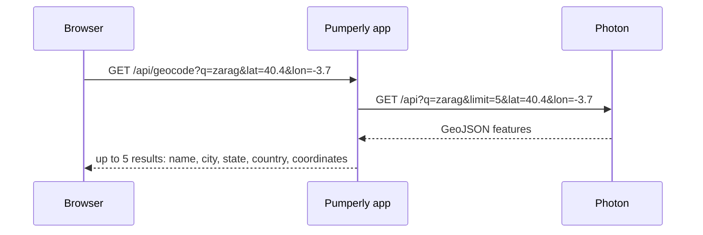

# Geocoding with Photon

This page explains how Pumperly turns typed place names into map positions, and how to run the search engine behind it. Geocoding is optional. Without it, the search boxes find nothing, and everything else keeps working.

Geocoding means turning a place name or address into coordinates. [Photon](https://github.com/komoot/photon) is an open-source geocoder built on [OpenStreetMap](https://www.openstreetmap.org) data. It is made for search-as-you-type. You run it yourself, next to the app.

## What Pumperly uses Photon for {#what-pumperly-uses-photon-for}

Photon powers the origin, destination and stop boxes of the route planner. Nothing else in Pumperly uses it. The scrapers do not geocode stations.



- The browser starts asking after 2 characters and waits for a 300 ms pause in typing.
- It sends the current map centre as `lat` and `lon`. Photon then ranks places near what the visitor is looking at higher.
- Pumperly asks Photon for 5 results and waits at most 5 seconds.
- An error page from Photon, or a body that is not JSON, becomes an empty list. A timeout or a refused connection makes `/api/geocode` answer `502`.
- Answers may be cached by a proxy for 5 minutes. The response carries `Cache-Control: public, s-maxage=300`.

[HTTP API](../reference/api.md) documents `/api/geocode` in full.

Pumperly does not send a language to Photon. Each result's name comes back in Photon's default language for that place, which is usually the local name.

## Running without Photon {#running-without-photon}

Leave [`PHOTON_URL`](../reference/environment-variables.md#photon_url) unset. Then:

- `/api/geocode` returns an empty list, and the search boxes show no matches.
- Visitors cannot pick a place by typing its name.
- A [share link](../using/links.md) for a route already holds coordinates, so it still opens the route, as long as [Valhalla](routing-valhalla.md) runs.
- The map, prices and scrapers work as normal.

## Connecting Pumperly to Photon {#connecting-pumperly-to-photon}

Set [`PHOTON_URL`](../reference/environment-variables.md#photon_url) to Photon's base URL, without a trailing slash, for example `http://pumperly-photon:2322`. Pumperly appends `/api`. Any Photon server that serves the standard `/api` search endpoint works.

Pumperly calls Photon from the server, not from the browser. Photon does not need to be reachable from the internet, and it needs no CORS settings.

## Running Photon with Docker Compose {#running-photon-with-docker-compose}

Photon has no official Docker image. The project runs the official Photon release file on a plain Java 21 image. Photon's import data comes from the per-country dumps that Graphhopper publishes at [download1.graphhopper.com/public](https://download1.graphhopper.com/public/).

This example imports Spain and Portugal. Add it to the Compose file that runs the app. [Run with Docker Compose](../getting-started/docker-compose.md) covers the rest of that file.

```yaml
services:
  photon:
    image: eclipse-temurin:21-jre
    container_name: pumperly-photon
    restart: unless-stopped
    working_dir: /photon
    entrypoint: ["/bin/bash", "-c"]
    command:
      - |
        set -euo pipefail
        REGIONS="spain portugal"   # dump folder names, space-separated
        LANGS="es,pt,en"           # languages to index, comma-separated
        BASE="https://download1.graphhopper.com/public/europe"
        if [ ! -f /photon/.import_complete ]; then
          apt-get update -qq
          apt-get install -y -qq --no-install-recommends wget zstd
          wget -q -O /photon/photon.jar \
            https://github.com/komoot/photon/releases/download/1.0.1/photon-1.0.1.jar
          rm -rf /photon/photon_data /photon/all.jsonl
          for r in $$REGIONS; do
            wget -q -O "/photon/$$r.jsonl.zst" \
              "$$BASE/$$r/photon-dump-$$r-1.0-latest.jsonl.zst"
            zstd -dc "/photon/$$r.jsonl.zst" >> /photon/all.jsonl
            rm "/photon/$$r.jsonl.zst"
          done
          java -Xmx4g -jar /photon/photon.jar import \
            -import-file /photon/all.jsonl -languages "$$LANGS"
          rm /photon/all.jsonl
          touch /photon/.import_complete
        fi
        exec java -jar /photon/photon.jar serve -languages "$$LANGS" -listen-ip 0.0.0.0
    volumes:
      - pumperly-photon:/photon
    deploy:
      resources:
        limits:
          memory: 12G

  app:
    environment:
      PHOTON_URL: http://pumperly-photon:2322

volumes:
  pumperly-photon:
```

What the script does on the first start:

1. Installs `wget` and `zstd` and downloads the Photon 1.0.1 release file.
2. Downloads each region's dump, unpacks it and appends it to one file, `all.jsonl`.
3. Imports that one file in a single run, then deletes it.
4. Writes `.import_complete`, so later starts skip straight to serving.
5. Starts the server on port 2322, listening on every interface of the container.

The index lives in `/photon/photon_data` inside the volume. Pumperly reaches Photon on the internal Compose network, so port 2322 does not need to be published on the host.

!!! warning "Three rules that keep the import working"
    - **Import everything in one run.** A second `import` into an existing index has left the container crash-looping. To add a region, start over with the full list.
    - **Import before you serve.** Only one Photon process can open the index at a time. An import that runs in the background while the server is up fails with `failed to obtain node locks`.
    - **Write `$$` for shell variables in Compose.** Compose replaces `$NAME` with a value from the host before the shell sees it. `$$NAME` reaches the shell as `$NAME`.

!!! tip "Use Java 21"
    The example pins the `21-jre` image. The project has seen problems running this Photon release on newer Java versions.

### Choosing regions {#choosing-regions}

Set `REGIONS` to the dump folders for the countries your visitors search in. Folder names do not always match the country name. Open the dump server and copy the exact names. Some examples of names that differ:

| Folder | Covers |
|---|---|
| `british-islands` | United Kingdom and Ireland |
| `france-monacco` | France and Monaco (the spelling is the folder's) |
| `switzerland-liechtenstein` | Switzerland and Liechtenstein |
| `baltics` | Estonia, Latvia and Lithuania |
| `luxemburg` | Luxembourg |

The example's `BASE` points at the European dumps. For countries elsewhere, check what the dump server offers before you plan them.

To change the regions later, edit `REGIONS`, delete `.import_complete` from the volume, and recreate the container. The script then deletes the old index and imports the new list from scratch.

### Choosing languages {#choosing-languages}

`LANGS` sets which name translations Photon indexes, for example `es,en,fr`. A place can then be found by any of its names in those languages. More languages mean a larger index and a longer import. Use the same list for `import` and `serve`.

## Memory, disk and time {#memory-disk-and-time}

| Phase | Memory | Time |
|---|---|---|
| Import | The example gives Java 4 GB of heap, `-Xmx4g`, inside a 12 GB container. Give the container several GB more than the heap. | Grows with the regions. An import of many European countries takes many hours. |
| Serving | A few GB | Pumperly waits at most 5 seconds for each answer. |

Disk holds the dumps while they are unpacked, then the index. Both grow with the number of regions and languages. The Helm chart's default Photon volume is 300 GiB, and its default memory is a 2 GiB request with an 8 GiB limit.

!!! tip "Build Valhalla and Photon one after the other"
    Both first starts need a lot of memory. On a machine with limited RAM, let [Valhalla](routing-valhalla.md) finish its tile build before you start Photon.

## Running Photon with Helm {#running-photon-with-helm}

The chart can run Photon, but it ships no Photon image or start-up command. With `photon.enabled: true` you must set `photon.image.repository`, `photon.image.tag` and `photon.command` or `photon.args`. The chart refuses to render without the image. It then:

- mounts the Photon volume at `/photon/photon_data`, where Photon keeps its index when it runs from `/photon`;
- probes `/api?q=test` on port 2322;
- sets `PHOTON_URL` on the app to its own Photon service.

The Compose script above can serve as the command, with `/photon` as the working directory. Its `$$` escapes are for Compose only, so write `$` in a Helm value. To use a Photon server you already run, leave `photon.enabled` off and set `externalServices.photonUrl`. [Run on Kubernetes with Helm](../getting-started/kubernetes.md) covers the rest of the chart.

## Checking that search works {#checking-that-search-works}

First check that the app container can reach Photon. The app image includes `wget`. Replace `pumperly` with the name of your app container:

```bash
docker exec pumperly wget -qO- "http://pumperly-photon:2322/api?q=Zaragoza&limit=1"
```

Then ask Pumperly:

```bash
curl -s "http://localhost:3000/api/geocode?q=Zaragoza"
```

A working setup returns a JSON list of up to 5 results. Each has `name`, `city`, `state`, `country` and `coordinates`, where `coordinates` is `[longitude, latitude]`. `city`, `state` and `country` are `null` when Photon has no value for them.

!!! tip "Check the country code when you test a new region"
    Photon matches loosely. A search for a city in a region you have not imported can still return a similar name elsewhere. When you test a new region, query Photon directly and check that `countrycode` in the result is the country you expect.

## Troubleshooting {#troubleshooting}

| Symptom | Likely cause | What to do |
|---|---|---|
| Search boxes never show matches | `PHOTON_URL` unset or wrong, or the import has not finished | Check the variable and Photon's log. The server only starts after the import. |
| `/api/geocode` answers `502` | Photon is not reachable or took longer than 5 seconds | Check that the containers share a network and that Photon is running. |
| The container restarts during a second import | An import into an existing index | Delete `.import_complete` and import every region in one run. |
| `failed to obtain node locks` | An import and the server ran at the same time | Let the import finish before the server starts, as the example does. |
| A place in a new region is not found | The region's folder name is wrong, or the download failed | Check the exact folder name on the dump server and the import log. |

For logs and general checks, see [Monitoring and troubleshooting](../operations/troubleshooting.md).
