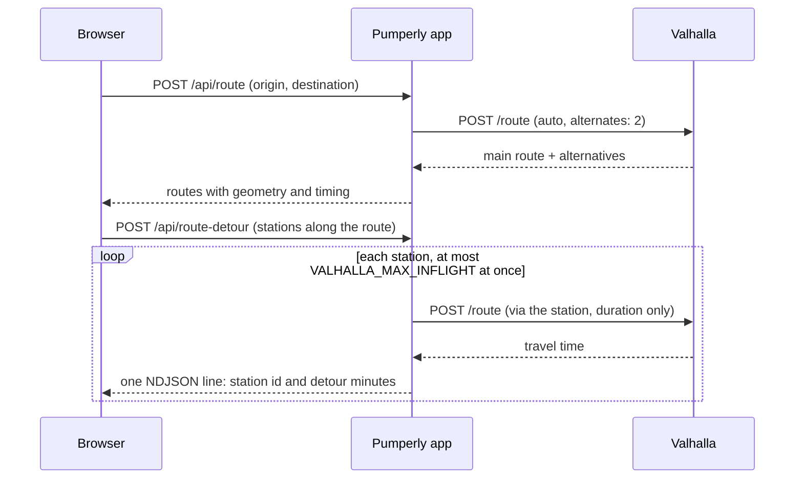

# Routing with Valhalla

This page explains how Pumperly plans routes and how to run the routing engine it needs. Routing is optional. Without it, the map, prices and station search by area all keep working.

[Valhalla](https://github.com/valhalla/valhalla) is an open-source routing engine built on [OpenStreetMap](https://www.openstreetmap.org) data. It turns a start, an end and optional stops into a road route with a travel time. Pumperly talks to it over HTTP. You run Valhalla yourself, next to the app.

## What Pumperly uses Valhalla for {#what-pumperly-uses-valhalla-for}

Two API routes call Valhalla. Both send `POST /route` requests with the `auto` costing, which means a car. Pumperly has no truck, bicycle or walking profile.

| Pumperly endpoint | What it asks Valhalla | Limits |
|---|---|---|
| `POST /api/route` | One route from origin to destination. Without stops, it asks for 2 alternatives, so a visitor sees up to 3 routes. With stops (up to 5), it asks for a single route through them. | 30 requests a minute per client. 10-second timeout, 15 seconds when alternatives are requested. |
| `POST /api/route-detour` | For each station along the route, the time of a trip that passes through the station. The difference from the plain route is the station's detour time. | 10 requests a minute per client. Up to 150 stations per request, each with its own Valhalla call and a 10-second timeout. |

The detour endpoint is the heavy one. One visitor who moves the detour slider can cause 150 Valhalla calls. Pumperly limits this in two places:

- Each detour request works through its stations with 8 workers at most.
- All Valhalla calls in the app share one pool of [`VALHALLA_MAX_INFLIGHT`](../reference/environment-variables.md#valhalla_max_inflight) slots, 6 by default. A call waits in a queue until a slot is free. A visitor who leaves the page cancels the calls still waiting.



The detour answers stream back one line at a time, so the list fills in while Valhalla works. A station whose call fails gets `detourMin: -1` and shows no detour time.

!!! note "The rate limits need a reverse proxy"
    The per-client limits identify a client by the first address in `X-Forwarded-For`, then by `X-Real-IP`. Put Pumperly behind a reverse proxy that sets those headers and replaces any value the client sent. Without one, every visitor with no such header shares a single limit, and a visitor who sends a fake header gets a limit of their own.

## Running without Valhalla {#running-without-valhalla}

Leave [`VALHALLA_URL`](../reference/environment-variables.md#valhalla_url) unset. Then:

- `POST /api/route` answers `502` with `{"error": "Routing service unavailable"}`, and the route panel shows an error.
- `POST /api/route-detour` returns `-1` for every station.
- The map, prices, station popups, clustering and the scrapers work as normal.

Pumperly behaves the same way when Valhalla is set but unreachable, still building its tiles, or has no road near the requested points. Route requests answer `502`, with the error `Routing service unavailable` or `Route calculation failed`, and detours return `-1`.

## Connecting Pumperly to Valhalla {#connecting-pumperly-to-valhalla}

| Variable | Default | Set it to |
|---|---|---|
| [`VALHALLA_URL`](../reference/environment-variables.md#valhalla_url) | unset | Valhalla's base URL without a trailing slash, such as `http://pumperly-valhalla:8002`. Pumperly appends `/route`. |
| [`VALHALLA_MAX_INFLIGHT`](../reference/environment-variables.md#valhalla_max_inflight) | `6` | How many Valhalla calls may run at once. Raise it if Valhalla has spare CPU and detour times arrive slowly. Lower it if Valhalla struggles. It must be a whole number of 1 or more. |
| [`PUMPERLY_MAX_DETOUR_STATIONS`](../reference/environment-variables.md#pumperly_max_detour_stations) | `150` | The most stations one detour request may route. Lower it to reduce load. Extra stations are thinned out evenly along the route. |

!!! danger "Never set `VALHALLA_MAX_INFLIGHT` to 0 or leave it empty"
    With `0`, an empty value or one that is not a number, no call ever gets a slot. Every route request then hangs. Delete the variable to get the default.

## Running Valhalla with Docker Compose {#running-valhalla-with-docker-compose}

The project uses the [gis-ops Valhalla image](https://github.com/gis-ops/docker-valhalla). On its first start it downloads OpenStreetMap extracts, builds routing tiles from them and then serves requests. The tiles are kept in a volume, so later starts skip the build.

A service for Spain only looks like this. Add it to the Compose file that runs the app. [Run with Docker Compose](../getting-started/docker-compose.md) covers the rest of that file.

```yaml
services:
  valhalla:
    image: ghcr.io/gis-ops/docker-valhalla/valhalla:3.5.1
    container_name: pumperly-valhalla
    restart: unless-stopped
    environment:
      tile_urls: https://download.geofabrik.de/europe/spain-latest.osm.pbf
      use_tiles_ignore_pbf: "False"
      serve_tiles: "True"
      build_elevation: "False"
      build_admins: "True"
      build_time_zones: "True"
      build_transit: "False"
      server_threads: "4"
    volumes:
      - pumperly-valhalla:/custom_files
    deploy:
      resources:
        limits:
          memory: 24G

  app:
    environment:
      VALHALLA_URL: http://pumperly-valhalla:8002

volumes:
  pumperly-valhalla:
```

These settings belong to the gis-ops image, not to Pumperly. The ones above do this:

| Setting | Value | What it does |
|---|---|---|
| `tile_urls` | one extract URL | The OpenStreetMap extract to download on the first start. |
| `serve_tiles` | `True` | Start serving routes once the tiles are built. |
| `use_tiles_ignore_pbf` | `False` | Build the tiles from the extract rather than expecting ready-made tiles. |
| `build_admins` | `True` | Build country and region borders, which Valhalla uses for rules that differ by country. |
| `build_time_zones` | `True` | Build time zone data. |
| `build_elevation`, `build_transit` | `False` | Pumperly uses neither height data nor public transport. |
| `server_threads` | `4` | Threads that answer requests. Match it to the CPU cores you can spare. |

The image's own README lists every setting it accepts.

Pumperly reaches Valhalla on the internal Compose network. Port 8002 does not need to be published on the host.

## Choosing the map area {#choosing-the-map-area}

Valhalla can only route where its extract has roads. Cover every country where your visitors plan trips. [Geofabrik](https://download.geofabrik.de/) publishes extracts per continent, country and region.

=== "One country or one region"

    Set `tile_urls` to a single extract. A region extract such as `europe/dach` (Germany, Austria and Switzerland) or a whole continent covers several countries in one file.

    ```yaml
    tile_urls: https://download.geofabrik.de/europe/portugal-latest.osm.pbf
    ```

=== "Several separate countries"

    Merge the extracts into one file first, with [osmium](https://osmcode.org/osmium-tool/):

    ```bash
    osmium merge spain-latest.osm.pbf portugal-latest.osm.pbf france-latest.osm.pbf \
      -o merged.osm.pbf
    ```

    Then either host `merged.osm.pbf` somewhere the container can download it and put that URL in `tile_urls`, or copy it into the Valhalla volume and remove `tile_urls`. The image builds from every `.pbf` file in `/custom_files`, so leave only the merged file there.

!!! warning "Give Valhalla one extract, not several"
    Building from several separate extracts has crashed the tile build with `SIGABRT`. Merge them first, as shown above.

Countries outside Europe need their own extracts, such as `australia-oceania/australia`, `south-america/argentina`, `north-america/mexico` or `asia/taiwan`. Merge them in the same way.

## Memory, disk and time {#memory-disk-and-time}

The tile build is the expensive part. It happens once, and again whenever you change the extract.

| Phase | Memory | Time |
|---|---|---|
| Tile build | Grows with the extract. Plan about 24 GB for a large multi-country extract. The Helm chart's default limit is 24 GiB. | Grows with the extract. A large multi-country extract takes hours. |
| Serving | About 2 GB | Loading tiles after a restart takes up to a minute. See [Troubleshooting](#troubleshooting). |

Disk holds the downloaded extract and the built tiles. Both grow with the area. The Helm chart's default volume is 100 GiB.

!!! tip "Build Valhalla and Photon one after the other"
    Both builds need a lot of memory. On a machine with limited RAM, start Valhalla first and let it finish before you start [Photon](geocoding-photon.md).

## Changing or refreshing the extract {#changing-or-refreshing-the-extract}

The tiles never update themselves. Roads change, so rebuild from a fresh extract from time to time, for example monthly. Rebuild also whenever you add or remove a country.

To rebuild, stop Valhalla, then delete its volume and start it again:

```bash
docker compose stop valhalla
docker compose rm -f valhalla
docker volume rm <project>_pumperly-valhalla
docker compose up -d valhalla
```

Replace `<project>` with your Compose project name. `docker volume ls` shows the full volume name. If you copied a merged extract into the volume yourself, copy the new one in after you recreate it.

## Running Valhalla with Helm {#running-valhalla-with-helm}

The chart can run Valhalla for you. When `valhalla.enabled` is `true`, the chart sets `VALHALLA_URL` to its own Valhalla service on port 8002. To use a Valhalla server you already run, leave it off and set `externalServices.valhallaUrl`.

```yaml title="values.yaml"
valhalla:
  enabled: true
  tileUrls: "https://download.geofabrik.de/europe/spain-latest.osm.pbf"
  serverThreads: "4"
  persistence:
    size: 100Gi
  resources:
    requests:
      memory: 4Gi
    limits:
      memory: 24Gi
```

Apart from `enabled`, which defaults to `false`, the values shown are the chart defaults. The chart passes `tileUrls` to the image as `tile_urls`. For several countries, point it at one merged extract. The chart probes Valhalla on `/status`, so Kubernetes sends it traffic only once it answers. [Run on Kubernetes with Helm](../getting-started/kubernetes.md) covers the rest of the chart.

## Checking that routing works {#checking-that-routing-works}

First check that the app container can reach Valhalla. The app image includes `wget`. Replace `pumperly` with the name of your app container:

```bash
docker exec pumperly wget -qO- http://pumperly-valhalla:8002/status
```

A JSON answer means Valhalla is up. Then ask Pumperly for a route, here from Madrid to Valencia:

```bash
curl -s -X POST http://localhost:3000/api/route \
  -H 'Content-Type: application/json' \
  -d '{"origin": [-3.7038, 40.4168], "destination": [-0.3763, 39.4699]}'
```

Coordinates are `[longitude, latitude]`. A working setup returns `{"routes": [...]}` with one to three routes. See [HTTP API](../reference/api.md) for the full request and response.

## Troubleshooting {#troubleshooting}

| Symptom | Likely cause | What to do |
|---|---|---|
| Every route request answers `502` | `VALHALLA_URL` unset or wrong, or Valhalla still building | Check the variable, then Valhalla's log. The first build takes a while. |
| Routes fail for a minute after Valhalla restarts | Valhalla is still loading its tiles | Wait. Short routes recover first, long ones after 30 to 60 seconds. |
| Routes fail in one country only | That country is not in the extract | Add it and rebuild. See [Choosing the map area](#choosing-the-map-area). |
| The tile build crashes with `SIGABRT` | Several separate extracts | Merge them into one file. |
| The tile build crash-loops with `double free or corruption` at the same point | Malformed `level` tags on indoor corridor ways in the OpenStreetMap data | Drop those ways before building: `osmium tags-filter -i merged.osm.pbf w/highway=corridor -o filtered.osm.pbf`. |
| Route requests hang and never answer | `VALHALLA_MAX_INFLIGHT` is 0, empty or not a number | Delete it or set a whole number of 1 or more. |
| Detour times arrive slowly | Few slots, or a busy Valhalla | Raise `VALHALLA_MAX_INFLIGHT` if Valhalla has spare CPU, or lower `PUMPERLY_MAX_DETOUR_STATIONS`. |
| `429 Too many requests` | The per-client rate limit | Behind a proxy that does not set `X-Forwarded-For`, all visitors share one limit. Fix the proxy headers. |

For logs and general checks, see [Monitoring and troubleshooting](../operations/troubleshooting.md).
