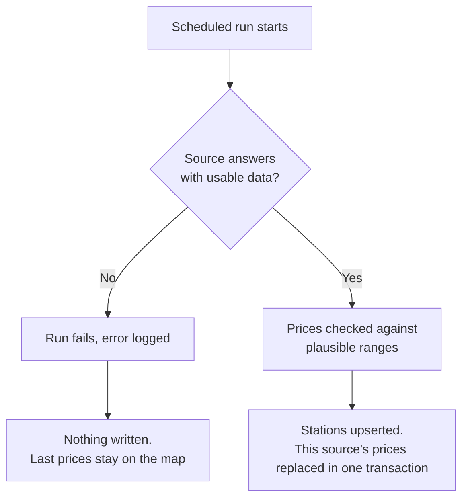

# Coverage and status

This page lists every country Pumperly supports, where its data comes from and whether that source works today. Use it to decide which countries to enable and to tell a broken source from a broken install.

Pumperly has two kinds of data. **Fuel prices** come from one scraper per country: a scraper is the piece of code that downloads a source and writes its stations and prices to the database. **EV charging locations** come from Open Charge Map for every country, plus official registries for Spain and Germany.

## Status labels {#status-labels}

Every source on this page carries one of these labels. The label describes what the scraper does on each run today.

| Status | What the scraper does |
|---|---|
| **Running** | Downloads the source and writes fresh prices on every run. |
| **Needs a key** | Works once you set an API key. Without it, every run fails and writes nothing. |
| **Paused** | Still scheduled, but the source refuses the request. Each run fails before it writes anything. |
| **Blocked** | The source actively turns scrapers away. Each run fails and writes nothing. |
| **Down** | The source no longer answers, or does not answer from where the server runs. Each run fails and writes nothing. |

A run that fails never deletes data. The prices from the last good run stay on the map, and each station's popup shows how old its price is. [What a failing source looks like](#what-a-failing-source-looks-like) explains how to spot one.

## Fuel prices {#fuel-prices}

The **key** column is the name the scheduler and the logs use for the scraper. The **every** column is the default interval between runs, from `DEFAULT_INTERVALS` in [`src/instrumentation-node.ts`](https://github.com/GeiserX/Pumperly/blob/main/src/instrumentation-node.ts). The **default fuel** column is the fuel the map selects when it opens on that country, from [`src/lib/config.ts`](https://github.com/GeiserX/Pumperly/blob/main/src/lib/config.ts).

### Europe {#europe}

| Country | Key | Source | Currency | Every | Default fuel | Status |
|---|---|---|---|---|---|---|
| Austria | `AT` | [E-Control Spritpreisrechner](fuel-sources.md#austria) | EUR | 2 h | B7 | Running |
| Belgium | `BE` | [ANWB](fuel-sources.md#anwb) | EUR | 6 h | E10 | Running |
| Bosnia and Herzegovina | `BA` | [Fuelo.net](fuel-sources.md#fuelo) | BAM | 12 h | B7 | Paused |
| Bulgaria | `BG` | [Fuelo.net](fuel-sources.md#fuelo) | EUR | 12 h | B7 | Paused |
| Croatia | `HR` | [MZOE](fuel-sources.md#croatia) | EUR | 12 h | B7 | Running |
| Cyprus | `CY` | [Consumer Protection Service observatory](fuel-sources.md#cyprus) | EUR | 6 h | E5 | Running |
| Czech Republic | `CZ` | [Fuelo.net](fuel-sources.md#fuelo) | CZK | 12 h | E5 | Paused |
| Denmark | `DK` | [FuelPrices.dk](fuel-sources.md#denmark) | DKK | 6 h | E10 | Needs a key |
| Estonia | `EE` | [Fuelo.net](fuel-sources.md#fuelo) | EUR | 12 h | E5 | Paused |
| Finland | `FI` | [polttoaine.net](fuel-sources.md#finland) | EUR | 12 h | E10 | Running |
| France | `FR` | [data.economie.gouv.fr](fuel-sources.md#france) | EUR | 1 h | E10 | Running |
| Germany | `DE` | [Tankerkoenig](fuel-sources.md#germany) | EUR | 1 h | E5 | Needs a key |
| Greece | `GR` | [FuelGR](fuel-sources.md#greece) | EUR | 12 h | B7 | Running |
| Hungary | `HU` | [Fuelo.net](fuel-sources.md#fuelo) | HUF | 12 h | E5 | Paused |
| Iceland | `IS` | [Gasvaktin](fuel-sources.md#iceland) | ISK | 6 h | B7 | Running |
| Ireland | `IE` | [Pick A Pump](fuel-sources.md#ireland) | EUR | 12 h | B7 | Blocked |
| Italy | `IT` | [MIMIT](fuel-sources.md#italy) | EUR | 12 h | B7 | Running |
| Latvia | `LV` | [Fuelo.net](fuel-sources.md#fuelo) | EUR | 12 h | E5 | Paused |
| Lithuania | `LT` | [Fuelo.net](fuel-sources.md#fuelo) | EUR | 12 h | E5 | Paused |
| Luxembourg | `LU` | [ANWB](fuel-sources.md#anwb) | EUR | 12 h | E10 | Running |
| Moldova | `MD` | [ANRE](fuel-sources.md#moldova) | MDL | 12 h | B7 | Running |
| Netherlands | `NL` | [ANWB](fuel-sources.md#anwb) | EUR | 6 h | E10 | Running |
| North Macedonia | `MK` | [Fuelo.net](fuel-sources.md#fuelo) | MKD | 12 h | B7 | Paused |
| Norway | `NO` | [DrivstoffAppen](fuel-sources.md#norway) | NOK | 6 h | E5 | Down |
| Poland | `PL` | [Fuelo.net](fuel-sources.md#fuelo) | PLN | 12 h | E5 | Paused |
| Portugal | `PT` | [DGEG](fuel-sources.md#portugal) | EUR | 12 h | B7 | Running |
| Romania | `RO` | [Peco Online](fuel-sources.md#romania) | RON | 12 h | B7 | Running |
| Serbia | `RS` | [NIS and cenagoriva.rs](fuel-sources.md#serbia) | RSD | 12 h | E5 | Running |
| Slovakia | `SK` | [Fuelo.net](fuel-sources.md#fuelo) | EUR | 12 h | E5 | Paused |
| Slovenia | `SI` | [goriva.si](fuel-sources.md#slovenia) | EUR | 6 h | B7 | Running |
| Spain | `ES` | [MITECO](fuel-sources.md#spain) | EUR | 12 h | B7 | Running |
| Sweden | `SE` | [bensinpriser.nu](fuel-sources.md#sweden) | SEK | 12 h | E5 | Running |
| Switzerland | `CH` | [Fuelo.net](fuel-sources.md#fuelo) | CHF | 12 h | E5 | Paused |
| Turkey | `TR` | [Fuelo.net](fuel-sources.md#fuelo) | TRY | 12 h | B7 | Paused |
| United Kingdom | `GB` | [CMA open data](fuel-sources.md#united-kingdom) | GBP | 4 h | E5 | Running |

For the Fuelo countries the currency column is the scraper's fallback. The Fuelo scraper reads the currency from each price label and only uses the fallback when the label shows none it recognises.

### Outside Europe {#outside-europe}

| Country | Key | Source | Currency | Every | Default fuel | Status |
|---|---|---|---|---|---|---|
| Argentina | `AR` | [Secretaría de Energía](fuel-sources.md#argentina) | ARS | 12 h | E5 | Down from Europe |
| Australia, Western Australia | `AU` | [FuelWatch](fuel-sources.md#australia-western-australia) | AUD | 12 h | E10 | Running |
| Australia, New South Wales | `AU_NSW` | [FuelCheck](fuel-sources.md#australia-new-south-wales) | AUD | 12 h | E10 | Needs a key |
| Mexico | `MX` | [CRE](fuel-sources.md#mexico) | MXN | 12 h | E5 | Running |
| Taiwan | `TW` | [CPC Corporation](fuel-sources.md#taiwan) | TWD | 12 h | E5 | Running |

The United States has no fuel prices. It has [EV charging locations only](#ev-charging).

### Notes on the statuses {#status-notes}

**Paused: the twelve Fuelo countries.** Switzerland, Poland, the Czech Republic, Hungary, Bulgaria, Slovakia, Estonia, Latvia, Lithuania, Bosnia and Herzegovina, North Macedonia and Turkey all come from Fuelo.net. Fuelo answers the scraper's station-list request with HTTP 403, and its `robots.txt` disallows the endpoint. Pumperly respects that. The scraper stays scheduled, fails on its first request, and the prices it last wrote stay frozen on the map. No replacement source is in place for these countries.

**Blocked: Ireland.** Pick A Pump rejects scrapers with HTTP 403, and its `robots.txt` disallows them. No open alternative source exists, so Irish prices stay frozen.

**Down: Norway.** The DrivstoffAppen public API is retired. Its old endpoints answer HTTP 404, and its successor requires authorisation Pumperly cannot obtain. Norway has no official station-level price dataset. The scraper keeps sending one request per run, so Norway recovers on its own if the public API returns.

**Down from Europe: Argentina.** The government server at `datos.energia.gob.ar` drops connections from European addresses. The scraper works from a server in the Americas.

**Needs a key: Germany.** The Tankerkoenig API requires a free `TANKERKOENIG_API_KEY`. Without it, every German fuel run fails. German EV chargers need no key.

**Needs a key: Denmark.** FuelPrices.dk requires a free `FUELPRICES_DK_API_KEY`. Without the key, the scraper falls back to the DrivstoffAppen API, which is the same retired API as Norway's, so the fallback fails too.

**Needs a key: New South Wales.** FuelCheck requires both `NSW_FUEL_API_KEY` and `NSW_FUEL_API_SECRET`. Without them only Western Australian prices update. The two Australian states are separate scrapers, so one failing never touches the other's prices.

[API keys](../configuration/api-keys.md) explains how to get each key and where to set it.

## EV charging {#ev-charging}

EV chargers come from three sources. Every fuel country above also gets EV chargers, and so does the United States.

| Region | Key | Source | Every | Needs |
|---|---|---|---|---|
| Every supported country and the United States | `EV_<code>`, for example `EV_FR` | [Open Charge Map](ev-sources.md#open-charge-map) | 24 h | `PUMPERLY_OCM_API_KEY` |
| Spain | `EV_ES_REVE` | [Mapa REVE](ev-sources.md#mapa-reve) | 1 h | `PUMPERLY_REVE_API_KEY` |
| Germany | `EV_DE_BNETZA` | [BNetzA Ladesäulenregister](ev-sources.md#bnetza) | 24 h | nothing |

Spain and Germany each use exactly one EV source at a time, never both:

- **Spain** uses Mapa REVE when `PUMPERLY_REVE_API_KEY` is set, and Open Charge Map otherwise.
- **Germany** uses the BNetzA register by default. Set `PUMPERLY_DE_EV_SOURCE=ocm` to use Open Charge Map instead.

Without `PUMPERLY_OCM_API_KEY`, the Open Charge Map scrapers still run on schedule but write nothing. German chargers from BNetzA still load, because that source needs no key.

EV chargers have no prices. None of the three sources publishes a per-litre price, and per-kWh tariffs do not fit the price model. [EV charging sources](ev-sources.md) covers each source in detail.

## Community datasets {#community-datasets}

Places with no source to scrape can be added as committed data files under [`src/scrapers/data/`](https://github.com/GeiserX/Pumperly/tree/main/src/scrapers/data). Each dataset registers its own scraper, keyed `STATIC_<SOURCE>`, and writes only its own rows. The repository ships with no datasets registered yet. [`src/scrapers/data/README.md`](https://github.com/GeiserX/Pumperly/blob/main/src/scrapers/data/README.md) explains the format, and [Adding a country](adding-a-country.md) covers the wider process.

## Choosing what runs {#choosing-what-runs}

By default every fuel scraper runs, including both Australian states. Each country also gets one EV source: Open Charge Map everywhere, including the United States, except that Germany uses the BNetzA register and Spain uses Mapa REVE when its key is set. These settings narrow that down:

| Setting | Effect |
|---|---|
| `PUMPERLY_ENABLED_COUNTRIES` | Comma-separated country codes. Each code enables its fuel scraper and its EV scraper. `US` enables EV chargers for the United States. |
| `PUMPERLY_EV_ENABLED=0` | Turns off every EV scraper, including Mapa REVE and BNetzA. |
| `PUMPERLY_SCRAPE_INTERVAL_<KEY>` | Sets one scraper's interval in hours, using the key from the tables above. `0` stops that scraper. |
| `PUMPERLY_SCRAPE_INTERVAL_HOURS` | Sets the interval for every scraper that has no per-key override. `0` stops all automatic scraping. |

!!! warning "Listing `AU` does not enable New South Wales"
    `PUMPERLY_ENABLED_COUNTRIES` matches scraper keys exactly. `AU` enables the Western Australia scraper only. To keep New South Wales, list `AU_NSW` as well, for example `PUMPERLY_ENABLED_COUNTRIES=AU,AU_NSW`.

!!! tip "Stop requests to sources that refuse them"
    A Paused, Blocked or Down scraper still sends requests on every run. To stop them, set its interval to `0`. For example, `PUMPERLY_SCRAPE_INTERVAL_IE=0` stops the Irish scraper, and `PUMPERLY_SCRAPE_INTERVAL_AU_NSW=0` stops New South Wales if you have no key. The last prices those scrapers wrote stay in the database.

[Countries and scrape schedule](../configuration/countries-and-schedule.md) covers these settings in full, and [Environment variables](../reference/environment-variables.md) lists their defaults.

## What a failing source looks like {#what-a-failing-source-looks-like}

After every run the scheduler logs one summary line per scraper. A healthy run reports `OK`:

```text
[scraper] FR: OK — 1234 stations, 5678 prices in 12.3s
```

A failing run reports its error count instead, and the scraper's own lines above it say why:

```text
[scraper] IE: 1 error(s) — 0 stations, 0 prices in 12.3s
```

The flow below shows what each outcome does to the data.



A source that returns an answer with no stations in it is treated as a failure too, so an empty reply can never wipe a country. [How scrapers work](how-scrapers-work.md) explains the full run, and [Monitoring and troubleshooting](../operations/troubleshooting.md) covers reading the logs.
