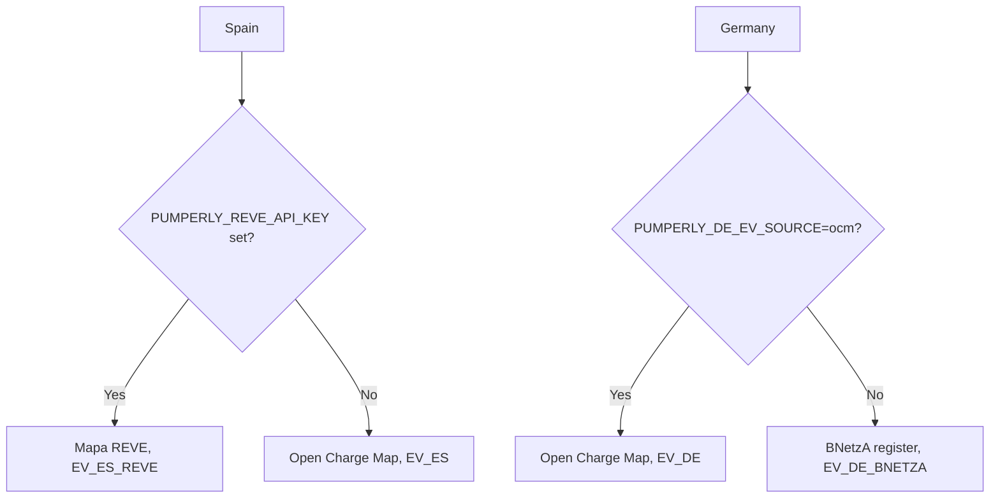
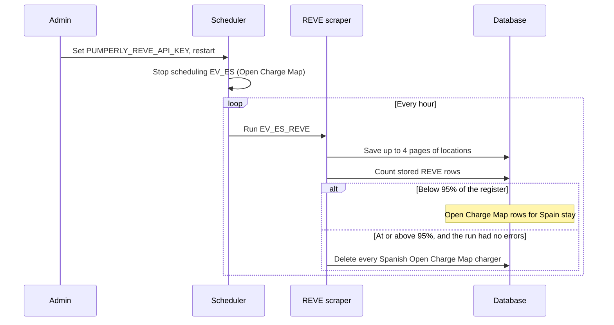

# EV charging sources

This page describes where Pumperly's EV charging locations come from, how each source is read and which settings tune it. EV chargers carry a location, an operator and an address. They carry no price.

## The three sources {#the-three-sources}

| Source | Covers | Key | Every | Licence |
|---|---|---|---|---|
| [Open Charge Map](#open-charge-map) | Every supported country and the United States | `PUMPERLY_OCM_API_KEY` | 24 h | Open Database License (ODbL) |
| [Mapa REVE](#mapa-reve) | Spain | `PUMPERLY_REVE_API_KEY` | 1 h | Non-commercial use, credit Red Eléctrica de España |
| [BNetzA Ladesäulenregister](#bnetza) | Germany | None | 24 h | CC BY 4.0, credit "Bundesnetzagentur.de" |

Open Charge Map is crowdsourced: anyone can add or edit a charger. Mapa REVE and the BNetzA register are official registries that charge point operators must file into, so they are authoritative where Open Charge Map is crowdsourced.

None of the three publishes a per-litre price. Mapa REVE publishes connector tariffs, but they are per kWh and per session, which the price model cannot hold, so they are left out.

## Which source a country uses {#which-source}

Every other country uses Open Charge Map. Spain and Germany each have a second, official source, and each uses exactly one of its two sources at a time. Running both would put two pins on almost every charger, because the sources overlap heavily.



The scheduler and the manual scraper command apply the same rule, from [`spain-ev-source.ts`](https://github.com/GeiserX/Pumperly/blob/main/src/scrapers/spain-ev-source.ts) and [`germany-ev-source.ts`](https://github.com/GeiserX/Pumperly/blob/main/src/scrapers/germany-ev-source.ts). In the scheduler, `PUMPERLY_EV_ENABLED=0` turns off all three sources at once.

!!! warning "Naming a source by hand overrides the rule"
    The manual command `npm run scraper:run -- --country=all` picks one source per country, like the scheduler. Naming a scraper explicitly, such as `--country=EV_ES`, runs it even when the other source is active. One such run puts back every Open Charge Map row the registry had retired. They stay, as duplicates, until the registry's next error-free run deletes them again.

## Open Charge Map {#open-charge-map}

[Open Charge Map](https://openchargemap.org) is a community database of charging locations worldwide. Pumperly runs one scraper per country, keyed `EV_<code>`, for example `EV_FR` or `EV_US`. The code is in [`src/scrapers/ocm.ts`](https://github.com/GeiserX/Pumperly/blob/main/src/scrapers/ocm.ts).

| | |
|---|---|
| Source key | `ocm` |
| Station ids | `ocm-<id>` |
| Every | 24 h |
| API key | `PUMPERLY_OCM_API_KEY`. Free: sign in at openchargemap.org and open **My Profile**, then **My API Keys** |
| Licence | Open Database License (ODbL) |

### What is imported {#ocm-what-is-imported}

Only chargers marked operational are requested. Each one becomes a station with:

- **Brand:** the operator's name.
- **Name:** the location's title, or the operator followed by "Charging" when there is no title.
- **Address:** the first address line and the postcode.
- **Town and province:** as Open Charge Map records them.

### Without an API key {#ocm-without-a-key}

The scrapers still run on schedule. Each one logs `PUMPERLY_OCM_API_KEY not set, skipping` and writes nothing. Because the run returned no stations, the scheduler reports it with one error. German chargers still load from the BNetzA register, which needs no key.

### How a large country is fetched {#ocm-tiling}

Open Charge Map returns at most 5,000 results per request and cuts the rest off without saying so. Small countries fit in one request. Large ones, such as the United States, Germany, the United Kingdom and France, do not.

The first request for a country has no bounding box. When it comes back full, the scraper splits the whole world into four boxes and asks for each one, still filtered by country code. It keeps splitting any box that comes back full. Boxes share edges, so results are merged by their Open Charge Map id.

Open Charge Map also under-reports large boxes: a box wider than about 2 degrees can return far fewer results than it holds. So a box wider than the trusted span is split again whenever it returns anything, even when it is not full.

Splitting stops at any of these limits:

- a box narrower than 0.05 degrees, about 5 km;
- the request budget for the country, 800 requests by default;
- 15 minutes of active request time for the country.

When a limit stops the split, the scraper logs `coverage may be partial` and keeps everything it found.

### Rate limits {#ocm-rate-limits}

All Open Charge Map scrapers share one rate limit on Open Charge Map's side, so they share one queue on Pumperly's side:

- **One request at a time across all countries,** by default. Time spent waiting in this queue does not count against a country's 15-minute budget.
- **A 600 ms pause before each tile request.**
- **HTTP 429 is retried four times.** The scraper waits for the time the `Retry-After` header gives. Without the header it waits 1, 2, 4 and then 8 seconds. It keeps its place in the queue while it waits, which pauses all Open Charge Map traffic until the limit recovers. A fifth 429 fails that country's run, and nothing from it is written.

### Settings {#ocm-settings}

| Variable | Default | Effect |
|---|---|---|
| `PUMPERLY_OCM_API_KEY` | unset | API key. Without it, nothing is fetched. |
| `PUMPERLY_OCM_MAX_CONCURRENCY` | `1` | Open Charge Map requests allowed at once, across all countries. |
| `PUMPERLY_OCM_TILE_DELAY_MS` | `600` | Pause before each tile request, in milliseconds. |
| `PUMPERLY_OCM_MAX_REQUESTS` | `800` | Request budget per country per run. |
| `PUMPERLY_OCM_TRUST_SPAN_DEG` | `2` | Widest box, in degrees, whose result count is trusted without splitting. |

The scrapers read these values once, when the app starts. A value that is not a number, or is out of range, falls back to the default.

!!! note "Chargers removed from Open Charge Map stay on the map"
    The shared scraper pipeline only deletes fuel stations that lost their prices. It never deletes EV chargers. A charger that disappears from Open Charge Map keeps its pin in Pumperly. The only runs that delete Open Charge Map rows are the Spanish and German handovers described below.

## Mapa REVE, Spain {#mapa-reve}

[Mapa REVE](https://www.mapareve.es) is Spain's official register of charging points, run by Red Eléctrica de España (REE). Every Spanish charge point operator files into it. The code is in [`src/scrapers/reve.ts`](https://github.com/GeiserX/Pumperly/blob/main/src/scrapers/reve.ts).

| | |
|---|---|
| Source key | `reve` |
| Scraper key | `EV_ES_REVE` |
| Station ids | `reve-<id>` |
| Every | 1 h |
| API key | `PUMPERLY_REVE_API_KEY`. Free, request it at [mapareve.es/api-contacto](https://www.mapareve.es/api-contacto). Keys expire after about a year |
| Licence | Non-commercial use only. Red Eléctrica de España must be credited, and the data must not be altered or misrepresented |

### The rate limit shapes everything {#reve-rate-limit}

The API allows **5 requests per hour** and returns at most 100 locations per request. The register holds about 14,500 locations across about 146 pages. There is no bulk export. So a complete pass takes about 30 hours at the hard limit, and one run can never fetch the whole register.

The scraper works with that limit. Each hourly run fetches a few pages and saves them, and the register fills in over successive runs. Saving a station that already exists updates it in place, and the pipeline never deletes EV chargers. So each run adds to what the previous runs saved.

| Variable | Default | Effect |
|---|---|---|
| `PUMPERLY_REVE_PAGES_PER_RUN` | `4` | Pages per run, capped at 5. A value below 1 or not a number falls back to 4. The default leaves one request per hour spare for a manual run. |
| `PUMPERLY_REVE_CUTOVER_RATIO` | `0.95` | Share of the register that must be stored before Open Charge Map's Spanish rows are deleted. Must be above 0 and at most 1. |

At the default of 4 pages per run, the first full load takes about 37 hours. At 5 it takes about 30.

### Which pages a run fetches {#reve-page-window}

The scraper stores no cursor. It works out the first page of each run from the clock:

```text
first page = (hours since 1 January 1970 × pages per run) mod total pages
```

A restart, a redeploy or a fresh install therefore carries on from wherever the clock points, with no state to save or lose. After a full pass the window wraps around and starts again, and that is how existing locations get refreshed.

The first run after the app starts does not yet know how many pages exist. It fetches page 1, reads the page count from the response headers, then spends the rest of its budget on the pages the clock points to.

When the API answers HTTP 429, the hourly budget is spent. The API sends no `Retry-After` and the window is a whole hour, so the scraper stops and saves what it has. The next run continues.

!!! warning "Keep REVE hourly"
    `PUMPERLY_SCRAPE_INTERVAL_HOURS` also applies to `EV_ES_REVE`. A global value of `24` means one run per day, which stretches a full pass from days to weeks. To use a global interval and keep REVE hourly, also set `PUMPERLY_SCRAPE_INTERVAL_EV_ES_REVE=1`. A per-scraper setting always wins over the global one.

### What is imported {#reve-what-is-imported}

- **Brand:** the operator's trade name, taken from the `owner` field before ` - `. For example, `Qwello - www.qwello.es` becomes `Qwello`. When `owner` is empty, the legal name in `cpo_name` is used.
- **Name:** REVE does not send one, so the scraper builds it from the brand and the highest connector power at the location, for example `Qwello — 150 kW`. Without a brand it uses `Punto de recarga`.
- **Address:** the street address and the postcode.
- **Province:** converted from the INE province code, spelled the same way as the Spanish fuel data.

### The handover from Open Charge Map {#reve-handover}

REVE and Open Charge Map overlap heavily in Spain: most REVE locations sit within 50 m of an Open Charge Map pin. The switch works like this:



Open Charge Map stops being scraped for Spain at once. Its existing Spanish rows stay while REVE fills in, so the map is never empty of chargers. **Expect two pins for many chargers during that time.** Once the stored REVE rows reach the cutover ratio of the register's total, the next error-free run deletes every Spanish Open Charge Map charger. The check needs the register's total from the API, so it never runs on a guess.

### Renewing the key {#reve-key-renewal}

REVE keys expire about a year after they are issued. Nothing fails loudly when a key lapses. Each run logs an HTTP error, and the Spanish chargers already stored stay on the map but stop being refreshed. Open Charge Map does not come back for Spain, because the key is still set.

The repository carries a scheduled GitHub Actions workflow, [`.github/workflows/reve-key-renewal.yml`](https://github.com/GeiserX/Pumperly/blob/main/.github/workflows/reve-key-renewal.yml), for the project's own key. Once a year, a week before that key expires, it opens an issue titled "Renew the Mapa REVE API key (expires <date>)" with the renewal steps. If such an issue is already open, it adds a comment instead. It can also be run by hand from the Actions tab.

The workflow only tracks the project's own key. If you run your own instance, keep your own reminder. The renewal steps are the same:

1. Request a new key at [mapareve.es/api-contacto](https://www.mapareve.es/api-contacto). State that the use is non-commercial. The key arrives by email with its new expiry date.
2. Set `PUMPERLY_REVE_API_KEY` to the new key and restart the app.
3. Check the key with one request. HTTP `200` means it works. `401` or `403` means it is wrong.

    ```bash
    curl -sS -o /dev/null -w '%{http_code}\n' \
      -H "x-api-key: $NEW_KEY" \
      'https://www.mapareve.es/api/external/v1/locations?limit=1&page=1'
    ```

    This request counts against the hourly limit of 5.

4. In a fork that uses the workflow, update both the `schedule` cron and `KEY_EXPIRY` to a week before the new expiry date.

??? note "The workflow file"

    ```yaml
    --8<-- ".github/workflows/reve-key-renewal.yml"
    ```

## BNetzA Ladesäulenregister, Germany {#bnetza}

The Ladesäulenregister is the German charging point register kept by the Bundesnetzagentur, the federal network agency. Every operator of a publicly accessible charge point must file into it under §5 of the Ladesäulenverordnung, the charging station ordinance. It holds about 74,000 locations. The code is in [`src/scrapers/bnetza.ts`](https://github.com/GeiserX/Pumperly/blob/main/src/scrapers/bnetza.ts).

| | |
|---|---|
| Source key | `bnetza` |
| Scraper key | `EV_DE_BNETZA` |
| Station ids | `bnetza-<latitude>_<longitude>` |
| Every | 24 h |
| API key | None |
| Licence | CC BY 4.0, attribution "Bundesnetzagentur.de" |

The register only lists operators who completed the notification procedure and agreed to publication, so it is not complete. It is still several times larger than Open Charge Map's German coverage.

### Choosing Germany's source {#bnetza-source-choice}

| `PUMPERLY_DE_EV_SOURCE` | Germany's EV source |
|---|---|
| unset, or any value other than `ocm` | BNetzA register |
| `ocm` (any case) | Open Charge Map |

### How the file is read {#bnetza-reading}

The register is one tab-separated file of about 19 MB, regenerated daily. Each run downloads the whole file, with a 5-minute deadline.

- **Columns are found by header name,** not position. If a column the scraper needs is missing or renamed, the run fails without writing anything.
- **Only operational rows are kept.** These are rows whose `Status` is `1`.
- **Coordinates must be plain decimal numbers,** and they must fall inside a padded bounding box around Germany. Anything else is skipped and counted.
- **Rows are merged per location.** The register has one row per charging device, so one car park can be five identical rows. The scraper merges rows whose coordinates match to 5 decimal places, about 1.1 m. The station id is built from those same rounded coordinates.
- **The brand is the operator.** The name joins the operator, the address supplement (`Adresszusatz`) and the street.

Each run logs how many rows it read, merged and skipped:

```text
[bnetza] DE: <rows> rows → <stations> stations (merged <n>, skipped <n> not operational, <n> out of bounds, <n> malformed)
```

### Cleanup after each run {#bnetza-cleanup}

The file arrives complete in one run, so Germany needs no backfill period. After a run with no errors, the scraper counts the BNetzA stations that run refreshed. If the count reaches the safety floor, it makes two deletions:

1. **BNetzA stations the run did not refresh.** These left the register, or their operator corrected the coordinates, which changes the id.
2. **Every German Open Charge Map charger.** Once BNetzA has landed, those rows are duplicates.

| Variable | Default | Effect |
|---|---|---|
| `PUMPERLY_BNETZA_MIN_STATIONS` | `10000` | Stations a run must refresh before either deletion runs. A value below 1 or not a number falls back to the default. |

The floor counts only rows this run wrote, not rows already in the database. A broken download that refreshes a handful of stations can therefore never delete the rest, and never retires Open Charge Map on its strength.

## Switching a source back {#switching-back}

The handovers only run in one direction. Registry runs delete Open Charge Map rows, but nothing deletes registry rows once their scraper stops running. If you switch Spain or Germany back to Open Charge Map, the registry's pins stay, and Open Charge Map adds its own next to them.

To clear the old registry rows after switching back, delete them in `psql` against the Pumperly database:

=== "Spain, after removing the REVE key"

    ```sql
    DELETE FROM stations
    WHERE country = 'ES'
      AND station_type = 'ev_charger'
      AND external_id LIKE 'reve-%';
    ```

=== "Germany, after setting PUMPERLY_DE_EV_SOURCE=ocm"

    ```sql
    DELETE FROM stations
    WHERE country = 'DE'
      AND station_type = 'ev_charger'
      AND external_id LIKE 'bnetza-%';
    ```

EV chargers have no price rows, so nothing else needs deleting. [Backing up the database](../operations/backup-and-restore.md) explains how to take a backup first.
