# How scrapers work

This page explains how Pumperly turns a public price feed into rows on the map. It covers the contract every scraper follows, what one run writes to the database, the guards that stop a bad run from deleting good data, and how the scheduler decides when each scraper runs.

A **scraper** is one TypeScript class that reads one upstream source for one country. There is one per fuel source, plus the EV charger scrapers. They all live in [`src/scrapers/`](https://github.com/GeiserX/Pumperly/tree/main/src/scrapers) and all extend one base class, `BaseScraper`, in [`src/scrapers/base.ts`](https://github.com/GeiserX/Pumperly/blob/main/src/scrapers/base.ts).

## The contract

A scraper declares two names and implements one method. The base class does everything else.

| Member | What it is | Example |
| --- | --- | --- |
| `country` | ISO 3166-1 alpha-2 code of the country the rows belong to. | `"SE"` |
| `source` | A short, stable name for the upstream source. It is stored on every price row the scraper writes. | `"bensinpriser"` |
| `fetch()` | Downloads the upstream data and returns it as plain lists: `{ stations, prices }`. It never touches the database. | |

`fetch()` returns two arrays of normalised records:

| Record | Fields |
| --- | --- |
| `RawStation` | `externalId`, `name`, `brand` (or `null`), `address`, `city`, `province` (or `null`), `latitude`, `longitude`, `stationType` (`"fuel"`, `"ev_charger"` or `"both"`) |
| `RawFuelPrice` | `stationExternalId` (matches a station's `externalId` in the same result), `fuelType` (one of the [fuel type codes](../reference/fuel-types.md)), `price` (per litre, in local currency), `currency` (ISO 4217) |

The `externalId` is the source's own id for the station, usually with a short prefix such as `ocm-` or `se-bp-`. Together with `country` it identifies a station across runs. [Data model](../reference/data-model.md) explains both columns in full.

EV charger scrapers return stations with `stationType: "ev_charger"` and an empty price list.

`fetch()` should throw when the upstream answers with an HTTP error or with data of the wrong shape. The base class turns the throw into a failed run that changes nothing. A single malformed row is different: skip it and keep going, so one bad record cannot cost the whole country a run.

## One run, step by step

`BaseScraper.run()` is the pipeline every scraper shares. It opens its own database connection, runs these steps, and always disconnects at the end.

```mermaid
sequenceDiagram
    participant S as Scheduler
    participant R as BaseScraper.run()
    participant F as fetch()
    participant U as Upstream source
    participant DB as PostGIS

    S->>R: run()
    R->>F: fetch()
    F->>U: HTTP request(s)
    U-->>F: response
    F-->>R: stations and prices
    R->>R: Drop prices outside the currency's band
    R->>R: Drop fuel stations left with no valid price
    alt No stations left
        R-->>S: Error "Aborted destructive replace", nothing written
    else At least one station
        loop Every 500 stations
            R->>DB: INSERT ... ON CONFLICT (external_id, country) DO UPDATE
        end
        R->>DB: Look up station ids for this country
        R->>DB: One transaction: delete this source's prices, insert the new ones
        alt Every station batch succeeded
            R->>DB: Delete this country's fuel stations that have no price at all
        else A station batch failed
            R->>R: Skip the cleanup and record an error
        end
        R-->>S: Result with counts and errors
    end
```



### 1. Filter prices

Every price must be greater than zero. It must also fall inside a plausible range for its currency, called a **price band**. A price outside the band is dropped. This catches placeholder values such as `9.999` and prices in the wrong unit, such as cents where the scraper expected whole units.

Which band applies depends on the fuel and the currency:

| Case | Accepted range |
| --- | --- |
| `H2`, `CNG`, `LNG` and `ADBLUE`, any currency | At least 0.05 and below 100 |
| `EUR`, `GBP` and `CHF` | From `PUMPERLY_PRICE_MIN` to `PUMPERLY_PRICE_MAX`. The defaults are 0.30 and 4.00. |
| Any other currency with a band | The band for that currency (table below) |
| A currency with no band | 0.1 to 100,000 |

The per-currency bands live in the `PRICE_BANDS` table in [`base.ts`](https://github.com/GeiserX/Pumperly/blob/main/src/scrapers/base.ts). At the time of writing they are:

| Currency | Min | Max | Currency | Min | Max |
| --- | --- | --- | --- | --- | --- |
| HUF | 200 | 2000 | SEK | 6 | 60 |
| RON | 3 | 30 | ISK | 100 | 700 |
| RSD | 60 | 600 | TWD | 15 | 80 |
| TRY | 10 | 400 | NOK | 7 | 70 |
| PLN | 2 | 20 | DKK | 6 | 60 |
| CZK | 10 | 150 | MXN | 8 | 100 |
| BGN | 1 | 10 | ARS | 200 | 20000 |
| MKD | 30 | 300 | AUD | 0.5 | 5.0 |
| BAM | 1 | 10 | MDL | 10 | 100 |

The table also holds bands for EUR, GBP and CHF, but a run uses the two environment variables for those three currencies instead. If `PUMPERLY_PRICE_MIN` or `PUMPERLY_PRICE_MAX` is not a number, the default is used, so a typo cannot switch the check off.

After the price filter, a station of type `fuel` with no valid price left is dropped from this run. EV chargers are kept even though they carry no prices.

### 2. The empty-fetch guard

If no station is left after filtering, the run stops here. It records the error `Aborted destructive replace: fetch returned 0 stations / N valid prices` and writes nothing.

This guard exists because an upstream can answer `HTTP 200` with an empty or broken body that still parses. Without the guard, the next step would delete every price the source had and put nothing back, and the cleanup after it would then delete the country's stations.

### 3. Upsert stations

The run writes stations in batches of 500. Each batch is one `INSERT ... ON CONFLICT (external_id, country) DO UPDATE` statement. A new station is inserted. A known station gets its name, brand, address, city, province, type and position overwritten, and `updated_at` set to now. The position is stored as a PostGIS point built with `ST_SetSRID(ST_MakePoint(longitude, latitude), 4326)`.

A batch that fails is recorded as an error (`Station batch 500-1000: ...`) and the run moves on to the next batch. The failed batch matters again in step 5.

!!! warning "Duplicate ids in one fetch break a whole batch"
    PostgreSQL rejects an `INSERT ... ON CONFLICT DO UPDATE` that hits the same row twice in one statement. If `fetch()` returns two stations with the same `externalId` and they land in the same batch, every station in that batch (up to 500) is lost for the run, and the orphan cleanup is skipped. De-duplicate by id inside `fetch()`.

### 4. Replace this source's prices

The run looks up the database id of every station in the country, then maps each price to its station by `externalId`. A price whose station is not in the database is skipped.

Then one transaction replaces the prices:

1. Delete every price row whose `source` is this scraper's source and whose station is in this scraper's country.
2. Insert the new prices in batches of 2,000. Each row gets `reported_at` set to the current time.

Because it is a single transaction, readers see either the old set or the new set, never a mix. The transaction may run for up to 120 seconds. If it fails, it rolls back and the old prices stay.

The delete is scoped by country as well as by source. That matters where one source name serves several countries. The Netherlands, Belgium and Luxembourg scrapers all use the source `anwb`, and none of them can delete the others' prices.

The delete touches only this scraper's own source. This run never touches prices written under any other source name. That is what makes it safe for two sources to cover one country, as in Australia. It is also why a retired source needs its own cleanup, described in [Handing a country over to a new source](#handing-a-country-over-to-a-new-source).

### 5. Clean up orphaned stations

A fuel station with no price left from any source is an **orphan**. The last step deletes the country's orphans:

```sql
DELETE FROM stations
WHERE country = $1
  AND station_type = 'fuel'
  AND NOT EXISTS (SELECT 1 FROM fuel_prices fp WHERE fp.station_id = stations.id)
```

This is how a station disappears from the map when its source stops listing it. Step 4 removes its old prices, no new ones arrive, and step 5 removes the station.

The cleanup runs only when every station batch in step 3 succeeded. If a batch failed, the stations in it may not have been written this run, and their prices were already replaced in step 4. Deleting orphans then could remove stations that are only missing because of the failure. So the run records `Skipped orphan cleanup: one or more station batches failed` and leaves them alone.

!!! note "EV chargers are never cleaned up by the base class"
    The cleanup only deletes rows with `station_type = 'fuel'`. An EV charger that its source stops listing stays in the table. A scraper that needs to remove EV rows does it in its own `run()` override, as the Mapa REVE and BNetzA scrapers do. See [EV charging sources](ev-sources.md).

### The result

`run()` returns a `ScraperResult`:

| Field | Meaning |
| --- | --- |
| `country`, `source` | The scraper's two names. |
| `stationsUpserted` | Stations sent in batches that succeeded. |
| `pricesUpserted` | Price rows inserted. |
| `durationMs` | Wall time of the whole run. |
| `errors` | Every problem the run recorded. An empty list means a clean run. |

### What a failure leaves behind

| What went wrong | What the database looks like afterwards | Error recorded |
| --- | --- | --- |
| `fetch()` threw: HTTP error, timeout, unexpected shape | Unchanged. The last good prices stay. | `Fatal: <message>` |
| `fetch()` returned nothing usable | Unchanged. | `Aborted destructive replace: ...` |
| A station batch failed | Other batches written. Prices replaced for stations the database knows. No orphan cleanup. | `Station batch ...` and `Skipped orphan cleanup: ...` |
| The price transaction failed | Stations updated. Prices rolled back to the previous set. No orphan cleanup. | `Fatal: <message>` |

When a source is down or blocks Pumperly, its prices therefore stay at their last good values rather than vanishing. `reported_at` records when Pumperly wrote each price, so the statistics menu, which shows the newest `reported_at` per country, makes a stalled country visible. [Coverage and status](coverage.md) lists the sources that are currently down.

## The scheduler

Scrapers run inside the web app. There is no separate worker. Next.js calls `register()` in [`src/instrumentation.ts`](https://github.com/GeiserX/Pumperly/blob/main/src/instrumentation.ts) once when the server starts. In the Node.js runtime it loads [`src/instrumentation-node.ts`](https://github.com/GeiserX/Pumperly/blob/main/src/instrumentation-node.ts) and calls `registerNode()`, which builds the list of scrapers to run and starts a timer for each. Keeping the scheduler in its own module keeps the scrapers out of the Edge bundle.

### Scraper keys

Every scraper has a **key** in the scheduler. The key is what you use in environment variables.

| Key form | What runs | Example |
| --- | --- | --- |
| `XX` | The fuel price scraper for country `XX` | `SE` |
| `XX_NAME` | A second fuel scraper for the same country | `AU_NSW` (New South Wales, next to `AU` for Western Australia) |
| `EV_XX` | The OpenChargeMap EV scraper for country `XX` | `EV_SE` |
| `EV_XX_NAME` | An official EV registry that replaces OpenChargeMap for `XX` | `EV_ES_REVE`, `EV_DE_BNETZA` |
| `STATIC_NAME` | A committed community dataset (see [`src/scrapers/data/README.md`](https://github.com/GeiserX/Pumperly/blob/main/src/scrapers/data/README.md)) | none ship today |

### Which scrapers run

1. If `PUMPERLY_SCRAPE_INTERVAL_HOURS=0`, nothing runs. The log says `automatic scraping disabled`.
2. If `PUMPERLY_ENABLED_COUNTRIES` is unset, every key is selected.
3. If it is set, only the keys it lists are selected. For each listed code that is not itself an `EV_` key, `EV_<code>` is added when such a key exists. So `SE` selects `SE` and `EV_SE`, and `US` selects `EV_US` alone, because the United States has EV coverage only.
4. `PUMPERLY_EV_ENABLED=0` removes every `EV_` key.
5. Spain and Germany each keep exactly one EV source. Spain runs `EV_ES_REVE` when `PUMPERLY_REVE_API_KEY` is set and `EV_ES` otherwise. Germany runs `EV_DE_BNETZA` unless `PUMPERLY_DE_EV_SOURCE=ocm`. Running both would put two pins on most chargers.

!!! note "A second scraper for a country needs its own key"
    Listing `AU` in `PUMPERLY_ENABLED_COUNTRIES` selects `AU` and `EV_AU`, not `AU_NSW`. List `AU_NSW` too if you set the variable and want New South Wales.

### How often each one runs

Each key's interval, in hours, comes from the first of these that is set:

1. `PUMPERLY_SCRAPE_INTERVAL_<KEY>`, for example `PUMPERLY_SCRAPE_INTERVAL_FR=0.5` or `PUMPERLY_SCRAPE_INTERVAL_EV_ES_REVE=2`.
2. `PUMPERLY_SCRAPE_INTERVAL_HOURS`, when it is greater than zero. It then applies to every key, EV keys included.
3. The key's default in `DEFAULT_INTERVALS` in `instrumentation-node.ts`.
4. 12 hours.

An interval of zero or less disables that one key. Fuel sources default to between 1 and 12 hours, depending on how often the upstream changes. OpenChargeMap keys default to 24 hours. `EV_ES_REVE` defaults to 1 hour because the Mapa REVE API allows only a few requests per hour, so the scraper fetches a few pages each hour. [Countries and scrape schedule](../configuration/countries-and-schedule.md) lists every default.

### Start-up and overlap

Scrapers do not all start at once. The first run of each key waits 10 seconds, plus 5 seconds for each key before it in the list. With every key selected, the last one starts several minutes after boot. After its first run, each key repeats on its own interval.

If a run is still going when the next tick arrives, that tick is skipped with the log line `previous run still in progress — skipping this tick`. The next tick tries again. This guard lives in memory, per key, inside one process.

!!! warning "Run one replica"
    Every app process runs its own scheduler. Two replicas scrape every country twice, and their runs can overlap on the same rows. The Helm chart defaults to one replica and the `Recreate` update strategy for this reason. See [Run on Kubernetes with Helm](../getting-started/kubernetes.md).

### Log lines

Each key logs its schedule at start-up and one summary line per run. The scraper itself logs under its source name.

```text
[scraper] SE: scraping every 12h
[bensinpriser] Fetching data for SE ...
[bensinpriser] Fetched 1350 stations, 3400 price rows (dropped 150 with no prices)
[bensinpriser] Upserted 1200 stations
[bensinpriser] Inserted 3400 prices
[scraper] SE: OK — 1200 stations, 3400 prices in 4.2s
```

The numbers above are examples. A run with problems ends in `N error(s)` instead of `OK`. A fatal error, an aborted replace and a skipped cleanup are also logged under the source name. A failed station batch is not logged on its own: it shows only in that count and in the result's `errors`.

## Running a scraper by hand

The command-line runner in [`src/scrapers/cli.ts`](https://github.com/GeiserX/Pumperly/blob/main/src/scrapers/cli.ts) runs scrapers once against the database in `DATABASE_URL`, then exits:

```bash
npm run scraper:run -- --country=SE
npm run scraper:run -- --country=SE,EV_SE
npm run scraper:run -- --country=all
```

It differs from the scheduler in a few ways:

- It runs the chosen scrapers one after another, never in parallel.
- `AU` runs both Australian fuel scrapers, Western Australia and New South Wales.
- `--country=all` applies the same Spain and Germany EV rule as the scheduler. Naming `EV_ES` or `EV_DE` explicitly runs it anyway.
- It ignores `PUMPERLY_ENABLED_COUNTRIES` and the interval variables.
- It does not run `STATIC_` datasets.
- It prints a summary per scraper and exits with status 1 if any scraper recorded an error.

[Run from source](../development.md#run-from-source) shows how to point it at a local database.

## Handing a country over to a new source

Sometimes a country's source dies and a new one replaces it. The new scraper gets a new `source` name and new `externalId`s, because they are different data. That creates a problem: `run()` only replaces prices of its own source. The dead source's prices are never refreshed and never deleted. Its stations keep their frozen prices, so the orphan cleanup never removes them either. The map would show the same forecourt twice, once with a current price and once with a stale one.

The Swedish scraper, [`src/scrapers/sweden.ts`](https://github.com/GeiserX/Pumperly/blob/main/src/scrapers/sweden.ts), shows the pattern that fixes this. It overrides `run()`:

```ts
async run(): Promise<ScraperResult> {
  const result = await super.run();
  if (result.errors.length > 0 || result.stationsUpserted < MIN_STATIONS) return result;
  // ...delete the retired sources' prices for SE, then SE fuel stations left with no price
}
```

1. It runs the normal pipeline first, so the new source's stations and prices are written.
2. It retires the old data only after a full, error-free run. Any recorded error skips the handover for this run.
3. It also requires at least `MIN_STATIONS` (200) stations written. A degraded feed that returns a handful of rows cannot retire a whole country.
4. It deletes the prices of the retired sources, listed by name in `RETIRED_SOURCES`, for Sweden only.
5. If that deleted anything, it deletes the Swedish fuel stations left with no price. These are the old source's stations.
6. A failure in this cleanup is added to the run's errors as `Cleanup: <message>`. It does not undo the new data.

After the first successful handover the retired sources have no rows left, so later runs delete nothing. The step is safe to leave in place.

The two EV registries use variations of the same idea, because EV rows are never removed by the base class:

| Scraper | Retires | Condition |
| --- | --- | --- |
| Sweden, `bensinpriser` | Prices of the retired sources, then Swedish fuel stations left without a price | Error-free run and at least 200 stations |
| Mapa REVE, `EV_ES_REVE` | Spanish OpenChargeMap chargers (`ocm-` ids) | Error-free run and the local REVE rows reach a share of the registry, 95% by default (`PUMPERLY_REVE_CUTOVER_RATIO`) |
| BNetzA, `EV_DE_BNETZA` | German OpenChargeMap chargers, and its own chargers that left the register | Error-free run and at least `PUMPERLY_BNETZA_MIN_STATIONS` rows (default 10,000) refreshed by this run |

[EV charging sources](ev-sources.md) describes the two EV handovers in detail. [Adding a country](adding-a-country.md) covers when a new scraper needs this pattern.
