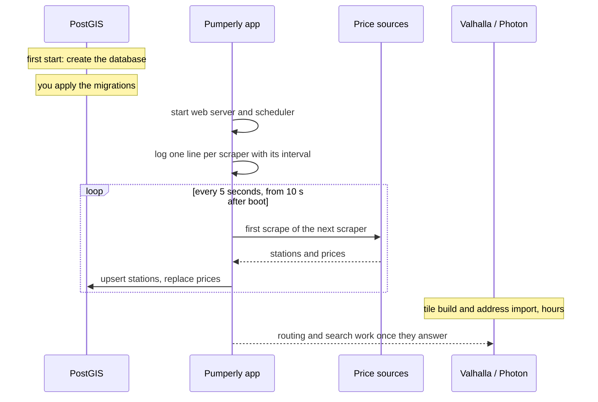

# What happens on first start

This page follows a new install from the first `docker compose up` to a map full of prices. It explains each log line the app prints, and how to check that the scrapes worked.

## The short version

1. PostGIS creates its data directory, user and database.
2. The schema is applied: by the `migrate` service of the shipped compose file, before the app starts, or by you on other setups. The app never creates tables itself. See [step 4 of Run with Docker Compose](docker-compose.md#4-create-the-database-schema).
3. The app starts its web server on port 3000 and its scheduler in the same process.
4. The scheduler starts each enabled scraper in turn, 5 seconds apart, beginning 10 seconds after boot.
5. As each first scrape finishes, that country's stations appear on the map.
6. Valhalla and Photon, if you run them, build their data in their own containers. That takes hours. The app does not wait for them.



## The database

The `postgis/postgis` image initialises its volume on the first start only. It creates the `pumperly` user and database from `POSTGRES_USER`, `POSTGRES_PASSWORD` and `POSTGRES_DB`. Later starts reuse the volume and ignore those variables.

The app runs `node server.js` and does not run migrations. The tables come from the SQL files under [`prisma/migrations`](https://github.com/GeiserX/Pumperly/tree/main/prisma/migrations), which the image carries together with `migrate.mjs`, the script that applies them. The shipped compose file runs that script as its `migrate` service before the app starts; on other setups you run it yourself. [Run with Docker Compose](docker-compose.md#4-create-the-database-schema) shows how.

!!! tip "Create the schema before the app's first start"
    The shipped compose file already does. On other setups, if the app starts first, every first scrape fails with `relation "stations" does not exist`. A failed scraper waits for its next interval before it tries again, which is 12 hours for many countries. Once the schema exists, restart the app to scrape straight away.

## The scheduler

The scheduler lives in [`src/instrumentation-node.ts`](https://github.com/GeiserX/Pumperly/blob/main/src/instrumentation-node.ts), loaded by [`src/instrumentation.ts`](https://github.com/GeiserX/Pumperly/blob/main/src/instrumentation.ts). Next.js runs it once, when the server process starts. It gives each scraper its own timer inside the app process. Nothing runs outside the app.

### Which scrapers run

The scheduler builds its list from four settings:

| Setting | Effect |
|---|---|
| `PUMPERLY_SCRAPE_INTERVAL_HOURS=0` | Turns every scraper off. The app logs `[scraper] PUMPERLY_SCRAPE_INTERVAL_HOURS=0 — automatic scraping disabled` and serves what is already in the database. |
| `PUMPERLY_ENABLED_COUNTRIES` | The fuel scrapers to run, as country codes. When it is unset, every scraper runs. |
| `PUMPERLY_EV_ENABLED` | Unless it is `0`, each listed country also gets its EV charger scraper. `US` has EV chargers only. |
| `PUMPERLY_REVE_API_KEY`, `PUMPERLY_DE_EV_SOURCE` | Pick the EV source for Spain and Germany. Each country runs one EV source, never two. |

When the Spanish or German EV source is an official registry, the app logs it at start:

```text
[scraper] Spain EV: using Mapa REVE (official registry) instead of OpenChargeMap
[scraper] Germany EV: using the BNetzA Ladesäulenregister instead of OpenChargeMap
```

Each line appears only when that country's EV scraper is enabled. The Spanish line also needs `PUMPERLY_REVE_API_KEY` to be set. The German line appears unless `PUMPERLY_DE_EV_SOURCE=ocm`. See [EV charging sources](../data/ev-sources.md).

!!! note "Australia is two scrapers"
    `AU` runs the Western Australia source. New South Wales is a separate scraper, `AU_NSW`. List it too if you set `PUMPERLY_ENABLED_COUNTRIES`, for example `AU,AU_NSW`. It needs `NSW_FUEL_API_KEY` and `NSW_FUEL_API_SECRET`. See [Countries and scrape schedule](../configuration/countries-and-schedule.md).

### How often each one runs

Each scraper gets an interval in hours. The first match wins:

1. `PUMPERLY_SCRAPE_INTERVAL_<CODE>`, for example `PUMPERLY_SCRAPE_INTERVAL_FR=0.5`. A value of 0 or less turns that scraper off.
2. `PUMPERLY_SCRAPE_INTERVAL_HOURS`, when it is above 0.
3. The built-in default for that scraper. Most fuel sources run every 12 hours, some every 1 to 6 hours. Open Charge Map runs daily. A scraper with no default runs every 12 hours.

The app logs the result for each scraper:

```text
[scraper] ES: scraping every 12h
[scraper] FR: scraping every 1h
[scraper] EV_FR: scraping every 24h
```

The full table of defaults is in [Countries and scrape schedule](../configuration/countries-and-schedule.md).

### The staggered first runs

The first runs do not all start at once. Scraper number *n* in the list, counting from 0, starts at 10 seconds plus 5 × *n* seconds after boot. This keeps the database from taking every first write at the same moment.

With `PUMPERLY_ENABLED_COUNTRIES=ES,FR`, the list and its start times are:

| Scraper | First run after boot |
|---|---|
| `ES` | 10 s |
| `FR` | 15 s |
| `EV_FR` | 20 s |
| `EV_ES` | 25 s |

The fuel scrapers come first, in the order you listed them. Their EV scrapers follow. Spain's and Germany's EV scrapers always move to the end of the list.

With `PUMPERLY_ENABLED_COUNTRIES` unset, the list holds every scraper, so the last first run starts several minutes after boot.

After its first run, each scraper repeats on its interval. If a run is still going when the next one is due, the scheduler skips that tick and logs `previous run still in progress — skipping this tick`.

## A scrape, line by line

Each scrape downloads the source, checks the data and writes it. A healthy Spanish run logs lines like these, with real counts in place of `N`:

```text
[miteco] Fetching data for ES ...
[miteco] Fetched N stations, N price rows
[miteco] Upserted N stations
[miteco] Inserted N prices
[scraper] ES: OK — N stations, N prices in N.Ns
```

The name in the first brackets is the source, not the country. The last line is the scheduler's summary. `OK` means no errors; otherwise it shows the error count, such as `1 error(s)`.

Between those lines the scraper:

- drops prices outside the plausible range for their currency, and logs `Filtered out N invalid prices`;
- drops fuel stations left with no price;
- aborts without touching the database if the source returned no stations at all, so an empty answer never wipes a country;
- replaces the source's prices for that country in one transaction, so the map never shows half an update;
- deletes fuel stations that no longer have any price.

[How scrapers work](../data/how-scrapers-work.md) covers each step.

## Errors you can expect

Some errors on a first start are normal:

| Log line | Meaning |
|---|---|
| `[ocm] PUMPERLY_OCM_API_KEY not set, skipping`, then `Aborted destructive replace: fetch returned 0 stations / 0 valid prices` | No Open Charge Map key. Every `EV_` scraper that uses it reports one error per run and writes nothing. Set the key, or set `PUMPERLY_EV_ENABLED=0`. |
| `[tankerkoenig] Fatal error: TANKERKOENIG_API_KEY env var required. Register at https://onboarding.tankerkoenig.de` | Germany's fuel prices need a key. See [API keys](../configuration/api-keys.md). |
| Errors from a country listed as paused or blocked | Some sources refuse automated access or are offline. [Coverage and status](../data/coverage.md) lists them. |
| `relation "stations" does not exist` | The schema is missing. Apply it, then restart the app. |

Any other error repeating on every run belongs in [Monitoring and troubleshooting](../operations/troubleshooting.md).

## Valhalla and Photon

Routing and address search run in their own containers, and their first start is slow:

- Valhalla downloads OpenStreetMap extracts and builds routing tiles from them. Tiles are kept on its volume, so later starts only load them.
- Photon downloads address data and imports it into its own search index, also kept on its volume.

Both take hours on a first start, more for more countries. The app starts without waiting. Until Valhalla answers, route requests fail with status 502. Until Photon answers, the search box shows no results. The map and its prices work the whole time.

[Routing with Valhalla](../configuration/routing-valhalla.md) and [Geocoding with Photon](../configuration/geocoding-photon.md) cover setup, timings and the traps on the way.

## Check that it works

### The app is up

```bash
curl -s http://localhost:3000/api/config
```

This returns the default country, the default fuel and the enabled countries as JSON. It does not touch the database, so it answers even when the schema is missing. The Helm chart uses it as its health probe.

### The database has data

```bash
curl -s http://localhost:3000/api/stats
```

This returns, per country, the number of stations and prices and the time of the newest price, plus totals. A country appears once its first scrape has written stations. A response of `{"error":"Internal server error"}` with status 500 means the query failed: check `DATABASE_URL` and the schema. The app marks the response cacheable for 5 minutes, and allows a stale copy for 10 more while it refreshes. A caching proxy in front of the app may therefore show numbers a few minutes old.

In the browser, the **Stats** button in the top bar shows the same numbers. The button is hidden on narrow screens.

You can also ask PostGIS directly:

```bash
docker compose -f docker/docker-compose.yml exec db \
  psql -U pumperly -d pumperly \
  -c 'SELECT country, count(*) FROM stations GROUP BY country ORDER BY 2 DESC;'
```

### The map shows stations

Open the map and pan to a country whose first scrape finished. Stations load for the area on screen. If `/api/stats` lists the country but the map stays empty there, check the selected fuel type: the map shows stations that sell the fuel you picked.

## Later starts

A restart repeats only the scheduler part. The database, Valhalla's tiles and Photon's index stay on their volumes. Every enabled scraper runs again 10 seconds or more after boot, on the same staggered timetable, whatever its interval. Frequent restarts therefore mean frequent scrapes.
