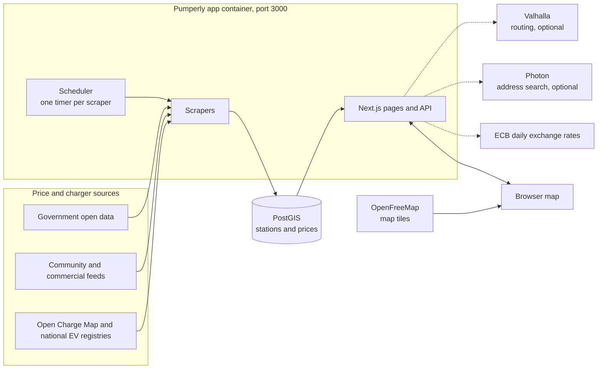

---
hide:
  - navigation
---

# Pumperly { .pumperly-visually-hidden }

  

  
  
  
  
  

---

**Pumperly** is an open-source map of fuel prices and EV charging stations, with a route planner on top. You pick a start and a destination. Pumperly draws the route and lists the stations along it, with each station's price and the extra minutes a stop would cost you. You can use it at [pumperly.com](https://pumperly.com) or run your own copy.

Prices come from official, community and commercial sources, with at least one scraper per country. A scraper is a small job inside the app that downloads a source's data on a schedule and stores it in a PostGIS database. PostGIS is PostgreSQL with map and distance functions. Routing uses [Valhalla](https://github.com/valhalla/valhalla) and address search uses [Photon](https://github.com/komoot/photon). Both are optional: without them, the map and its prices still work.

-   :material-docker: **[Run with Docker Compose](getting-started/docker-compose.md)**

    ---

    Start PostGIS and the app with Docker, create the database schema and open the map.

-   :material-map-marker-radius: **[The map](using/map.md)**

    ---

    Find the cheapest station near you, switch fuel type and currency, and read a station's prices.

-   :material-earth: **[Coverage and status](data/coverage.md)**

    ---

    Which countries have prices, where they come from, and which sources are paused.

-   :material-format-list-bulleted: **[Environment variables](reference/environment-variables.md)**

    ---

    Every setting, its default and what it changes.

## The map

Each dot is a station, coloured by its price for the fuel you picked. The scale runs from green for the cheapest through yellow and red to purple for the most expensive. See [The map](using/map.md).

Plan a route and the side panel lists the stations along it. The detour slider hides stations that would cost more than the minutes you allow. See [Planning a route](using/routes.md).

## What it does

- Shows fuel stations with their latest prices, for the fuel type you choose. The colour scale is set from the stations currently loaded, between their 5th and 95th percentile price, so green means cheap for the area you are looking at.
- Shows EV charging stations. Spain and Germany can use their official national registries. Every other country uses [Open Charge Map](https://openchargemap.org). See [EV charging sources](data/ev-sources.md).
- Plans a route from A to B, with stops and alternative routes, when Valhalla is configured. See [Routing with Valhalla](configuration/routing-valhalla.md).
- Lists the stations along the route with the detour each one adds, so you can pick the cheapest stop within the minutes you allow.
- Searches addresses and places as you type, when Photon is configured. See [Geocoding with Photon](configuration/geocoding-photon.md).
- Converts prices into the currency you choose, using the European Central Bank's daily reference rates. A few currencies the ECB does not publish use a fixed approximate rate. See [Currencies and exchange rates](reference/currencies.md).
- Speaks 17 languages. The address bar carries the language, for example `/en` or `/de`.
- Makes routes and stations shareable as a link. See [Share links and deep links](using/links.md).
- Answers a small [HTTP API](reference/api.md) for stations, routes and statistics.

## How it runs

- The app is one Next.js process. It serves the map, answers the API and runs every scraper on its own timer. See [How scrapers work](data/how-scrapers-work.md).
- The image is `drumsergio/pumperly` on Docker Hub, for linux/amd64 and linux/arm64. It listens on port 3000 and runs as user id 1001.
- Scrapers write to PostGIS. The API reads from it: stations in the map view, stations along a route, and statistics.
- The app calls Valhalla for routes and Photon for address search. When `VALHALLA_URL` or `PHOTON_URL` is not set, that feature is off and the rest keeps working.
- The browser loads the map tiles straight from [OpenFreeMap](https://openfreemap.org), which draws [OpenStreetMap](https://www.openstreetmap.org) data.
- Because scrapers run inside the web process, run one copy of the app per database. Two copies would scrape every source twice.

## Getting help

- New here? Start with [Run with Docker Compose](getting-started/docker-compose.md), then read [What happens on first start](getting-started/first-start.md).
- If something is broken, read [Monitoring and troubleshooting](operations/troubleshooting.md), then open an [issue on GitHub](https://github.com/GeiserX/Pumperly/issues).
- To report a security problem, follow the [security policy](https://github.com/GeiserX/Pumperly/blob/main/SECURITY.md) and do not open a public issue.
- The [Glossary](reference/glossary.md) explains the terms these pages use.
- Separate projects connect Pumperly to Home Assistant, to AI assistants over MCP and to n8n. See [Related projects](related.md).
- To add a country or send a fix, read [Adding a country](data/adding-a-country.md) and [Development](development.md).

## All pages

- [Features at a glance](features.md)
- Get started: [Run with Docker Compose](getting-started/docker-compose.md) · [What happens on first start](getting-started/first-start.md) · [Full stack with routing and geocoding](getting-started/full-stack.md) · [Run on Kubernetes with Helm](getting-started/kubernetes.md)
- Using Pumperly: [The map](using/map.md) · [Planning a route](using/routes.md) · [EV charging](using/ev-charging.md) · [Share links and deep links](using/links.md)
- Data sources: [Coverage and status](data/coverage.md) · [Sources at a glance](data/sources-at-a-glance.md) · [Fuel price sources](data/fuel-sources.md) · [EV charging sources](data/ev-sources.md) · [How scrapers work](data/how-scrapers-work.md) · [Adding a country](data/adding-a-country.md)
- Configuration: [Countries and scrape schedule](configuration/countries-and-schedule.md) · [Routing with Valhalla](configuration/routing-valhalla.md) · [Geocoding with Photon](configuration/geocoding-photon.md) · [API keys](configuration/api-keys.md)
- Operations: [Upgrading](operations/upgrading.md) · [Backing up the database](operations/backup-and-restore.md) · [Monitoring and troubleshooting](operations/troubleshooting.md)
- Reference: [Environment variables](reference/environment-variables.md) · [HTTP API](reference/api.md) · [Data model](reference/data-model.md) · [Fuel types](reference/fuel-types.md) · [Currencies and exchange rates](reference/currencies.md) · [Glossary](reference/glossary.md)
- [Related projects](related.md) · [Roadmap](roadmap.md) · [Development](development.md)

## License

Pumperly is released under the [AGPL-3.0-or-later](https://github.com/GeiserX/Pumperly/blob/main/LICENSE) license. Price and charger data keep the licence of their source. [Fuel price sources](data/fuel-sources.md) and [EV charging sources](data/ev-sources.md) list them. Some sources allow only non-commercial use, and most require credit. If you run a public instance, read [Data licences on a public instance](getting-started/docker-compose.md#data-licences-on-a-public-instance) first.
