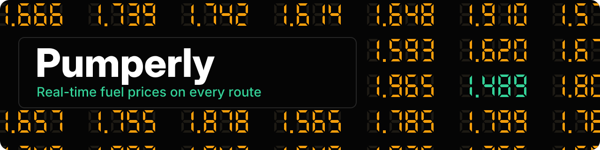
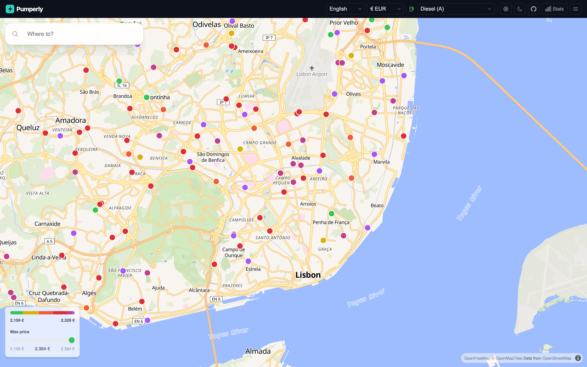
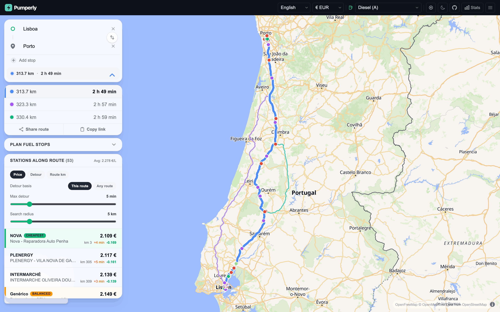
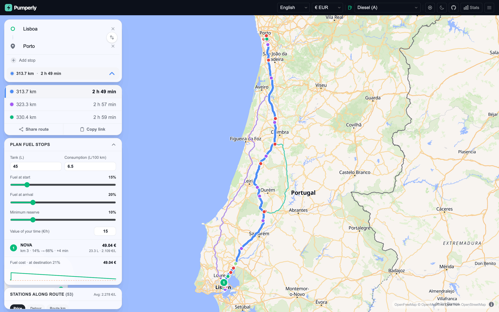
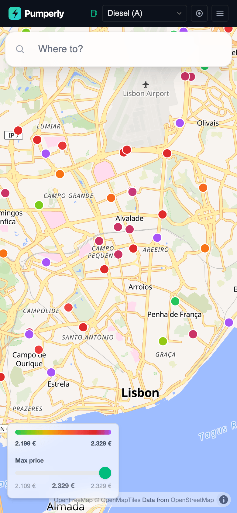
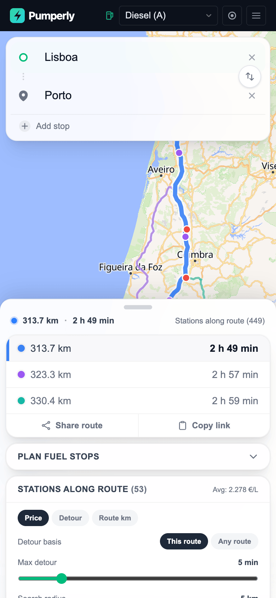
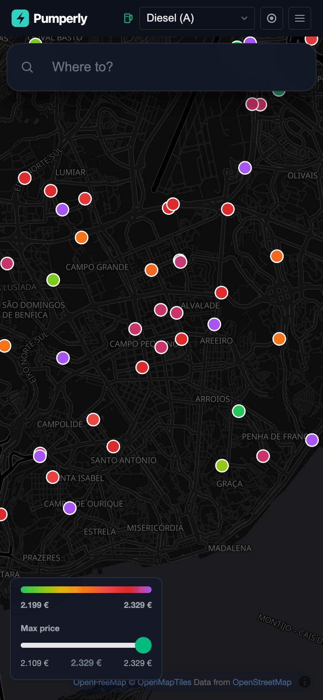
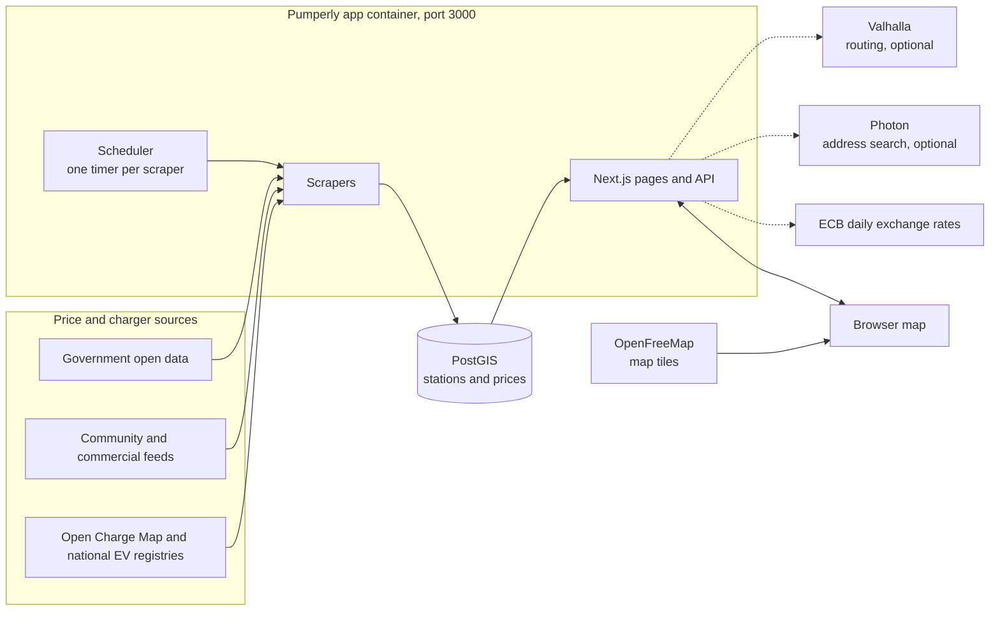

---
hide:
  - navigation
---

# Pumperly { .pumperly-visually-hidden }

  

  
  
  
  
  

---

**Pumperly** is an open-source map of fuel prices and EV chargers with a route planner on top. Pick a destination and it draws the route, lists every station along it with its price and the minutes a stop would add, and plans the cheapest places to fill up. Prices come straight from government and community sources in 22 countries, with no key to set. Use it at [pumperly.com](https://pumperly.com) or [run your own copy with Docker Compose](getting-started/docker-compose.md) and read [Planning a route](using/routes.md) to see what it does with a trip.

[Open pumperly.com](https://pumperly.com){ .md-button .md-button--primary }
[Run it yourself](getting-started/docker-compose.md){ .md-button }

-   :material-docker: **[Run with Docker Compose](getting-started/docker-compose.md)**

    ---

    Start PostGIS and the app with the shipped compose file and open the map on port 3000.

-   :material-play-circle-outline: **[What happens on first start](getting-started/first-start.md)**

    ---

    Watch the scrapers fill the map country by country, and check that it worked.

-   :material-map-marker-path: **[Planning a route](using/routes.md)**

    ---

    Stations along your trip, the detour each one costs, and the cheapest fuel stops planned for you.

-   :material-format-list-bulleted: **[Environment variables](reference/environment-variables.md)**

    ---

    Every setting, its default and what it changes.

## The map and the route

Each dot is a station, coloured by its price for the fuel you picked: green is the cheapest 5% on screen, purple the most expensive. See [The map](using/map.md).

Plan a route and the side panel lists the stations along it, sorted by price, detour or position. The max-detour slider hides the ones that cost more minutes than you allow. See [Planning a route](using/routes.md).

Open **Plan fuel stops**, give it your tank size, consumption and how full you start, and it picks the cheapest stops that get you there. The stops are numbered on the map. Added in v1.15.0.

<figure markdown>

<figcaption>On a phone</figcaption>
</figure>
<figure markdown>

<figcaption>Stations in the bottom sheet</figcaption>
</figure>
<figure markdown>

<figcaption>Dark mode</figcaption>
</figure>

## What it shows

- Fuel stations with their latest prices for the fuel you choose: diesel, petrol, LPG, CNG, LNG, hydrogen, HVO and AdBlue. See [Fuel types](reference/fuel-types.md).
- Live prices from 22 countries with no key to set, and from two more with a free key. 39 countries are supported in all; [Coverage and status](data/coverage.md) lists each one, its source and whether the source works today.
- EV chargers from the official registries of Spain and Germany and from [Open Charge Map](https://openchargemap.org) elsewhere. See [EV charging](using/ev-charging.md).
- A station's popup: brand, address, price, when it was last updated, directions, and a link to share. See [Station popup](using/map.md#station-popup).
- Routes with up to five stops and up to three alternatives, when Valhalla is configured; address search as you type, when Photon is configured.
- Prices in any of 37 currencies, converted with the European Central Bank's daily rates; the interface in 17 languages. See [Currencies and exchange rates](reference/currencies.md).
- Share links for a station or a route. See [Share links and deep links](using/links.md).
- A small [HTTP API](reference/api.md) for stations, routes and statistics, used by the [related projects](related.md).

## How it runs

- One Next.js process serves the map, answers the API and runs every scraper on its own timer. See [How scrapers work](data/how-scrapers-work.md).
- The image is `drumsergio/pumperly` on Docker Hub, for linux/amd64 and linux/arm64. It listens on port 3000 and runs as user id 1001.
- Scrapers write to PostGIS. The map, the route list and the stats read from it.
- Routes need [Valhalla](configuration/routing-valhalla.md) and address search needs [Photon](configuration/geocoding-photon.md). Without them the map and its prices still work. [Full stack with routing and geocoding](getting-started/full-stack.md) runs all of it.
- Run one copy of the app per database. Two copies would scrape every source twice.

## What it does not do

- It has no prices for EV charging. The sources publish charger locations, not tariffs.
- It has no fuel prices for the United States, only chargers. No national price feed exists.
- It does not route without Valhalla, and its search box finds nothing without Photon. The shipped compose file starts neither.
- It does not store prices for a paused or blocked source. The last good prices stay on the map, and each popup says how old they are.

## Privacy

- No accounts, no cookies for tracking, no analytics. The only cookie remembers your language. Your currency and theme are saved in the browser, not on the server.
- Your position is used to centre the map and to fill in "My location" as the start of a route. It is sent to the server only as the start point of a route you ask for.
- Address searches go to the Photon server the operator configured, and routes to the Valhalla server. On pumperly.com both are self-hosted.
- The map tiles load from [OpenFreeMap](https://openfreemap.org), which sees your tile requests like any map site.

## Getting help

- New here? Start with [Run with Docker Compose](getting-started/docker-compose.md), then [What happens on first start](getting-started/first-start.md).
- If something is broken, read [Monitoring and troubleshooting](operations/troubleshooting.md), then open an [issue on GitHub](https://github.com/GeiserX/Pumperly/issues).
- To report a security problem, follow the [security policy](https://github.com/GeiserX/Pumperly/blob/main/SECURITY.md) and do not open a public issue.
- The [Glossary](reference/glossary.md) explains the terms these pages use.
- Home Assistant, AI assistants over MCP and n8n connect through the [related projects](related.md).
- To add a country or send a fix, read [Adding a country](data/adding-a-country.md) and [Development](development.md).

## All pages

- Get started: [Run with Docker Compose](getting-started/docker-compose.md) · [What happens on first start](getting-started/first-start.md) · [Full stack with routing and geocoding](getting-started/full-stack.md) · [Run on Kubernetes with Helm](getting-started/kubernetes.md)
- Using Pumperly: [The map](using/map.md) · [Planning a route](using/routes.md) · [EV charging](using/ev-charging.md) · [Share links and deep links](using/links.md)
- Data sources: [Coverage and status](data/coverage.md) · [Sources at a glance](data/sources-at-a-glance.md) · [Fuel price sources](data/fuel-sources.md) · [EV charging sources](data/ev-sources.md) · [How scrapers work](data/how-scrapers-work.md) · [Adding a country](data/adding-a-country.md)
- Configuration: [Countries and scrape schedule](configuration/countries-and-schedule.md) · [Routing with Valhalla](configuration/routing-valhalla.md) · [Geocoding with Photon](configuration/geocoding-photon.md) · [API keys](configuration/api-keys.md)
- Operations: [Upgrading](operations/upgrading.md) · [Backing up the database](operations/backup-and-restore.md) · [Monitoring and troubleshooting](operations/troubleshooting.md)
- Reference: [Environment variables](reference/environment-variables.md) · [HTTP API](reference/api.md) · [Data model](reference/data-model.md) · [Fuel types](reference/fuel-types.md) · [Currencies and exchange rates](reference/currencies.md) · [Glossary](reference/glossary.md)
- Project: [Roadmap](roadmap.md) · [Related projects](related.md) · [Development](development.md)

## License

Pumperly is released under the [AGPL-3.0-or-later](https://github.com/GeiserX/Pumperly/blob/main/LICENSE) license. Price and charger data keep the licence of their source; [Fuel price sources](data/fuel-sources.md) and [EV charging sources](data/ev-sources.md) list them, and some allow only non-commercial use. If you run a public instance, read [Data licences on a public instance](getting-started/docker-compose.md#data-licences-on-a-public-instance) first.

