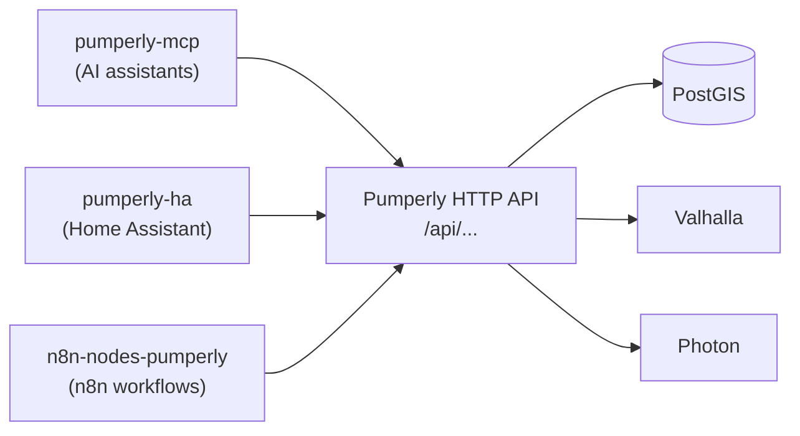

# Integrations

This page lists the projects that use Pumperly's data outside the web map: an MCP server for AI assistants, a Home Assistant integration and an n8n node. Each one is a separate repository with its own releases and issues.

All three are clients of the same [HTTP API](reference/api.md) that the web map uses. They send plain HTTP requests to a Pumperly instance and never touch the database. Each one points at `https://pumperly.com` by default, and each lets you change that address to your own instance.

## At a glance

| Project | What it is | What you get | Licence |
| --- | --- | --- | --- |
| [pumperly-mcp](https://github.com/GeiserX/pumperly-mcp) | An MCP server | An AI assistant can look up prices, find stations, plan routes and geocode places | GPL-3.0 |
| [pumperly-ha](https://github.com/GeiserX/pumperly-ha) | A Home Assistant custom integration | Price sensors for the stations around a location, for dashboards and automations | GPL-3.0 |
| [n8n-nodes-pumperly](https://github.com/GeiserX/n8n-nodes-pumperly) | An n8n community node | Workflow steps for stations, routes, stats, config, exchange rates and geocoding, plus a trigger that fires when a country's prices refresh | MIT |

## pumperly-mcp

[pumperly-mcp](https://github.com/GeiserX/pumperly-mcp) connects an AI assistant to a Pumperly instance. MCP, the Model Context Protocol, is a standard way for an assistant to call outside tools and read outside data.

The server offers five tools and three read-only resources:

| Kind | Name | Pumperly endpoint it calls |
| --- | --- | --- |
| Tool | `find_nearest_stations` | `GET /api/stations/nearest` |
| Tool | `get_stations_in_area` | `GET /api/stations` |
| Tool | `calculate_route` | `POST /api/route` |
| Tool | `find_route_stations` | `POST /api/route-stations` |
| Tool | `geocode` | `GET /api/geocode` |
| Resource | `pumperly://config` | `GET /api/config` |
| Resource | `pumperly://stats` | `GET /api/stats` |
| Resource | `pumperly://exchange-rates` | `GET /api/exchange-rates` |

It is written in Go and ships three ways: an npm package (`npx pumperly-mcp`), a Docker image (`drumsergio/pumperly-mcp`) and a binary on its GitHub releases page. The npm package runs over stdio, the transport most desktop assistants expect. The Docker image serves MCP over HTTP at `/mcp`.

| Variable | Default | Purpose |
| --- | --- | --- |
| `PUMPERLY_URL` | `https://pumperly.com` | The Pumperly instance to query, without a trailing slash |
| `TRANSPORT` | empty, which means HTTP | Set to `stdio` for the stdio transport |
| `LISTEN_ADDR` | `127.0.0.1:8080`; the Docker image sets `0.0.0.0:8080` | The HTTP listen address |

!!! warning "The HTTP transport has no login"
    Anyone who can reach the HTTP port can use the server. The Docker image listens on all interfaces, so publish its port only to `127.0.0.1`, or put a reverse proxy with authentication in front of it.

Install steps and client configuration are in the [pumperly-mcp README](https://github.com/GeiserX/pumperly-mcp#readme).

## pumperly-ha

[pumperly-ha](https://github.com/GeiserX/pumperly-ha) is a [Home Assistant](https://www.home-assistant.io/) custom integration. You install it through [HACS](https://hacs.xyz/), the Home Assistant Community Store, as a custom repository, or by copying `custom_components/pumperly` into your configuration.

The setup flow asks for four things: the instance URL, a location (your Home Assistant home location by default), the fuel types to track and a search radius between 1 and 50 km. It checks the URL by reading `GET /api/config`.

For each fuel type it fetches the five nearest stations inside the radius and creates three sensors. The `<fuel>` part of each name is the fuel's label in lower case, such as `diesel_b7` in `sensor.pumperly_cheapest_diesel_b7`.

| Sensor | Value |
| --- | --- |
| `sensor.pumperly_cheapest_<fuel>` | The lowest price among those stations |
| `sensor.pumperly_nearest_<fuel>` | The price at the closest of them |
| `sensor.pumperly_average_<fuel>` | The average price across them |

The cheapest and nearest sensors carry that station's name, brand, address, city, distance, coordinates and the time the price was reported. The average sensor carries the number of stations it averaged. Two diagnostic sensors show the instance's total station and price counts.

The integration polls every 30 minutes. Each poll reads `GET /api/stats` once and `GET /api/stations/nearest` once per fuel type. When an instance answers `404` on the nearest-stations endpoint, it falls back to `GET /api/stations` with a bounding box and sorts by distance itself.

!!! tip "Price alerts"
    Pumperly has no price alerts of its own. A Home Assistant automation on a `cheapest` sensor fills that gap: trigger when the value drops below a threshold, then send a notification. The [pumperly-ha README](https://github.com/GeiserX/pumperly-ha#readme) has a worked example.

## n8n-nodes-pumperly

[n8n-nodes-pumperly](https://github.com/GeiserX/n8n-nodes-pumperly) adds Pumperly to [n8n](https://n8n.io/), a workflow automation tool. It is an n8n community node, installed from n8n's community nodes settings.

The Pumperly node offers these operations:

| Resource | Operation | Pumperly endpoint |
| --- | --- | --- |
| Station | Get by Area | `GET /api/stations` |
| Station | Get Nearest | `GET /api/stations/nearest` |
| Route | Calculate | `POST /api/route` |
| Route | Get Stations Along Route | `POST /api/route-stations` |
| Stats | Get | `GET /api/stats` |
| Config | Get | `GET /api/config` |
| Exchange Rate | Get | `GET /api/exchange-rates` |
| Geocode | Search | `GET /api/geocode` |

The Pumperly Trigger node polls `GET /api/stats`. It emits one item for each country whose last update time changed since the previous poll. You can limit it to a list of country codes, such as `ES,DE,FR`. The first poll only records the current times, so a new workflow does not fire for every country at once.

The node's credential holds only the instance URL. Pumperly's API needs no key.

## Pointing an integration at your own instance

Every integration takes the base URL of a Pumperly instance, such as `https://pumperly.example.com`. Give it the root address of the instance, without a language path such as `/en` and without `/api`.

What an integration can return depends on what the instance has:

- Station and price lookups need only the database. They work as soon as the scrapers have filled it.
- Route calculation needs Valhalla. Without `VALHALLA_URL`, `POST /api/route` answers `502` with `Routing service unavailable`. See [Routing with Valhalla](configuration/routing-valhalla.md).
- Stations along a route need only the database. `POST /api/route-stations` takes a route line you already have, so it works without Valhalla.
- Geocoding needs Photon. Without `PHOTON_URL`, `GET /api/geocode` returns an empty list. See [Geocoding with Photon](configuration/geocoding-photon.md).
- Only the countries the instance scrapes have data. See [Countries and scrape schedule](configuration/countries-and-schedule.md).

!!! note "Route endpoints are rate limited"
    `POST /api/route` and `POST /api/route-stations` accept 30 requests per minute from one client address. Over that, they answer `429` with a `Retry-After` header. An integration that plans many routes in a loop must wait and retry. The [HTTP API reference](reference/api.md) lists every endpoint, its parameters and its limits.

## Build your own

Anything that speaks HTTP and JSON can use Pumperly the same way. The API needs no key and no account. Start from the [HTTP API reference](reference/api.md). If you publish an integration, open an issue on [Pumperly](https://github.com/GeiserX/Pumperly/issues) so it can be listed here.
