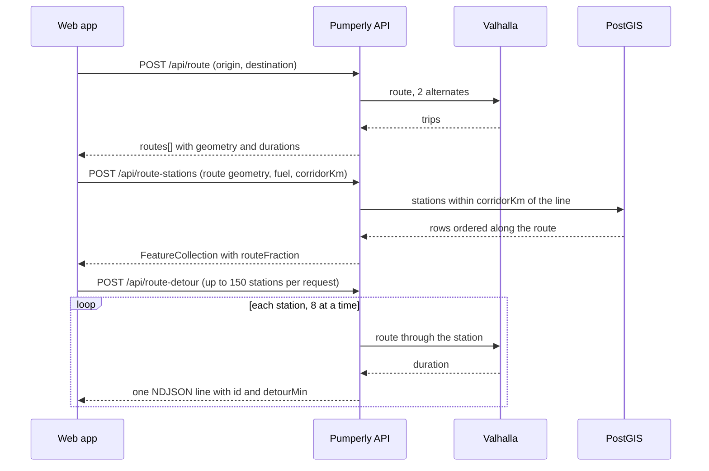

# HTTP API

This page describes every endpoint under `/api`. The web app uses the same endpoints, so anything the map can do, a script can do too.

Each section gives the method, the parameters and how they are checked, the response shape, the limits and the caching headers. The code lives in [`src/app/api`](https://github.com/GeiserX/Pumperly/tree/main/src/app/api).

## Overview

| Endpoint | Method | What it returns | Rate limit | `Cache-Control` |
|---|---|---|---|---|
| [`/api/config`](#config) | GET | The instance's default country, fuel and enabled countries | none | `public, s-maxage=3600, stale-while-revalidate=7200` |
| [`/api/stats`](#stats) | GET | Station and price counts per country | none | `public, s-maxage=300, stale-while-revalidate=600` |
| [`/api/stations`](#stations) | GET | Stations inside a bounding box, with the latest price for one fuel | none | `public, s-maxage=60, stale-while-revalidate=300` |
| [`/api/stations/nearest`](#stations-nearest) | GET | The closest stations to a point | none | `public, s-maxage=60, stale-while-revalidate=300` |
| [`/api/geocode`](#geocode) | GET | Place search results from Photon | none | `public, s-maxage=300, stale-while-revalidate=600` |
| [`/api/exchange-rates`](#exchange-rates) | GET | ECB euro reference rates | none | `public, s-maxage=3600, stale-while-revalidate=86400` |
| [`/api/route`](#route) | POST | Driving routes from Valhalla | 30 per minute per IP | not set |
| [`/api/route-stations`](#route-stations) | POST | Stations along a route | 30 per minute per IP | not set |
| [`/api/route-detour`](#route-detour) | POST | Detour time for each station, streamed | 10 per minute per IP | `no-cache, no-transform` |

`s-maxage` tells a shared cache, such as a CDN or a caching proxy, how long it may serve a stored copy. `stale-while-revalidate` lets it keep serving that copy for the extra number of seconds while it fetches a fresh one.

## Conventions

**No authentication.** Every endpoint is public. There are no API keys and no sessions.

**No CORS headers.** Pumperly does not send `Access-Control-Allow-Origin`. A browser page on another origin cannot read the responses. Server-side scripts, `curl` and native apps are not affected.

**Coordinates are `[longitude, latitude]`.** This is the GeoJSON order. It applies to every coordinate pair in a request body and in a response. Query parameters use named `lat` and `lon` instead, or a `bbox` string.

**Fuel codes.** Every endpoint that takes a `fuel` accepts exactly one code from [Fuel types](fuel-types.md), such as `B7`, `E10` or `EV`. Any other value is rejected with `400`.

**Prices are in the station's own currency.** The API never converts. Each station carries a `currency` code. The web app converts on the client with the rates from [`/api/exchange-rates`](#exchange-rates). See [Currencies and exchange rates](currencies.md).

**Examples.** The GET examples call the public instance at `https://pumperly.com`. The POST examples call `http://localhost:3000`, the port the Docker image listens on. Replace it with the address of your own instance.

**GeoJSON.** The three station endpoints return a GeoJSON `FeatureCollection`. Each feature is a `Point`. See [The station feature](#the-station-feature).

### Errors

Errors are JSON objects with an `error` string. Validation errors also carry `details`, the list of problems the [Zod](https://zod.dev) schema found.

```json
{
  "error": "Invalid parameters",
  "details": [
    { "code": "…", "path": ["fuel"], "message": "…" }
  ]
}
```

| Status | `error` | When |
|---|---|---|
| `400` | `Invalid parameters` | A parameter is missing, has the wrong type or is out of range. `details` says which. |
| `400` | `Invalid JSON` | A POST body is not valid JSON. |
| `429` | `Too many requests` | The client went over the endpoint's rate limit. A `Retry-After` header gives the seconds to wait. |
| `500` | `Internal server error` | The database query failed. |
| `502` | varies | An upstream service failed: Valhalla, Photon or the ECB feed. Each endpoint lists its own message. |

### Rate limits

The three POST endpoints count requests per client IP in fixed one-minute windows. The first request from an IP opens a window. When the count reaches the limit, further requests get `429` until the window ends.

The client IP is the first entry of `X-Forwarded-For`. If that header is missing, Pumperly uses `X-Real-IP`. If both are missing, every client shares one bucket named `unknown`.

!!! warning "Run Pumperly behind a proxy that rewrites `X-Forwarded-For`"
    The limiter trusts these headers. A reverse proxy must replace `X-Forwarded-For` with the real client address, not append to what the client sent. Exposed directly, a client can send any value and pick its own bucket, which defeats the limit.

The counters live in the memory of the Node process. They reset when the app restarts. Two replicas behind a load balancer each keep their own counters, so the effective limit doubles.

## GET /api/config {#config}

Returns the settings the instance was started with. It does not touch the database, so it answers even while PostGIS is down. The Helm chart uses it for its startup, liveness and readiness probes.

**Parameters:** none.

**Response:**

| Field | Type | Meaning |
|---|---|---|
| `defaultCountry` | string | ISO 3166-1 alpha-2 code from [`PUMPERLY_DEFAULT_COUNTRY`](environment-variables.md#pumperly_default_country). Defaults to `ES`. |
| `defaultFuel` | string | [`PUMPERLY_DEFAULT_FUEL`](environment-variables.md#pumperly_default_fuel) if set, otherwise the default fuel of the default country. |
| `center` | `[lon, lat]` | The default country's initial map centre. |
| `zoom` | number | The default country's initial map zoom. |
| `enabledCountries` | array | One object per enabled country: `code`, `name` (the country's own name for itself), `center` and `zoom`. |

`enabledCountries` follows [`PUMPERLY_ENABLED_COUNTRIES`](environment-variables.md#pumperly_enabled_countries). Codes Pumperly has no map settings for are dropped from this list. `US` is one of them: it enables EV chargers only and has no entry here.

```bash
curl -s https://pumperly.com/api/config
```

```json
{
  "defaultCountry": "ES",
  "defaultFuel": "B7",
  "center": [-3.7, 40.4],
  "zoom": 6,
  "enabledCountries": [
    { "code": "ES", "name": "España", "center": [-3.7, 40.4], "zoom": 6 },
    { "code": "FR", "name": "France", "center": [2.35, 46.85], "zoom": 6 }
  ]
}
```

**Errors:** none.

## GET /api/stats {#stats}

Returns how many stations and price rows the database holds, per country, plus the instance config. The stats dropdown and the country markers on the map read it.

**Parameters:** none.

**Response:**

| Field | Type | Meaning |
|---|---|---|
| `totals.stations` | number | All stations, fuel and EV. |
| `totals.prices` | number | All rows in `fuel_prices`. |
| `countries[]` | array | One object per country present in the database, most stations first. |
| `countries[].code` | string | Country code. |
| `countries[].name` | string | Country name, or the code if Pumperly has no name for it. |
| `countries[].stations` | number | Stations in that country, EV chargers included. |
| `countries[].prices` | number | Price rows for that country's stations. |
| `countries[].lastUpdate` | string or `null` | ISO 8601 time of the newest price row. `null` when the country has no prices, as with EV-only coverage. |
| `config` | object | `defaultCountry`, `enabledCountries` (a plain list of codes), `defaultFuel`, `center` and `zoom`. |

`countries` lists every country with rows in the database, enabled or not. A country you disable keeps its rows until something deletes them.

```bash
curl -s https://pumperly.com/api/stats
```

Shape of the response, with illustrative numbers:

```json
{
  "totals": { "stations": 1000, "prices": 7000 },
  "countries": [
    { "code": "ES", "name": "España", "stations": 1000, "prices": 7000, "lastUpdate": "2026-01-01T06:00:00.000Z" }
  ],
  "config": {
    "defaultCountry": "ES",
    "enabledCountries": ["ES"],
    "defaultFuel": "B7",
    "center": [-3.7, 40.4],
    "zoom": 6
  }
}
```

**Errors:** `500` when the query fails.

## GET /api/stations {#stations}

Returns the stations inside a rectangle that sell one fuel, each with its latest price. This is what the map loads as you pan.

**Query parameters:**

| Name | Required | Validation |
|---|---|---|
| `bbox` | yes | Four comma-separated numbers: `minLon,minLat,maxLon,maxLat`. Longitudes must be within -180 to 180, latitudes within -90 to 90. Anything else fails with the message `bbox must be minLon,minLat,maxLon,maxLat with valid coordinates`. |
| `fuel` | yes | A fuel code. |

**What it selects:**

- For a fuel other than `EV`, a station is returned only if it has at least one price for that fuel. The price shown is the newest one by `reported_at`.
- For `EV`, it returns every station whose type is `ev_charger` or `both`. These features have no `price` and no `reportedAt`. Their `currency` is always `EUR` and means nothing.

**Limit:** at most 20,000 features. The query has no `ORDER BY`, so a box with more stations returns an arbitrary 20,000. Nothing in the response says it was cut. The server logs `[stations] result truncated at 20000`. Ask for a smaller box if you need them all.

```bash
curl -s "https://pumperly.com/api/stations?bbox=-3.75,40.38,-3.65,40.45&fuel=B7"
```

The response is a `FeatureCollection` of [station features](#the-station-feature).

**Errors:** `400` for bad parameters, `500` when the query fails.

## GET /api/stations/nearest {#stations-nearest}

Returns the stations closest to a point, nearest first. The web app does not call this endpoint. It is there for scripts and [integrations](../related.md).

**Query parameters:**

| Name | Required | Validation |
|---|---|---|
| `lat` | yes | A number from -90 to 90. |
| `lon` | yes | A number from -180 to 180. |
| `radius_km` | yes | A number from 0.5 to 100. |
| `fuel` | yes | A fuel code. |
| `limit` | no | An integer from 1 to 50. Defaults to `5`. |

The same selection rules as [`/api/stations`](#stations) apply: stations must have a price for the fuel, or be chargers when `fuel=EV`.

Each feature carries an extra `distanceKm`, rounded to three decimals.

!!! note "Distances are approximate"
    The search and the distance are computed in degrees and multiplied by 111.32 km. A degree of latitude is always about 111.32 km, so north-south distances are right. A degree of longitude shrinks towards the poles. So an east-west `distanceKm` is larger than the real distance, and the search area reaches less far east and west than `radius_km`. The error grows with latitude.

```bash
curl -s "https://pumperly.com/api/stations/nearest?lat=40.4168&lon=-3.7038&radius_km=5&fuel=E5&limit=3"
```

**Errors:** `400` for bad parameters, `500` when the query fails.

## GET /api/geocode {#geocode}

Searches for places by name through [Photon](../configuration/geocoding-photon.md). The search box on the map uses it for autocomplete.

When `q` is a coordinate pair, latitude first, the endpoint skips Photon. It returns one result, with `name` set to the trimmed query, `city`, `state` and `country` set to `null`, and the parsed `coordinates`. See [Typing coordinates](../using/routes.md#typing-coordinates) for the accepted formats.

**Query parameters:**

| Name | Required | Validation |
|---|---|---|
| `q` | yes | The search text, 1 to 200 characters. |
| `lat` | no | A number from -90 to 90. |
| `lon` | no | A number from -180 to 180. |

When both `lat` and `lon` are given, Photon ranks results near that point higher. The web app sends the centre of the map. If only one of the two is given, it is ignored.

**Response:** a JSON array of up to 5 results.

| Field | Type | Meaning |
|---|---|---|
| `name` | string | The place name. Falls back to the query text when Photon returns none. |
| `city` | string or `null` | |
| `state` | string or `null` | |
| `country` | string or `null` | |
| `coordinates` | `[lon, lat]` | |

Results Photon returns without a valid coordinate pair are skipped.

```bash
curl -s "https://pumperly.com/api/geocode?q=Puerta%20del%20Sol&lat=40.4&lon=-3.7"
```

Shape of the response, with illustrative values:

```json
[
  { "name": "Puerta del Sol", "city": "Madrid", "state": "Comunidad de Madrid", "country": "España", "coordinates": [-3.7035, 40.4169] }
]
```

!!! note "An empty list is not always \"nothing found\""
    Unless `q` is a coordinate pair, the endpoint returns `200` with `[]` when [`PHOTON_URL`](environment-variables.md#photon_url) is not set, when Photon answers with an error status, or when Photon's body is not JSON. Only a failed connection or a timeout (5 seconds) returns `502` with `Geocoding failed`.

**Errors:** `400` for bad parameters, `502` with `Geocoding failed`.

## GET /api/exchange-rates {#exchange-rates}

Returns the European Central Bank's daily euro reference rates, plus fixed rates for a few currencies the ECB does not publish. The web app fetches it once per page load. [Currencies and exchange rates](currencies.md) explains the feed, the fallbacks and how conversion works.

**Parameters:** none.

**Response:**

| Field | Type | Meaning |
|---|---|---|
| `base` | string | Always `EUR`. |
| `rates` | object | Units of each currency per 1 euro, keyed by ISO 4217 code. `EUR` is `1`. |
| `date` | string | The ECB reference date, `YYYY-MM-DD`. |
| `stale` | `true` | Present only when the ECB fetch failed and an older copy is served. |

```bash
curl -s https://pumperly.com/api/exchange-rates
```

Shape of the response, with illustrative rates:

```json
{
  "base": "EUR",
  "rates": { "EUR": 1, "USD": 1.1, "GBP": 0.85, "TWD": 36 },
  "date": "2026-01-02"
}
```

The server keeps the rates in memory for 24 hours after a successful fetch. Within that time it does not call the ECB again. If a later fetch fails, it serves the old copy with `"stale": true` and `Cache-Control: public, s-maxage=60`, so caches retry soon.

**Errors:** `502` with `Failed to fetch exchange rates` when the ECB fetch fails and there is no copy in memory.

## POST /api/route {#route}

Computes driving routes between two points through [Valhalla](../configuration/routing-valhalla.md). It asks Valhalla for car routing (the `auto` costing) in kilometres.

**Rate limit:** 30 requests per minute per IP.

**Body:**

| Field | Required | Validation |
|---|---|---|
| `origin` | yes | `[lon, lat]`. Finite numbers, longitude -180 to 180, latitude -90 to 90. |
| `destination` | yes | `[lon, lat]`, same rules. |
| `waypoints` | no | Up to 5 `[lon, lat]` pairs, visited in order between origin and destination. |

**Response:** `{ "routes": [ … ] }`.

- Without waypoints, Valhalla is asked for 2 alternates. The response holds the main route first and then up to 2 alternatives.
- With one or more waypoints, the response holds exactly one route. Valhalla offers alternates only for a plain A to B trip.

Each route object:

| Field | Type | Meaning |
|---|---|---|
| `geometry` | GeoJSON `LineString` | The route line, `[lon, lat]` pairs. Thinned to at most 2,000 points, always keeping the first and last. |
| `distance` | number | Kilometres. |
| `duration` | number | Seconds. |
| `bbox` | `[minLon, minLat, maxLon, maxLat]` | Computed from the full line before thinning. |
| `durations` | number[] | Seconds from the start at each point of `geometry`. Same length as the coordinate list. |

The 2,000-point ceiling matches the limit of [`/api/route-stations`](#route-stations), so a route's `geometry` can be sent there unchanged.

```bash
curl -s -X POST http://localhost:3000/api/route \
  -H 'Content-Type: application/json' \
  -d '{"origin":[-3.7038,40.4168],"destination":[-0.3763,39.4699]}'
```

**Errors:**

| Status | `error` | Cause |
|---|---|---|
| `400` | `Invalid JSON` or `Invalid parameters` | Bad body. |
| `429` | `Too many requests` | Rate limit. |
| `502` | `Routing service unavailable` | Valhalla returned no route, answered with an error status, or [`VALHALLA_URL`](environment-variables.md#valhalla_url) is not set. |
| `502` | `Route calculation failed` | The call to Valhalla threw, for example on a timeout. The timeout is 15 seconds for A to B and 10 seconds with waypoints. |

## POST /api/route-stations {#route-stations}

Returns the stations within a set distance of a route line, ordered from the start of the route to the end. The web app calls it after every new route, and again when you move the corridor slider.

**Rate limit:** 30 requests per minute per IP.

**Body:**

| Field | Required | Validation |
|---|---|---|
| `geometry.type` | yes | Exactly `LineString`. |
| `geometry.coordinates` | yes | 2 to 2,000 `[lon, lat]` pairs, finite and in range. |
| `fuel` | yes | A fuel code. |
| `corridorKm` | no | Corridor half-width in km, 0.5 to 50. Defaults to `5`. |

A station is in the [corridor](glossary.md#corridor) when its true distance to the line, measured on the globe, is at most `corridorKm`. Selection by fuel follows the same rules as [`/api/stations`](#stations).

**Response:** a `FeatureCollection` of [station features](#the-station-feature), each with an extra `routeFraction`. That is the station's position along the line, from `0` at the start to `1` at the end. Features come sorted by `routeFraction`.

**Limit:** at most 5,000 features. The cut keeps the first 5,000 along the route, so a long route with a wide corridor can lose its far end. The server logs `[route-stations] result hit LIMIT 5000 (may be truncated)`.

```bash
curl -s -X POST http://localhost:3000/api/route-stations \
  -H 'Content-Type: application/json' \
  -d '{"geometry":{"type":"LineString","coordinates":[[-3.7038,40.4168],[-3.60,40.38],[-3.50,40.33]]},"fuel":"B7","corridorKm":2}'
```

**Errors:** `400`, `429`, and `500` when the query fails.

## POST /api/route-detour {#route-detour}

Works out how many extra minutes each station adds to a trip. Results stream back one line at a time, as each station finishes. The web app uses them to sort and filter the stations along a route.

**Rate limit:** 10 requests per minute per IP. Each request can fan out to up to 150 Valhalla calls, so this limit is tighter than the others.

**Body:**

| Field | Required | Validation |
|---|---|---|
| `stations` | yes | 1 to 150 station objects (below). |
| `origin` | yes | `[lon, lat]` of the trip start. |
| `destination` | yes | `[lon, lat]` of the trip end. |
| `routeDuration` | yes | Duration of the original route in seconds, 0 or more. |

Each station object:

| Field | Required | Validation |
|---|---|---|
| `id` | yes | Any string. It is echoed back so you can match results. |
| `lon`, `lat` | yes | Finite numbers in range. |
| `before` | no | `[lon, lat]` of a point on the route before the station. |
| `after` | no | `[lon, lat]` of a point on the route after the station. |
| `onRouteSec` | no | Seconds to drive from `before` to `after` along the route, 0 or more. |

**Two ways to measure a detour.** Pumperly picks one per station:

- **Route-relative**, when `before`, `after` and `onRouteSec` are all present. Pumperly asks Valhalla for `before → station → after` and subtracts `onRouteSec`. This measures the detour from the route you are on. When the web app measures detours against the selected route, it places the two anchors about 3 km either side of the station's position on the route.
- **Whole trip**, otherwise. Pumperly asks Valhalla for `origin → station → destination` and subtracts `routeDuration`. This measures the best detour over any route.

**Response:** `Content-Type: application/x-ndjson`. [NDJSON](glossary.md#ndjson) is one JSON object per line:

```text
{"id":"a1","detourMin":2.4}
{"id":"a3","detourMin":0}
{"id":"a2","detourMin":-1}
```

| Field | Meaning |
|---|---|
| `id` | The station `id` you sent. |
| `detourMin` | Extra minutes, rounded to one decimal. `-1` means no result for this station. |

`detourMin` is `-1` when Valhalla returned no route, the call failed or timed out (10 seconds), or [`VALHALLA_URL`](environment-variables.md#valhalla_url) is not set. It is also `-1` when the computed detour is more than 60 seconds negative, which means the inputs do not agree with each other. A detour between -60 and 0 seconds becomes `0`.

Lines arrive in the order stations finish, not the order you sent them. Eight stations are worked on at a time. All requests to Valhalla also share one global limit of in-flight calls, [`VALHALLA_MAX_INFLIGHT`](environment-variables.md#valhalla_max_inflight) (default 6). Once the stream has started the status is always `200`, even if every line is `-1`. If the client disconnects, stations not yet started are dropped.

[`PUMPERLY_MAX_DETOUR_STATIONS`](environment-variables.md#pumperly_max_detour_stations) (default 150) caps how many stations one request routes. When a request holds more, Pumperly keeps an even spread along the list, in the original order. The body schema already rejects more than 150, so a lower value is the only one that has an effect.

The response also sends `Cache-Control: no-cache, no-transform` and `X-Accel-Buffering: no`. Those two headers ask proxies not to buffer or compress the stream. Pumperly turns off Next.js compression for the same reason.

```bash
curl -sN -X POST http://localhost:3000/api/route-detour \
  -H 'Content-Type: application/json' \
  -d '{"origin":[-3.7038,40.4168],"destination":[-0.3763,39.4699],"routeDuration":12600,"stations":[{"id":"a1","lon":-3.55,"lat":40.35}]}'
```

**Errors before the stream starts:** `400` and `429`.

## The station feature

`/api/stations`, `/api/stations/nearest` and `/api/route-stations` all return features of this shape:

```json
{
  "type": "Feature",
  "geometry": { "type": "Point", "coordinates": [-3.7038, 40.4168] },
  "properties": {
    "id": "00000000-0000-0000-0000-000000000000",
    "externalId": "12345",
    "country": "ES",
    "name": "Example station",
    "brand": "EXAMPLE",
    "address": "Calle Ejemplo 1",
    "city": "Madrid",
    "fuelType": "B7",
    "currency": "EUR",
    "price": 1.459,
    "reportedAt": "2026-01-01T06:00:00.000Z"
  }
}
```

| Property | Always present | Meaning |
|---|---|---|
| `id` | yes | Database UUID. It can change when a scraper re-imports a station. Do not store it. |
| `externalId` | yes | The station's ID at its [source](glossary.md#source). Together with `country` it is the durable identity. Share links use this pair. |
| `country` | yes | ISO 3166-1 alpha-2 code. |
| `name` | yes | Station name as the source gives it. |
| `brand` | yes, may be `null` | Brand or operator. |
| `address`, `city` | yes | As the source gives them. |
| `fuelType` | yes | The fuel code you asked for. |
| `currency` | yes | ISO 4217 code of `price`. `EUR` on EV chargers, where it carries no meaning. |
| `price` | no | Latest price for `fuelType`, in `currency`. Absent on EV chargers. |
| `reportedAt` | no | ISO 8601 time the price was stored. This is when Pumperly's scraper wrote it, not a time the source published. Absent on EV chargers. |
| `powerKw` | no | EV chargers only: highest single-connector power in kW. Absent when the source publishes none. |
| `distanceKm` | only `/api/stations/nearest` | Approximate distance from the query point. |
| `routeFraction` | only `/api/route-stations` | Position along the route, `0` to `1`. |

The [data model](data-model.md) describes the tables behind these fields.

## How the route endpoints fit together

The web app plans a trip with three calls in a row:



[Planning a route](../using/routes.md) describes what the user sees at each step.
