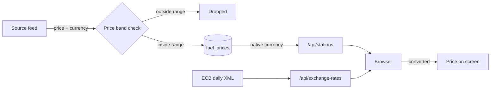

# Currencies and exchange rates

This page explains how Pumperly handles money. It covers which currencies prices are stored in, which currencies you can display them in, where the exchange rates come from, and the price ranges that reject bad data before it is stored.

## The short version

- Every price is stored in the currency its source publishes, with an ISO 4217 code next to it. Pumperly never converts a price into another currency before storing it. A few scrapers only turn a minor unit into the main one, such as pence into pounds.
- The API returns prices in that stored currency.
- The browser converts prices into the currency you pick, using the European Central Bank's daily rates.
- Before a scraper stores a price, it checks the price against a plausible range for its currency. Prices outside the range are dropped.



## Display currencies

The currency menu in the navigation bar offers 37 currencies. They are defined in [`src/lib/currency.tsx`](https://github.com/GeiserX/Pumperly/blob/main/src/lib/currency.tsx). The "Decimals" column is the number of decimal places a converted price is shown with.

| Code | Symbol | Name | Decimals | Rate source |
|---|---|---|---|---|
| `EUR` | € | Euro | 3 | base currency |
| `USD` | $ | US Dollar | 3 | ECB |
| `GBP` | £ | British Pound | 3 | ECB |
| `CHF` | CHF | Swiss Franc | 3 | ECB |
| `JPY` | ¥ | Japanese Yen | 0 | ECB |
| `CAD` | CA$ | Canadian Dollar | 3 | ECB |
| `AUD` | A$ | Australian Dollar | 3 | ECB |
| `NZD` | NZ$ | New Zealand Dollar | 3 | ECB |
| `SEK` | kr | Swedish Krona | 2 | ECB |
| `NOK` | kr | Norwegian Krone | 2 | ECB |
| `DKK` | kr | Danish Krone | 2 | ECB |
| `ISK` | kr | Icelandic Króna | 0 | ECB, fixed fallback |
| `CZK` | Kč | Czech Koruna | 2 | ECB |
| `PLN` | zł | Polish Złoty | 2 | ECB |
| `HUF` | Ft | Hungarian Forint | 0 | ECB |
| `RON` | lei | Romanian Leu | 3 | ECB |
| `BGN` | лв | Bulgarian Lev | 3 | none |
| `RSD` | din | Serbian Dinar | 0 | fixed fallback |
| `BAM` | KM | Bosnian Mark | 3 | fixed fallback |
| `MKD` | ден | Macedonian Denar | 0 | fixed fallback |
| `TRY` | ₺ | Turkish Lira | 2 | ECB |
| `CNY` | ¥ | Chinese Yuan | 2 | ECB |
| `HKD` | HK$ | Hong Kong Dollar | 2 | ECB |
| `KRW` | ₩ | South Korean Won | 0 | ECB |
| `SGD` | S$ | Singapore Dollar | 3 | ECB |
| `MYR` | RM | Malaysian Ringgit | 2 | ECB |
| `THB` | ฿ | Thai Baht | 2 | ECB |
| `IDR` | Rp | Indonesian Rupiah | 0 | ECB |
| `PHP` | ₱ | Philippine Peso | 2 | ECB |
| `INR` | ₹ | Indian Rupee | 2 | ECB |
| `ILS` | ₪ | Israeli Shekel | 2 | ECB |
| `ZAR` | R | South African Rand | 2 | ECB |
| `BRL` | R$ | Brazilian Real | 2 | ECB |
| `MXN` | MX$ | Mexican Peso | 2 | ECB |
| `ARS` | AR$ | Argentine Peso | 0 | fixed fallback |
| `MDL` | L | Moldovan Leu | 2 | fixed fallback |
| `TWD` | NT$ | New Taiwan Dollar | 1 | fixed fallback |

"ECB" means the rate comes from the ECB's daily feed. "Fixed fallback" means Pumperly supplies a rate itself when the feed does not carry the currency. See [Fallback rates](#fallback-rates).

`BGN` has no rate at all. The ECB feed does not carry it, and the code has no fallback for it. When it is the chosen currency, every price stays in its own currency. That includes browsers with the region `BG`, which get it by default (see below).

A price that is not converted keeps the decimals of its own currency. In the station popup, a price whose currency is not in this table shows with 3 decimals and its ISO code as the symbol.

## Picking the default currency

The first time you open Pumperly, it picks a currency from your browser's language settings:

1. It reads the browser's preferred languages in order, such as `en-GB` or `pt-BR`.
2. It takes the region part after the hyphen, such as `GB` or `BR`, and looks it up in the table below.
3. The first region found in the table decides the currency.
4. If no region matches, the currency is the euro.

| Browser region | Currency |
|---|---|
| `GB`, `UK` | GBP |
| `CH`, `LI` | CHF |
| `SE` | SEK |
| `NO` | NOK |
| `DK` | DKK |
| `IS` | ISK |
| `CZ` | CZK |
| `PL` | PLN |
| `HU` | HUF |
| `RO` | RON |
| `BG` | BGN |
| `TR` | TRY |
| `US` | USD |
| `CA` | CAD |
| `MX` | MXN |
| `BR` | BRL |
| `JP` | JPY |
| `CN` | CNY |
| `HK` | HKD |
| `KR` | KRW |
| `TW` | TWD |
| `SG` | SGD |
| `MY` | MYR |
| `TH` | THB |
| `ID` | IDR |
| `PH` | PHP |
| `IN` | INR |
| `IL` | ILS |
| `ZA` | ZAR |
| `AR` | ARS |
| `MD` | MDL |
| `AU` | AUD |
| `NZ` | NZD |

!!! tip "Euro-area regions are not in the table"
    Regions such as `ES`, `FR` or `DE` have no row, so the lookup moves on to the next language in the list. A browser set to `es-ES` first and `en-US` second ends up with US dollars. Pick the euro once in the menu and Pumperly remembers it.

A language with no region, such as plain `de`, is skipped. Serbia, Bosnia and Herzegovina and North Macedonia have no row either, so their dinar, mark and denar are never picked automatically.

Your choice from the menu is saved in the browser's local storage under the key `pumperly-currency`. A saved choice always wins over detection.

## How conversion works

The browser asks [`/api/exchange-rates`](api.md#exchange-rates) for the rates once per page load. Every rate is "units of this currency per 1 euro". To show a price in another currency, the browser divides by the source currency's rate and multiplies by the target's:

```text
shown price = price / rate[source currency] × rate[target currency]
```

A station in Hungary at 600 HUF, shown in pounds, with illustrative rates of 400 HUF and 0.85 GBP per euro, becomes 600 / 400 × 0.85 = 1.275 GBP.

The station popup then shows the original price too, with a line such as `1 Ft = 0.0021 £ · ECB Jan 2`. The date is the ECB reference date of the rates.

!!! note "When a price is not converted"
    If the rate for either currency is missing, the price stays in its own currency, with its own symbol. The same happens until the rates have loaded, and for the whole visit if `/api/exchange-rates` fails. A list can then mix currencies.

## The ECB feed

[`/api/exchange-rates`](https://github.com/GeiserX/Pumperly/blob/main/src/app/api/exchange-rates/route.ts) downloads the ECB's daily reference rates from:

```text
https://www.ecb.europa.eu/stats/eurofxref/eurofxref-daily.xml
```

The ECB publishes one set of reference rates per working day. The rates are quoted against the euro, which is why the euro is Pumperly's base currency. The feed needs no key.

The server reads the reference date and every `currency`/`rate` pair from the XML. It keeps the result in memory for 24 hours and does not call the ECB again within that time. Each app process has its own copy, and a restart clears it.

When a refresh fails:

- If there is a copy in memory, the server keeps serving it with `"stale": true` and a short `Cache-Control: public, s-maxage=60`, so caches retry soon.
- If there is no copy, the endpoint returns `502` and the browser shows prices unconverted.

Shared caches may keep a good response for an hour (`s-maxage=3600`), and serve it up to a day longer while they refresh it (`stale-while-revalidate=86400`).

## Fallback rates {#fallback-rates}

Some currencies Pumperly stores prices in are not in the ECB feed. For these, the server adds a fixed rate from the code, but only when the feed does not already carry the currency.

| Currency | Fallback rate (per euro) | Why a fixed value is used |
|---|---|---|
| `BAM` | 1.95583 | Bosnia's mark is pegged to the euro by a currency board, so this rate is exact. |
| `MKD` | 61.5 | Approximate. The denar is a managed float. |
| `RSD` | 117.0 | Approximate. The dinar is a managed float. |
| `ARS` | 1200 | Approximate. The peso loses value fast, so this figure goes stale quickly. |
| `MDL` | 19.5 | Approximate. |
| `ISK` | 140 | Used only if the ECB feed leaves the króna out. |
| `TWD` | 36 | Approximate. |

!!! warning "Fallback rates are fixed numbers"
    Apart from `BAM`, these rates do not move with the market. Converted prices in these currencies can drift away from reality, `ARS` most of all. The popup's conversion line still says "ECB" for them. To correct a rate, change it in [`src/app/api/exchange-rates/route.ts`](https://github.com/GeiserX/Pumperly/blob/main/src/app/api/exchange-rates/route.ts).

## Price bands {#price-bands}

A price band is the range of prices Pumperly accepts for one currency. It catches placeholder values, such as `0` or `9.999`, and prices in the wrong unit, such as a price per 1,000 litres or a misplaced decimal point. Bands apply when a scraper stores prices, before anything reaches the database. The API does not filter prices again when it reads them.

The rules live in `BaseScraper.run()` in [`src/scrapers/base.ts`](https://github.com/GeiserX/Pumperly/blob/main/src/scrapers/base.ts). For each price, in this order:

1. A price of zero or less is dropped.
2. `CNG`, `LNG`, `H2` and `ADBLUE` are kept if the price is at least 0.05 and below 100, whatever the currency. The rest of this list does not apply to them.
3. A price in `EUR`, `GBP` or `CHF` is kept if it is from [`PUMPERLY_PRICE_MIN`](environment-variables.md#pumperly_price_min) to [`PUMPERLY_PRICE_MAX`](environment-variables.md#pumperly_price_max). The defaults are 0.30 and 4.00. The same two numbers apply to all three currencies.
4. Any other currency is checked against its row in the table below. Both ends are inclusive.
5. A currency with no row is checked against a wide default of 0.1 to 100,000.

| Currency | Minimum | Maximum |
|---|---|---|
| `HUF` | 200 | 2,000 |
| `RON` | 3 | 30 |
| `RSD` | 60 | 600 |
| `TRY` | 10 | 400 |
| `PLN` | 2 | 20 |
| `CZK` | 10 | 150 |
| `BGN` | 1 | 10 |
| `MKD` | 30 | 300 |
| `BAM` | 1 | 10 |
| `MDL` | 10 | 100 |
| `SEK` | 6 | 60 |
| `ISK` | 100 | 700 |
| `TWD` | 15 | 80 |
| `NOK` | 7 | 70 |
| `DKK` | 6 | 60 |
| `MXN` | 8 | 100 |
| `ARS` | 200 | 20,000 |
| `AUD` | 0.5 | 5.0 |

The table in the code also has rows for `EUR` (0.5 to 4.0), `GBP` (0.4 to 3.5) and `CHF` (0.5 to 4.5). The check does not read them. Those three currencies always use the `PUMPERLY_PRICE_MIN` and `PUMPERLY_PRICE_MAX` pair from rule 3.

The `ARS` band is wide on purpose. Argentine prices rise quickly with inflation, so the band needs reviewing from time to time.

### What happens to rejected prices

A rejected price is dropped and counted. The scraper logs one line per run, such as `[miteco] Filtered out 12 invalid prices`.

A fuel station left with no valid price at all is dropped from that run too. EV chargers are never dropped this way, because they have no prices. If a run ends up with no stations at all, it stops before deleting anything, so a broken feed cannot empty a country. [How scrapers work](../data/how-scrapers-work.md) describes the full run.

!!! tip "Raising the band for a price spike"
    If real prices in euros, pounds or Swiss francs pass 4.00 per litre, raise [`PUMPERLY_PRICE_MAX`](environment-variables.md#pumperly_price_max). Otherwise every station above the limit loses that fuel on the next run. The other currencies' bands are constants in the code, so changing them needs a code change.

### Bands and parsing

Bands are also the second line of defence against parsing mistakes. The Fuelo.net scraper, which serves several countries, has to guess whether a dot in a price is a decimal point or a thousands separator. A wrong guess gives a price a hundred or a thousand times too large, and the band for that currency rejects it.
