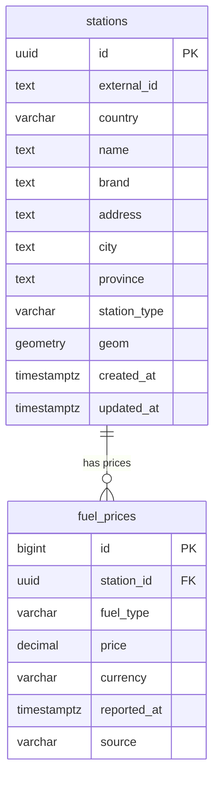

# Data model

This page describes the database Pumperly stores its data in: the two tables, their columns and indexes, and what the `external_id` and `source` columns mean. It is for contributors writing scrapers and for operators who query their own database.

Pumperly uses PostgreSQL with the [PostGIS](https://postgis.net) extension. **PostGIS** adds geographic types and functions, so the database itself can answer "which stations are inside this box" or "within 5 km of this route". Everything Pumperly shows lives in two tables:

- `stations`: one row per fuel station or EV charger.
- `fuel_prices`: one row per price, pointing at a station.



There are no user tables. Pumperly has no accounts, and the database holds nothing about visitors.

## Where the schema is defined

Two places in the repository describe these tables, and they are not identical.

- [`prisma/schema.prisma`](https://github.com/GeiserX/Pumperly/blob/main/prisma/schema.prisma) is the Prisma schema. The Prisma client used by the app is generated from it.
- [`prisma/migrations/`](https://github.com/GeiserX/Pumperly/tree/main/prisma/migrations) holds the SQL that creates the tables. It includes what the Prisma schema language cannot express.

| Item | `schema.prisma` | Migrations |
| --- | --- | --- |
| `stations.geom` | Not declared | `geometry(Point, 4326)` |
| The two GiST indexes on `geom` | Not declared | Created |
| Default for `stations.id` | `@default(uuid())`, filled in by the Prisma client | `DEFAULT gen_random_uuid()`, filled in by the database |
| `fuel_prices.price` | `Decimal(10, 3)` | `DECIMAL(6,3)` in the first migration, widened to `DECIMAL(10,3)` by a later one |

!!! warning "Scrapers write with raw SQL"
    Scrapers insert stations and prices with SQL, not through the Prisma client. Their station insert sets `geom` and leaves `id` to the database default. A database therefore needs the `geom` column and the `id` default from the migrations, or every scraper insert fails. The map and route queries also rely on the GiST indexes to stay fast. Tools that build the tables from `schema.prisma` alone, such as `prisma db push`, create none of these.


The shipped files, included here word for word:

=== "schema.prisma"

    ```text
    --8<-- "prisma/schema.prisma"
    ```

=== "Initial migration"

    ```sql
    --8<-- "prisma/migrations/0_init/migration.sql"
    ```

=== "Geography index migration"

    ```sql
    --8<-- "prisma/migrations/20260607220949_stations_geom_geography_gist/migration.sql"
    ```

## `stations`

One row per place: a fuel station, an EV charger, or a site that is both.

| Column | Type | Null | Meaning |
| --- | --- | --- | --- |
| `id` | `uuid` | No | Pumperly's own id for the row. Generated by the database. Prices point at it. |
| `external_id` | `text` | No | The source's id for the station. See [`external_id`](#external_id). |
| `country` | `varchar(2)` | No | ISO 3166-1 alpha-2 code of the scraper that wrote the row. It is not worked out from the coordinates. |
| `name` | `text` | No | Display name. Scrapers build one when the source has none, for example from the brand and the town. |
| `brand` | `text` | Yes | Brand or network, such as a fuel company or a charge point operator. `null` when the source gives none. |
| `address` | `text` | No | Street address. An empty string when the source has none. |
| `city` | `text` | No | Town or municipality. An empty string when the source has none. |
| `province` | `text` | Yes | Region, state or county, when the source gives one. |
| `station_type` | `varchar(20)` | No | `fuel`, `ev_charger` or `both`. Defaults to `fuel`. |
| `geom` | `geometry(Point, 4326)` | Yes | The position, as a PostGIS point in WGS84 longitude and latitude. Scrapers always set it. |
| `created_at` | `timestamptz` | No | When the row was first inserted. Never changed afterwards. |
| `updated_at` | `timestamptz` | No | When a scraper run last wrote this station. Every successful upsert sets it to the current time, even when nothing changed. |

`station_type` decides how the app queries a station:

| Value | Written by | Shown for |
| --- | --- | --- |
| `fuel` | Fuel price scrapers | Fuel searches, joined to `fuel_prices` |
| `ev_charger` | OpenChargeMap, Mapa REVE and BNetzA scrapers | The `EV` filter, without prices |
| `both` | Accepted by the scraper contract. No built-in scraper writes it. | The `EV` filter, and fuel searches when it has prices |

`geom` stores longitude first, as PostGIS does. To read it back as numbers, use `ST_X(geom)` for longitude and `ST_Y(geom)` for latitude.

## `fuel_prices`

One row per price of one fuel at one station.

| Column | Type | Null | Meaning |
| --- | --- | --- | --- |
| `id` | `bigint` | No | Row id, from a sequence. |
| `station_id` | `uuid` | No | The station, `stations.id`. Deleting a station deletes its prices. |
| `fuel_type` | `varchar(20)` | No | A fuel code such as `E5`, `E10` or `B7`. See [Fuel types](fuel-types.md). The database does not check the value. The `RawFuelPrice` type limits scrapers to codes from the list when the code is compiled. |
| `price` | `decimal` | No | Price per litre in `currency`, with three decimals. Gas fuels sold by weight, such as CNG in some countries, are per kilogram. |
| `currency` | `varchar(3)` | No | ISO 4217 code of `price`, such as `EUR` or `SEK`. Defaults to `EUR`. Scrapers always set it. |
| `reported_at` | `timestamptz` | No | When Pumperly wrote the price, not when the source last changed it. |
| `source` | `varchar(50)` | No | The name of the scraper source that wrote the row. See [`source`](#source). |

`EV` is a valid fuel code for API requests, but no price row ever carries it. An `EV` search queries stations by `station_type` instead. EV chargers have no rows in this table.

Nothing stops two rows for the same station and fuel. Readers take the newest one by `reported_at`. The example query [below](#reading-the-newest-price) shows the pattern.

## Indexes and constraints

| Name | On | Used for |
| --- | --- | --- |
| `stations_pkey` | `stations (id)` | Primary key. |
| `stations_external_id_country_key` | `stations (external_id, country)`, unique | The conflict target of the scrapers' `INSERT ... ON CONFLICT`. It makes a station's identity the pair of its source id and its country. |
| `stations_geom_idx` | `stations USING GIST (geom)` | Bounding-box searches on the map (`ST_Within` an envelope), radius searches for the nearest stations, and the fast `&&` pre-filter of the route search. |
| `stations_geom_geography_idx` | `stations USING GIST ((geom::geography))` | Distance in metres along a route (`ST_DWithin` on `geography`). |
| `fuel_prices_pkey` | `fuel_prices (id)` | Primary key. |
| `fuel_prices_station_id_fuel_type_reported_at_idx` | `fuel_prices (station_id, fuel_type, reported_at DESC)` | Finding the newest price of one fuel at one station. |
| `fuel_prices_station_id_fkey` | `fuel_prices.station_id` references `stations.id` | `ON DELETE CASCADE` and `ON UPDATE CASCADE`: a deleted station takes its prices with it. |

A **GiST index** is PostgreSQL's index type for geometric data. It lets a spatial query skip rows far from the area it asks about. The second GiST index is built on the expression `geom::geography`, so a query written with that exact cast can use it. The migration notes that on a large existing table you may prefer to build it by hand with `CREATE INDEX CONCURRENTLY`, which does not block writes.

## `external_id`

`external_id` is the station's id in its upstream source. It is how a scraper recognises a station it wrote on an earlier run. Each run upserts on `(external_id, country)`: a known pair updates the existing row, a new pair inserts a new one.

That makes two properties essential:

- **Stable.** The same station gets the same `external_id` on every run. If it changes, a new row with a new `id` is inserted. For a fuel station, the old row loses its prices and the orphan cleanup deletes it. An old EV charger row stays unless its scraper removes it.
- **Unique within the country, across all sources.** The unique index covers `external_id` and `country` only, not the source. After the station upsert, a run also maps its prices to stations by `external_id` within the country. Two sources that used the same id in one country would share, and overwrite, one row.

To keep sources apart, scrapers prefix the upstream id with a short tag. Some examples from the current scrapers:

| Source | `external_id` form |
| --- | --- |
| `bensinpriser` (Sweden) | `se-bp-<station id>` |
| `nsw_fuelcheck` (New South Wales) | `nsw_<station code>` |
| `ocm` (OpenChargeMap, every country) | `ocm-<POI id>` |
| `reve` (Mapa REVE, Spain) | `reve-<location id>` |
| `bnetza` (BNetzA register, Germany) | `bnetza-<latitude>_<longitude>`, rounded to 5 decimals. The register has one row per charging device, and the scraper merges the rows at one position into one station. |
| `miteco` (Spain) | The ministry's station id, with no prefix |

Some older scrapers use the upstream id without a prefix, as `miteco` does. A new scraper should use a prefix. [Adding a country](../data/adding-a-country.md#choosing-source-and-externalid) gives the rules.

`stations` has no `source` column. For EV chargers, which have no prices, the `external_id` prefix is the only record of where a row came from. That is how the Mapa REVE and BNetzA scrapers find the OpenChargeMap rows they replace: `external_id LIKE 'ocm-%'`.

## `source`

`source` is the name of the scraper that wrote a price row, such as `miteco`, `cma`, `fuelo_pl` or `bensinpriser`. It lives on `fuel_prices` only.

Every scraper run replaces exactly the price rows that carry its own `source` for stations in its own country. It never touches another source's rows. Two consequences:

- One source name can serve several countries. The Netherlands, Belgium and Luxembourg scrapers all write `anwb`, and none of them deletes the others' prices, because the replace is limited to one country.
- When a source is retired, its rows stay until something deletes them. The replacement scraper has to do that itself. [How scrapers work](../data/how-scrapers-work.md#handing-a-country-over-to-a-new-source) shows the pattern.

## How rows change over time

Only scrapers write to these tables. The app's API routes only read them.

| Event | Effect on `stations` | Effect on `fuel_prices` |
| --- | --- | --- |
| A source lists a new station | Row inserted | Its prices inserted |
| A source lists a known station again | Name, brand, address, city, province, type and position overwritten, `updated_at` set to now | This source's rows deleted and inserted fresh, with a new `reported_at` |
| A source stops listing a fuel station | Deleted at the end of the run, once no source has a price for it | Its rows from this source deleted |
| A source stops listing an EV charger | Kept, unless the EV scraper removes it itself | None |
| A run ends in a `Fatal` error | Unchanged, or partly updated if the error came after some station batches | Unchanged, unless the error came after the price replace committed |
| A station batch fails | The other batches are written. No station is deleted this run. | Replaced as usual for the stations the database knows |

The full sequence, including the guards that stop a bad run from deleting data, is in [How scrapers work](../data/how-scrapers-work.md).

Prices are replaced, not appended. The database holds the current price per station, fuel and source, not a price history.

## Reading the newest price

To query the data yourself, join each station to its newest price for one fuel. This is the pattern the app's own station endpoints use:

```sql
SELECT s.name, s.brand, s.city, fp.price, fp.currency, fp.reported_at
FROM stations s
JOIN LATERAL (
  SELECT price, currency, reported_at
  FROM fuel_prices
  WHERE station_id = s.id
    AND fuel_type = 'B7'
  ORDER BY reported_at DESC NULLS LAST
  LIMIT 1
) fp ON true
WHERE ST_DWithin(
  s.geom::geography,
  ST_SetSRID(ST_MakePoint(-3.70, 40.42), 4326)::geography,
  5000
)
ORDER BY fp.price
LIMIT 10;
```

This lists the ten cheapest diesel prices within 5 km of a point. `ST_MakePoint` takes longitude first. The lateral subquery can use the `fuel_prices` index, and the `ST_DWithin` on `geom::geography` can use the geography index.

For the same data over HTTP, see the [HTTP API](api.md).
