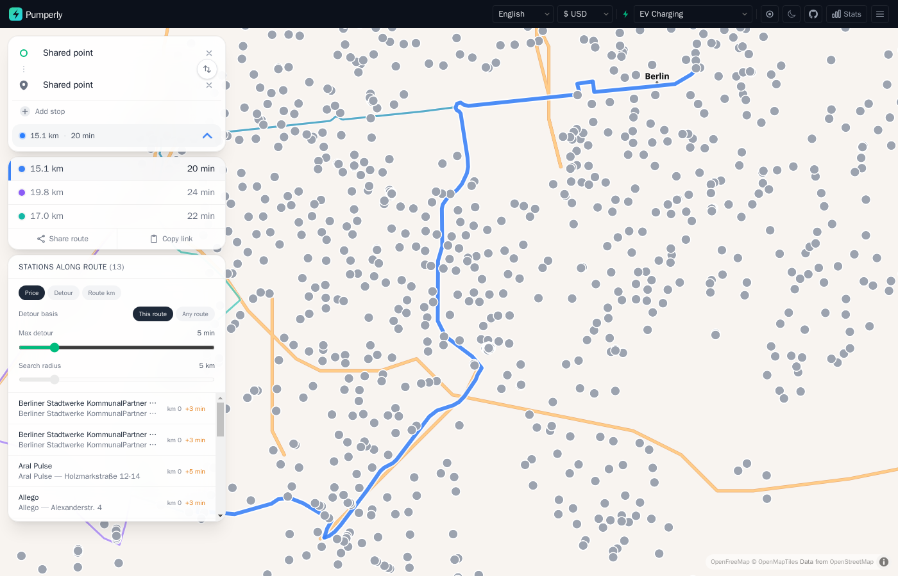

# EV charging

This page explains the EV layer: what it shows, what a charger's popup holds, and how charging stations along a route work. The map and route controls themselves are described in [The map](map.md) and [Planning a route](routes.md).

## Turning on the EV layer

Pick **EV Charging** in the fuel selector, under the **Electric** group. Its code is `EV`. The map then shows charging stations instead of fuel stations.

An operator can make it the first layer visitors see with [`PUMPERLY_DEFAULT_FUEL=EV`](../reference/environment-variables.md#pumperly_default_fuel).

## What the EV layer shows

Pumperly keeps a type on every station: a fuel station, an EV charger, or both. The EV layer shows every station of the second and third kind inside the visible area.

The fuel layers work differently. They show a station only when it has a price for the chosen fuel. A station marked as both appears on the EV layer, and on each fuel layer it has a price for.

Chargers carry no price. That changes a few things on the map:

| On a fuel layer | On the EV layer |
|-----------------|-----------------|
| Dots are coloured by price | Every dot is grey, and every cluster is orange |
| The price legend shows in the corner | No legend |
| The max-price slider shows | No max-price slider |

Clustering, country markers and the Stats panel work as on any other layer. The station counts in the country markers and the Stats panel include chargers.

## Where charger data comes from

Pumperly uses an official national registry where one exists, and [Open Charge Map](https://openchargemap.org) elsewhere:

| Where | Source |
|-------|--------|
| Spain | Mapa REVE, the official registry, when `PUMPERLY_REVE_API_KEY` is set. Open Charge Map otherwise. |
| Germany | The BNetzA Ladesäulenregister by default. `PUMPERLY_DE_EV_SOURCE=ocm` switches to Open Charge Map. |
| Every other covered country | Open Charge Map |

Open Charge Map needs `PUMPERLY_OCM_API_KEY`. Without it, every Open Charge Map scraper skips its run. That includes Spain without a REVE key, and Germany with `PUMPERLY_DE_EV_SOURCE=ocm`.

`PUMPERLY_EV_ENABLED=0` turns off charger scraping altogether. [EV charging sources](../data/ev-sources.md) covers each source, its licence and how it is refreshed.

## What a charger shows

Click a charger to open its popup. It holds:

1. The **brand**. For chargers this is the operator, when the source names one.
2. The **address** and the **city**.
3. The charger's **highest power** in kW, such as `150 kW`, labelled "Max. charging power · No price for EV Charging". When the source lists no power, it reads "Power unknown" instead. The German registry, OpenChargeMap and Mapa REVE all publish power.
4. The same four buttons as any station: **Get directions**, **Show on map**, **Copy link** and **Share**. See [Station popup](map.md#station-popup).

In a route's station list, a charger row shows the operator and the station name. Each source builds that name differently. The German registry, for example, combines the operator with the street and a site label, which tells apart two chargers at one address.

!!! note "No tariffs, connectors or live availability"
    Pumperly does not store charging tariffs, connector types or live availability. Its price model holds one price per litre for each fuel. A charging tariff is per kWh and per session, and that does not fit. The popup tells you where a charger is, who runs it and how fast it can charge. Check the operator's app for price and plug type.

## Chargers along a route

Route planning on the EV layer works the same way as on a fuel layer. See [Planning a route](routes.md). Pumperly finds the chargers within the search radius of each route and times the detour to each one.

The difference is that no charger has a price. That affects the station list:

| Feature | On the EV layer |
|---------|-----------------|
| Search radius, 1 to 25 km | Works as usual |
| Detour times and the detour basis | Work as usual |
| Max detour | Works as usual |
| Sort by **Detour** or **Route km** | Works as usual |
| Sort by **Price** | Keeps the chargers in route order, since none has a price |
| **Least detour** badge | Works as usual |
| **Cheapest** and **Balanced** badges | Never shown |
| Average price and the difference from it | Not shown |

Every charger within the radius is included, because none is left out for lacking a price. A route gets at most 5,000 stations, in route order.

!!! tip "Keep the radius small in cities"
    Cities have far more chargers than fuel stations. A 5 km radius across a large city can hold hundreds of them. Pumperly times detours in batches of 150 chargers, and each batch is one request. A visitor may send 10 detour requests a minute, so the later batches of a very dense corridor come back as unknown detours. Lower the search radius, or pick a route that avoids the centre. The limits are listed in [Limits](routes.md#limits).

Clicking a charger in the list or on the map adds it to the route as a stop, as on any layer. See [Pick a station as a stop](routes.md#pick-a-station-as-a-stop).

## Sharing a charger

A charger link must carry `fuel=EV`. The map only loads chargers on the EV layer, so a link without it opens a fuel layer where the charger never loads. The **Copy link** and **Share** buttons add it for you. [The EV rule](links.md#the-ev-rule) explains it in full.

## Summary

- Pick **EV Charging** (`EV`) in the fuel selector to see chargers.
- The EV layer shows every charger in view. Chargers have no price, so dots are grey and there is no legend or price slider.
- A charger's popup shows the operator, the address, the city and the highest power in kW. There are no tariffs, connectors or live availability.
- Along a route, detours and the detour filter work as usual. Price sorting and the Cheapest and Balanced badges do not apply.
- Keep the search radius small in cities, or dense corridors run into the detour rate limit.
