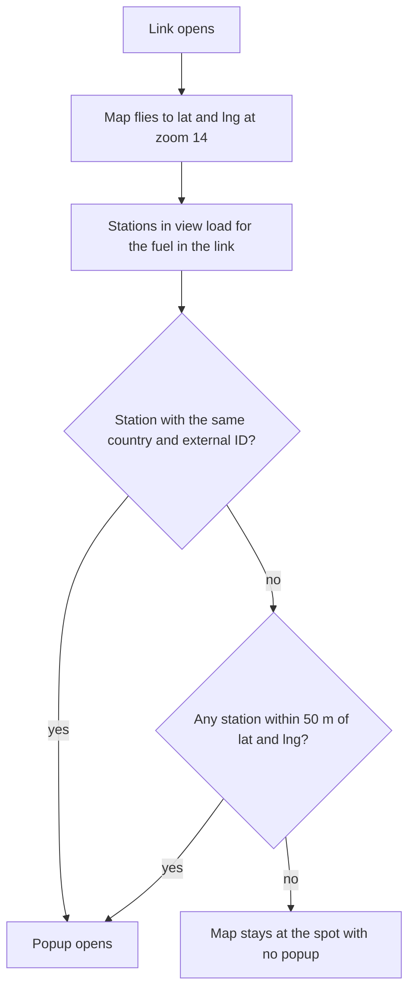

# Share links and deep links

This page explains the links Pumperly makes for stations and routes, and how to build one by hand. A **deep link** is an address that opens Pumperly on a given station or route instead of the default map.

There are two kinds:

=== "Station link"

    ```text
    https://pumperly.example.com/en?station=ES%3A12345&lat=40.4168&lng=-3.7038&fuel=B7
    ```

    Opens the map on one station, on the diesel layer, with its popup open.

=== "Route link"

    ```text
    https://pumperly.example.com/en?from=40.4168%2C-3.7038&to=41.3874%2C2.1686&via=41.6488%2C-0.8891&fuel=E5
    ```

    Opens a route from the first point to the second, through the third, on the 95 gasoline layer.

The code that writes and reads these links is [`src/lib/share-url.ts`](https://github.com/GeiserX/Pumperly/blob/main/src/lib/share-url.ts).

## Getting a link

You rarely need to build a link yourself:

| Where | Button | What it does |
|-------|--------|--------------|
| Station popup | Copy link | Copies the station link. |
| Station popup | Share | Opens the device's share sheet. Where the browser has none, it copies the link. |
| Route panel | Copy link | Copies the route link. |
| Route panel | Share route | Opens the device's share sheet. Where the browser has none, it copies the link. |

A check mark or "Copied!" confirms a copy for 2 seconds.

The address bar also keeps up with you. Pumperly rewrites it as you go, without adding browser history entries:

| What is open | The address bar holds |
|--------------|-----------------------|
| A route | The route link |
| A station, with no route | The station link |
| Nothing | The bare page address, such as `/en` |

So you can also copy the address bar at any time. Only one kind of link is in the address at once. While a route is open, the route owns it.

## Station links

```text
/{language}?station={COUNTRY}:{externalId}&lat={latitude}&lng={longitude}&fuel={fuel code}
```

| Parameter | Value | Required |
|-----------|-------|----------|
| `station` | The two-letter country code, a colon, and the station's ID at its source | No, but without it Pumperly can only match by position |
| `lat` | Latitude, -90 to 90 | Yes |
| `lng` | Longitude, -180 to 180 | Yes |
| `fuel` | A fuel code such as `B7`, `E10` or `EV` | No, but see [The EV rule](#the-ev-rule) |

The **external ID** is the ID the data source gives the station. Pumperly also has its own internal ID for each station, but that one can change when a source is imported again. The external ID stays the same, so links keep working. Only the part before the first colon is the country. An external ID may contain colons of its own.

Pumperly writes `lat` and `lng` rounded to 5 decimal places, about 1.1 m.

### What happens when a station link opens



1. The map flies to `lat` and `lng` at zoom 14. Pumperly skips its usual jump to your own location.
2. The stations in view load, for the fuel in the link.
3. Pumperly looks for the station with the same country and external ID. The country is matched without regard to case.
4. If none matches, it takes the nearest loaded station within 50 m of `lat` and `lng`.
5. The popup of the matched station opens. If nothing matched, the map stays at that spot with no popup.

A station link without a valid `lat` and `lng` is ignored, and the map opens as usual.

## The EV rule

**A link to an EV charger must carry `fuel=EV`.**

The map loads stations for one fuel at a time. On a fuel layer it loads only stations with a price for that fuel. Chargers have no price, so they load only on the EV layer.

A charger link without `fuel=EV` opens on the instance's default fuel. The charger never loads, so the popup never opens. You land on the right spot, but the charger is not there.

The **Copy link** and **Share** buttons in the popup always add the fuel of the layer you opened it from. Links from the app are correct. Keep `fuel=EV` when you build or edit a charger link by hand.

The same logic applies to fuel stations. A link with `fuel=LPG` finds a station only when it has an LPG price.

## Route links

```text
/{language}?from={lat},{lng}&to={lat},{lng}&via={lat},{lng}&via={lat},{lng}&fuel={fuel code}
```

| Parameter | Value | Required |
|-----------|-------|----------|
| `from` | Start, as `latitude,longitude` | Yes |
| `to` | Destination, as `latitude,longitude` | Yes |
| `via` | A stop, as `latitude,longitude`. Repeat it for each stop, in order. | No |
| `fuel` | A fuel code | No |

!!! warning "Latitude comes first"
    Route coordinates are `latitude,longitude`, as in `40.4168,-3.7038`. Many map tools write longitude first. Swapped values either fail the range check or land somewhere else.

The rules for reading a route link:

- `from` and `to` must both be valid, or the whole route is ignored.
- A `via` that is not a valid coordinate is skipped. The others still count.
- Only the first five valid `via` values are used. A route has at most five stops.
- Coordinates are written rounded to 5 decimal places.

### What happens when a route link opens

The start, the destination and every stop show as **Shared point**, since the link holds coordinates and no place names. Pumperly then plans the route the same way as when you pick the places yourself. See [Planning a route](routes.md).

When the route is ready, the map zooms to fit it. Pumperly skips its usual jump to your own location.

If the route fails, for example because the routing service is down, Pumperly keeps the route parameters in the address bar. Reload the page to try again.

A station you picked as a stop on the route is part of the link, as a `via`. Whoever opens the link gets it as an ordinary stop.

## Fuel in links

`fuel` takes one of the fuel codes listed in [Fuel types](../reference/fuel-types.md), such as `B7`, `E5`, `E10`, `LPG` or `EV`. A missing or unknown code falls back to the instance's default fuel.

The fuel only picks the layer the link opens on. The visitor can change it afterwards.

## Language in links

Links carry the language as the first part of the path, such as `/en` or `/de`. The page opens in that language.

A link without a language, such as `https://pumperly.example.com/?station=...`, redirects to a language path picked from the visitor's saved choice or browser. The station or route parameters stay on the address.

!!! note
    Changing the language inside Pumperly reloads the page without the station or route parameters. Copy the link before you switch.

## Characters in the link

The app writes links through the browser's standard URL encoding. The colon in `station` becomes `%3A` and the comma in coordinates becomes `%2C`:

```text
?station=ES%3A12345&lat=40.4168&lng=-3.7038&fuel=B7
?from=40.4168%2C-3.7038&to=41.3874%2C2.1686&fuel=E5
```

Both the encoded and the plain form work when you type a link by hand:

```text
?station=ES:12345&lat=40.4168&lng=-3.7038&fuel=B7
?from=40.4168,-3.7038&to=41.3874,2.1686&fuel=E5
```

## If both kinds are in one link

A link could carry route and station parameters at once. The route wins when `from` and `to` are both valid, and the station parameters are ignored. Pumperly itself never writes such a link.

## Summary

- A station link is `station=COUNTRY:externalId`, `lat`, `lng` and `fuel`. It opens the popup of the matching station.
- A route link is `from`, `to`, up to five `via`, and `fuel`, all as `latitude,longitude`.
- Charger links need `fuel=EV`, or the charger never loads. The app's buttons add it for you.
- The address bar always holds the link to what is open, so copying it works too.
- Changing language drops the parameters. Copy the link first.
