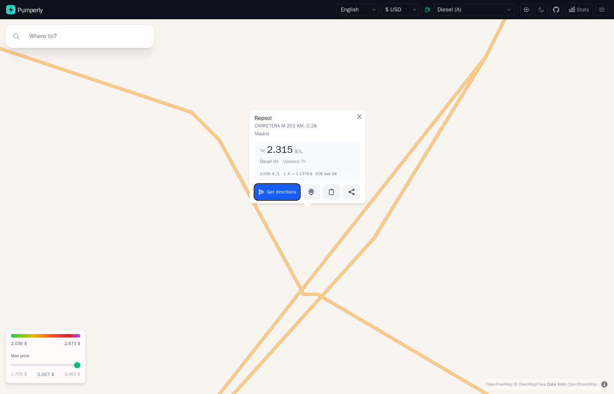

# The map

This page explains what you see on the Pumperly map and what each control does. Route planning has its own page, [Planning a route](routes.md), and charging stations have [EV charging](ev-charging.md).

## Layout

The screen has two parts:

- The **navbar** is the dark bar along the top. It holds the language, currency and fuel selectors, the locate-me button, the theme toggle, the Stats panel and a menu.
- The **map** fills the rest. The search box sits in its top-left corner. The price legend and the max-price slider sit in its bottom-left corner.

On a narrow screen some navbar controls move into the menu:

=== "Desktop (768 px and wider)"

    | Control | Where |
    |---------|-------|
    | Language and currency | Navbar |
    | Fuel type | Navbar |
    | Locate me | Navbar |
    | Dark mode | Navbar |
    | GitHub link and Stats | Navbar |
    | GitHub link, support, privacy, terms and data sources | Menu |

=== "Mobile (under 768 px)"

    | Control | Where |
    |---------|-------|
    | Language and currency | Menu |
    | Fuel type | Navbar |
    | Locate me | Navbar |
    | Dark mode | Menu |
    | GitHub link | Menu |
    | Stats | Not shown |
    | Support, privacy, terms and data sources | Menu |

The map tiles come from [OpenFreeMap](https://openfreemap.org). The map lets you zoom out to world level (zoom 2).

## What loads at each zoom level

Pumperly loads stations for the part of the map you can see. It fetches again 100 ms after you stop panning or zooming.

| Zoom | What the map shows |
|------|--------------------|
| Below 5 | One marker per country, no stations |
| 5 and above | Stations inside the visible area |

A single fetch returns at most 20,000 stations. Zoom in if an area looks thinner than you expect.

### Country markers

Below zoom 5 each country with stations gets one marker at its centre. The marker shows the country's flag and its station count, shortened to "12K" or "1.9K". Hover it to see the country name and the exact count. Click it to fly to that country.

The counts come from the same data as the [Stats panel](#stats-panel). A country with no stations gets no marker. Country markers are hidden while a route is open.

## Choosing a fuel

The fuel selector in the navbar decides which prices the map shows. Fuels are grouped, and the list shows these names:

| Group | Fuels |
|-------|-------|
| Diesel | Diesel (A), Diesel Premium, Diesel B10, Diesel B (Agrícola), Diesel Renovable (HVO) |
| Gasoline | Gasolina 95, Gasolina 95 Premium, Gasolina 95 E10, Gasolina 98, Gasolina 98 E10 |
| Gas | GLP / Autogas, GNC, GNL |
| Hydrogen | Hidrógeno |
| Electric | EV Charging |
| Other | AdBlue |

Each fuel has a code, such as `B7` for regular diesel or `EV` for charging. The full list with codes is in [Fuel types](../reference/fuel-types.md).

The first fuel you see is the instance default. The operator sets it with [`PUMPERLY_DEFAULT_FUEL`](../reference/environment-variables.md#pumperly_default_fuel). Without it, Pumperly uses the default fuel of the country in [`PUMPERLY_DEFAULT_COUNTRY`](../reference/environment-variables.md#pumperly_default_country).

On a fuel layer, a station appears only when it has a price for that fuel. A station that sells diesel but reported no diesel price does not show on the diesel layer. The EV layer works differently: it shows every charger, and chargers carry no price. See [EV charging](ev-charging.md).

Changing the fuel clears the max-price filter and resets the max detour to 5 minutes.

!!! note "Fuel names are not translated"
    The group names follow your language. The fuel names in the list, such as "Gasolina 95" or "GNC" for CNG, are the same in every language.

## Price colours

Each station is a dot coloured by its price. Cheap is green and expensive is purple:

| Position on the scale | Colour |
|-----------------------|--------|
| Cheapest | Green |
| | Lime |
| | Yellow |
| Middle | Orange |
| | Red |
| | Dark red |
| Most expensive | Purple |

The scale is relative to what you can see. Pumperly takes the prices of the stations currently on the map and finds the 5th and 95th percentile. The cheapest 5% are all green. The most expensive 5% are all purple. Everything in between is spread across the seven colours.

This keeps one very cheap or very expensive outlier from flattening the colours of every other station. It also means the same price can change colour when you pan to an area with different prices.

When the 5th and 95th percentile are less than 0.02 apart, Pumperly widens the scale to 0.01 on each side of their midpoint. Otherwise a handful of nearly equal prices would span the whole scale.

A station with no price is grey. On fuel layers this is rare. On the EV layer every dot is grey.

The **price legend** in the bottom-left corner shows the colour bar with the two percentile prices under its ends. It is hidden when no station on screen has a price.

## Max price filter

Under the legend, the **Max price** slider hides stations above a price you choose.

- The slider runs from the cheapest to the most expensive price on screen.
- It moves in steps of the smallest unit your currency displays, for example 0.001 € or 1 Ft.
- The value you picked shows in the middle, in green while the filter is on.
- While the filter is on, a counter such as `84 / 212` shows how many priced stations pass it.
- Drag the slider to the far right, or click **Clear**, to turn the filter off.

Stations with no price are never hidden by this filter.

The slider appears only when at least two stations on screen have a price and the prices differ by at least 0.005. Changing the fuel or the currency clears it. With a route open, the filter applies to the route's station list as well as the map.

## Clustering

With clustering on, nearby stations merge into one bigger circle with a count inside. Clusters form up to zoom 11 and gather stations within 50 pixels of each other.

| Stations in the cluster | Circle size |
|-------------------------|-------------|
| Under 50 | Smallest |
| 50 to 199 | Medium |
| 200 to 499 | Large |
| 500 or more | Largest |

A cluster is coloured by the average price of the priced stations inside it, on the same scale as single stations. A cluster with no priced station is grey. When no station on screen has a price, as on the EV layer, there is no scale and every cluster is orange. Click a cluster to zoom in until it splits.

Clustering is on by default. The operator turns it off with [`PUMPERLY_CLUSTER_STATIONS=false`](../reference/environment-variables.md#pumperly_cluster_stations). Clustering is always off while a route is open, because every single station on the route matters there.

## Station popup

Click a station to open its popup. Click the same station again, or the popup's close button, to close it.

From top to bottom the popup shows:

1. The **brand**, when the source names one.
2. The **address** and the **city**.
3. The **price block**:
    - The price, labelled per litre (`/L`).
    - The fuel name.
    - How long ago Pumperly last fetched the price from its source: "Updated just now", "Updated 12 min", "Updated 7h" or "Updated 3d".
    - When the price was converted to your currency, a `≈` in front of it and a line under it with the original price and the exchange rate. See [Currency](#currency).
4. Four buttons:

| Button | What it does |
|--------|--------------|
| Get directions | Opens Google Maps directions to the station. It uses the address and city when the station has an address, and the coordinates otherwise. |
| Show on map | Opens Google Maps with a pin on the station's coordinates. |
| Copy link | Copies a link to this station to the clipboard. The icon turns into a check mark when it worked. |
| Share | Opens your device's share sheet. Where the browser has none, it copies the link instead. |

When the station has no price for the chosen fuel, the price block reads "No price for" and the fuel name. This is what an EV charger shows.

The two link buttons are described in [Share links and deep links](links.md).

With a route open, clicking a station also adds it to the route as a stop. See [Pick a station as a stop](routes.md#pick-a-station-as-a-stop).

## Currency

The currency selector converts every price on the map, in the popup, on the legend and in the route list. It offers 37 currencies.

Your first currency comes from your browser. Pumperly reads the region part of your browser languages, such as `GB` in `en-GB`, and picks that region's currency. With no match it uses the euro. Your choice is saved in the browser under `pumperly-currency` and wins on the next visit.

### How conversion works

Pumperly fetches euro exchange rates from the European Central Bank (ECB) and reuses them for 24 hours. The ECB does not publish some of the currencies Pumperly shows. For those, Pumperly uses a fixed rate:

| Currency | Rate used |
|----------|-----------|
| BAM (Bosnian mark) | 1.95583 per euro, the official peg |
| MKD (Macedonian denar) | 61.5 per euro, approximate |
| RSD (Serbian dinar) | 117 per euro, approximate |
| ARS (Argentine peso) | 1,200 per euro, approximate |
| MDL (Moldovan leu) | 19.5 per euro, approximate |
| TWD (New Taiwan dollar) | 36 per euro, approximate |
| ISK (Icelandic króna) | 140 per euro, only when the ECB feed has no ISK rate |

A price is converted only when both its own currency and your currency have a rate. Otherwise it stays in its own currency, with its own symbol.

A converted price shows `≈` in front of it. The popup adds the original price and the rate used, for example `2.035 €/L · 1 € = 1.1378 $ · ECB Sep 28`. A price already in your currency shows no `≈` and no rate line.

Each currency has its own number of decimals: three for the euro, the pound and the dollar, two for the Swedish krona, none for the forint or the yen. [Currencies and exchange rates](../reference/currencies.md) lists them all.

!!! warning "Approximate rates are approximate"
    The fixed rates above do not follow the market. A price converted from one of these currencies, or into one of them, can be noticeably off. Compare prices in the source currency when it matters.

## Language

The language selector switches the interface between 17 languages: Spanish, English, French, German, Italian, Portuguese, Polish, Czech, Hungarian, Bulgarian, Slovak, Danish, Swedish, Norwegian, Serbian, Finnish and Catalan.

The language is part of the address: `/en` for English, `/de` for German. Pumperly picks it in this order:

1. The language in the address, when there is one.
2. The language you used last, saved in a cookie.
3. Your browser's preferred languages.
4. Spanish.

An address without a language, such as the bare site root, redirects to one picked by steps 2 to 4.

Choosing a language saves it and reloads the page at the new address.

!!! note
    Switching language reloads the map without the rest of the address. An open route or station popup closes. Copy its link first if you want to come back to it. The Stats panel and the menu entries are in English only.

## Dark mode

The theme button switches between a light and a dark theme. The map switches with it, between OpenFreeMap's light and dark styles.

On your first visit the theme follows your system setting. Pumperly then saves the theme in the browser under `pumperly-theme`, so later visits keep it even if your system setting changes. Toggling it updates the saved value.

## Locate me

The locate-me button in the navbar centres the map on where you are.

- While the browser looks up your position, the button spins.
- When it succeeds, the map flies to you at zoom 14 and a blue pulsing dot marks your position. The dot follows you as you move.
- When you refuse, the lookup fails, or it takes more than 10 seconds, the button turns red for 3 seconds.

Pumperly also tries this once when the map first loads, unless your browser has already refused location access. It does not try when you open a [shared link](links.md), so the shared station or route stays in view.

Pumperly uses your position to move the map and to fill in "My location" as the start of a route. See [Planning a route](routes.md#start-and-destination).

## Stats panel

The **Stats** button opens a panel with the size of the data behind the map. It only shows on screens 768 px and wider.

| Part | What it shows |
|------|---------------|
| Stations | The total number of stations, including EV chargers |
| Prices | The total number of stored price rows |
| Per-country table | Each country's flag, code, name and station count, and how long ago Pumperly last stored a price for it |

A country with no prices, such as one with only EV chargers, shows a dash in the last column. The panel loads its numbers the first time you open it.

## Summary

- Stations load for the visible area from zoom 5. Below that you see one marker per country.
- Dot colours are relative: green is the cheapest 5% on screen, purple the most expensive 5%.
- The max-price slider hides pricier stations and never hides unpriced ones.
- Prices convert with daily ECB rates. A `≈` marks a converted price. Seven currencies fall back to fixed rates when the ECB feed lacks them.
- The popup gives Google Maps directions, a pin, and a copyable or shareable link.
