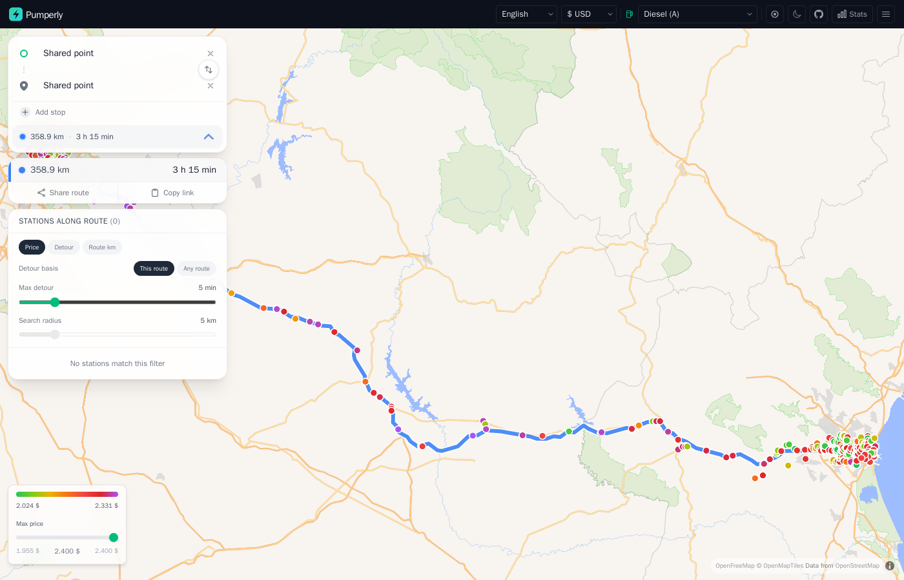
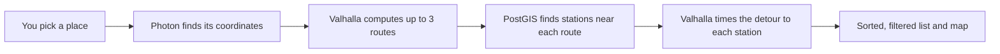

# Planning a route

This page explains how to plan a trip in Pumperly and how it finds and ranks the stations along it. It covers search, stops, alternative routes, the search radius, detour times, sorting and filters.

A route needs two self-hosted services. [Valhalla](../configuration/routing-valhalla.md) computes routes and detour times. [Photon](../configuration/geocoding-photon.md) turns what you type into places. Without Valhalla every route fails. Without Photon the search box finds nothing.

## How a route is built

1. You type a place. Pumperly asks Photon for matching places.
2. When the start and the destination are both known, Pumperly asks Valhalla for a route. Without stops it asks for up to two alternatives as well.
3. For every route, the database returns the stations within the [search radius](#search-radius) that have a price for your fuel. On the EV layer it returns every charger in range.
4. For the selected route, Pumperly asks Valhalla how many extra minutes each station costs. Results stream in station by station.
5. The side panel lists the stations. The map shows the same stations.

Routes are for a car. Pumperly uses Valhalla's `auto` profile.

## Start and destination

Pumperly asks for the destination first. On an empty map you see one box, **Where to?**.

- When Pumperly already knows your position, the start is set to **My location**. Picking a destination draws the route straight away.
- When it does not, a start box appears above the destination and gets the focus. Type a start there.

The start box has a **My location** entry. It shows when the box has focus and holds fewer than two characters, and on top of the suggestions. Picking it asks the browser for your position. If that fails, a "Location denied" message shows for 3 seconds.

See [Locate me](map.md#locate-me) for how the map uses your position.

### Search suggestions

Suggestions come from Photon.

- They start after you type two characters and pause for 300 ms.
- You get up to five places. Each shows its name, with the city and region in grey.
- Results lean towards the centre of the map view. Places near it rank higher.
- Use <kbd>Up</kbd> and <kbd>Down</kbd> to move through them and <kbd>Enter</kbd> to pick one. <kbd>Esc</kbd> closes the list.
- <kbd>Enter</kbd> with no list open searches for what you typed and takes the first match.

When nothing matches, the box says "No results found". A Pumperly with no `PHOTON_URL` set shows this for every search.

### Stops

Once the start box shows, **Add stop** adds an intermediate stop between the start and the destination. You can add up to five. Stops are numbered in route order.

- Picking a place for a stop recalculates the route.
- The cross next to a stop removes it and recalculates.
- The swap button between the start and the destination swaps them and reverses the stops.

Editing the start or the destination text closes the route until you pick a new place. Clearing the destination with its cross also removes every stop.

!!! note "Stops turn off alternative routes"
    Valhalla returns alternative routes only for a plain start-to-destination trip. With one or more stops you get a single route.

## Alternative routes

Without stops Pumperly asks Valhalla for two alternatives, so you can get up to three routes. Each keeps its colour: blue, then violet, then teal.

The side panel lists every route with its distance and driving time. The selected route has a coloured bar on its left and a thicker line on the map. The other routes are thinner and fainter.

Pick a different route by clicking its row, or by clicking its line on the map. The map zooms to fit it. Any open station closes.

Pumperly fetches the stations near every route at once. The list and the map show only the stations of the selected route. Detour times are computed for the selected route only, so switching routes starts them again.

## Search radius

The **Search radius** slider sets how far from the route a station may be. It runs from 1 to 25 km in 1 km steps. The default is 5 km.

The distance is a straight line from the station to the nearest point of the route. It is not a driving distance. A station 3 km away across a river can still count.

Pumperly fetches the stations again 300 ms after you stop moving the slider. The slider is greyed out while detour times are still being computed.

!!! tip
    A small radius keeps the list short and the detour times quick. Raise it on a motorway where stations are far apart.

## Detour minutes

The detour is the extra driving time a station adds to your trip, in minutes. Pumperly asks Valhalla for it one station at a time, several stations in parallel. Results appear in the list as they arrive.

The **Detour basis** switch chooses what the extra time is measured against.

=== "This route (default)"

    Pumperly takes two points on the selected route: 3 km before the station and 3 km after it, measured along the route. It then compares two times:

    - the time Valhalla needs to drive from the first point, through the station, to the second point;
    - the time the route itself takes between those two points.

    The difference is the detour. It answers "how much longer is my trip if I stop here on this route?". Measuring over a short stretch around the station keeps the number local to that part of the trip.

=== "Any route"

    Pumperly asks Valhalla for the time from your start, through the station, to your destination. It subtracts the driving time of the selected route.

    This ignores which route you picked. It answers "what does the best way through this station cost, compared with my route?". When you selected a slower route, a station on a faster alternative can come out at zero. It shows as unknown when going through it is more than a minute faster than your route.

    Any route leaves out your intermediate stops. With stops on the route, use **This route**.

Both bases round the result to a tenth of a minute. A result up to one minute below zero counts as zero.

Pumperly marks the detour as unknown when:

- Valhalla found no route through the station;
- the trip through the station came out more than one minute faster than the baseline;
- the request failed or hit a rate limit;
- the station was left out because the request had too many stations. See [Limits](#limits).

### How detours show in the list

| What you see | Meaning |
|--------------|---------|
| `+4 min` in amber | The station adds about 4 minutes. The list rounds to whole minutes, so `+0 min` means under half a minute. |
| Nothing | The detour is zero. |
| `...` | Pumperly is still computing it. |
| A dash (—) | The detour is unknown. |

## Max detour

The **Max detour** slider hides stations that cost too many extra minutes. It runs from 0 to 30 minutes in 1 minute steps. At 30 it reads **No limit** and hides nothing.

The default is 5 minutes, so you first see the stations that are worth the stop. Changing the fuel resets it to 5.

The filter applies to the map and the list alike.

- Stations with an unknown detour are hidden while a limit is set. Set **No limit** to see them.
- While detours are still coming in, the list only shows stations whose detour has arrived. The map keeps showing the others until then.

The [max-price filter](map.md#max-price-filter) from the map also applies to this list.

## The station list

The panel heading reads **Stations along route** with the number of stations that pass your filters. When the list has prices, the heading also shows their average, such as `Avg: 1.612 €/L`.

Each row shows:

| Left side | Right side |
|-----------|------------|
| The brand, with any badges | The price. A `≈` marks a converted price. |
| The station name | `km 132`: how far along the selected route the station sits, from the start |
| | The detour, such as `+3 min` |
| | The difference from the average price, in green when cheaper |

### Sorting

Three buttons sort the list:

| Button | Order |
|--------|-------|
| Price | Cheapest first. Stations with no price go last. |
| Detour | Smallest detour first. Unknown detours go last. |
| Route km | In the order you pass them on the route. |

### Badges

Up to three rows get a badge, computed from the stations that pass your filters:

| Badge | Given to |
|-------|----------|
| Cheapest | The station with the lowest price. |
| Least detour | The station with the smallest known detour. |
| Balanced | The best mix of price and detour. |

For **Balanced**, Pumperly scales each station's price and detour to a range of 0 to 1 within the list. It then scores each station as 60% price plus 40% detour and picks the lowest score. The badge needs at least three stations with both a price and a known detour. It is not shown when the same station already has the Cheapest or Least detour badge.

## Pick a station as a stop

With a route open, clicking a station adds it to your route. This works from the list and from the map.

1. The station's popup opens. When you clicked it in the list, the map also flies to it.
2. The station appears among your stops, with a pin icon instead of a number. Pumperly puts it in route order between your other stops.
3. Valhalla computes a route through the station. The map shows only that route, and the selected row in the route list shows its distance and time.

Picking another station replaces the previous one. Click the same station again, close its popup, or remove it from the stops to go back to your original route.

The station list and the detour times stay those of your original route. The station stop does not change which stations you see.

When you already have five stops, a station cannot be added and the list shows "Maximum stops reached". When the route through the station fails, a message shows for 3 seconds and the station is deselected.

The station stop is part of the route link. See [Share links and deep links](links.md#route-links).

## Sharing the route

Two buttons under the route list share it:

| Button | What it does |
|--------|--------------|
| Share route | Opens your device's share sheet. Where the browser has none, it copies the link and shows "Copied!". |
| Copy link | Copies the link to the clipboard and shows "Copied!". |

The link holds the start, destination, stops and fuel. [Share links and deep links](links.md) explains its format.

## Desktop and mobile layout

=== "Desktop (640 px and wider)"

    The search box and the route details stack in a card on the left of the map. When a route is open, a bar under the search box shows its distance and driving time. Click it to fold the route details away and show them again.

=== "Mobile (under 640 px)"

    The search box stays at the top. The route details and the station list move into a sheet at the bottom of the screen. Its header shows the distance, the driving time and the number of stations found, before filters.

    The sheet has three heights: a strip showing only the header, half the screen, and most of the screen. It opens at half. Drag the header to resize it, or tap the handle to step through the heights. Picking a station in the list lowers the sheet to the strip so you can see the map.

## Messages

| Message | What happened |
|---------|---------------|
| Route calculation failed | Valhalla returned no route, is not reachable, or is not configured. It also appears when you send too many route requests in a minute. |
| No results found | Photon returned no place for your text. |
| Finding stations... | The stations near the route are loading. |
| No stations found along this route | No station within the search radius has a price for your fuel. On the EV layer, no charger is in range. |
| Failed to load stations | The station request failed. |
| No stations match this filter | Your max price or max detour hides every station. |
| Maximum stops reached | You already have five stops. |

## Limits

These limits protect the server and a self-hosted Valhalla from overload. The rate limits count requests per visitor IP address.

| What | Limit |
|------|-------|
| Stops per route | 5 |
| Route requests | 30 per minute |
| Station searches along a route | 30 per minute |
| Detour requests | 10 per minute |
| Stations per route | 5,000, in route order |
| Stations per detour request | 150 |
| Detour lookups running at once, per request | 8 |

Pumperly sends the stations of a route to the detour service in batches of 150, one request per batch. A dense corridor with thousands of stations needs many requests, and batches past the rate limit come back as unknown detours. A smaller search radius avoids this.

Two settings let the operator tune this. [`PUMPERLY_MAX_DETOUR_STATIONS`](../reference/environment-variables.md#pumperly_max_detour_stations) lowers the number of stations timed per request, default 150. The stations it keeps are spread evenly along the route, and the rest show an unknown detour. [`VALHALLA_MAX_INFLIGHT`](../reference/environment-variables.md#valhalla_max_inflight) caps how many Valhalla requests run at once across all visitors, default 6.

## Summary

- Pick a destination. Pumperly routes from your location when it knows it, or asks for a start.
- Without stops you get up to three routes. Stations and detours follow the selected one.
- The search radius is a straight-line distance from the route, 1 to 25 km.
- **This route** measures the detour over 3 km on each side of the station. **Any route** measures start to destination through the station.
- Max detour defaults to 5 minutes and hides unknown detours until you set No limit.
- Clicking a station adds it as a stop and routes you through it.
